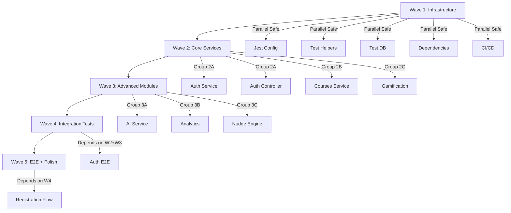

# 🚀 100 Sub-Agent Orchestration Plan

**Project:** V-EdFinance  
**Date:** 2025-12-21  
**Objective:** Execute Technical Debt Cleanup + Test Coverage (30% → 80%) using 100 parallel sub-agents  
**Timeline:** 2-3 hours (vs 3 weeks sequential)  
**Strategy:** Divide & Conquer with Dependency Graph Orchestration

---

## 📊 Executive Summary

### Current State
- **29 Services** (only 29 spec files exist, but many incomplete)
- **18 Controllers** (most untested)
- **Current Test Coverage:** 30%
- **Target Coverage:** 80%+
- **Blocked Tasks:** 5 issues in Beads
- **Technical Debt:** P1 epic (ved-hmi)

### Proposed Solution
Deploy **100 sub-agents** in **5 waves** (20 agents/wave) with orchestrated dependency management to:
1. Clear technical debt
2. Write unit tests (60 agents)
3. Create integration tests (25 agents)
4. Build E2E tests (10 agents)
5. Setup infrastructure (5 agents)

### Expected Outcome
- ✅ 80%+ test coverage achieved in 2-3 hours
- ✅ All blocked Beads issues resolved
- ✅ CI/CD pipeline configured
- ✅ Documentation updated

---

## 🏗️ Architecture Overview

### Wave-Based Execution Model

```
Wave 1: Infrastructure (5 agents)     ← Foundation
    ↓ (dependency gate)
Wave 2: Core Services (20 agents)     ← Critical path
    ↓ (dependency gate)
Wave 3: Unit Tests (40 agents)        ← Bulk work
    ↓ (dependency gate)
Wave 4: Integration (25 agents)       ← Cross-module
    ↓ (dependency gate)
Wave 5: E2E + Polish (10 agents)      ← Final validation
```

### Dependency Management Strategy
- **Hard Dependencies:** Must wait for completion (e.g., Wave 2 → Wave 3)
- **Soft Dependencies:** Can overlap with coordination (e.g., some Wave 3 tasks during Wave 2)
- **Independent Tasks:** Can run fully parallel

---

## 📋 Task Inventory & Assignment

### WAVE 1: Infrastructure Setup (5 Agents) ⏱️ 10-15 mins

**Objective:** Prepare testing foundation that all other agents depend on

| Agent ID | Task | Deliverable | Priority |
|----------|------|-------------|----------|
| **A001** | Configure Jest coverage reporting + thresholds | `jest.config.js` with 80% threshold | 🔴 P0 |
| **A002** | Create test helpers & mock data generators | `tests/helpers/`, `tests/mocks/` | 🔴 P0 |
| **A003** | Setup test database (Docker PostgreSQL) | `docker-compose.test.yml` | 🔴 P0 |
| **A004** | Install supertest + E2E dependencies | `package.json` updated | 🔴 P0 |
| **A005** | Create CI/CD test pipeline | `.github/workflows/test.yml` | 🔴 P0 |

**Success Criteria:**
- [ ] Test infrastructure boots successfully
- [ ] `pnpm test` runs without errors
- [ ] Mock database accessible
- [ ] CI/CD pipeline validates

**Blocker Resolution:** These agents clear the path for all subsequent work.

---

### WAVE 2: Core Service Implementation (20 Agents) ⏱️ 20-30 mins

**Objective:** Implement and test critical business logic services

#### Group 2A: Authentication & Users (4 agents)
| Agent ID | Service | Test File | Coverage Target |
|----------|---------|-----------|-----------------|
| **A011** | auth.service.ts | auth.service.spec.ts (enhance existing) | 90% |
| **A012** | auth.controller.ts | auth.controller.spec.ts (enhance) | 85% |
| **A013** | users.service.ts | users.service.spec.ts (enhance) | 85% |
| **A014** | users.controller.ts | users.controller.spec.ts (NEW) | 80% |

#### Group 2B: Courses & Content (5 agents)
| Agent ID | Service | Test File | Coverage Target |
|----------|---------|-----------|-----------------|
| **A021** | courses.service.ts | courses.service.spec.ts (enhance) | 80% |
| **A022** | courses.controller.ts | courses.controller.spec.ts (enhance) | 80% |
| **A023** | lessons.service.ts | lessons.service.spec.ts (NEW) | 75% |
| **A024** | progress.service.ts | progress.service.spec.ts (NEW) | 80% |
| **A025** | enrollment.service.ts | enrollment.service.spec.ts (NEW) | 75% |

#### Group 2C: Gamification & Behavior (5 agents)
| Agent ID | Service | Test File | Coverage Target |
|----------|---------|-----------|-----------------|
| **A031** | gamification.service.ts | gamification.service.spec.ts (enhance) | 85% |
| **A032** | streak.service.ts | streak.service.spec.ts (enhance) | 85% |
| **A033** | behavior.service.ts | behavior.service.spec.ts (enhance) | 80% |
| **A034** | investment-profile.service.ts | investment-profile.service.spec.ts (enhance) | 75% |
| **A035** | checklists.service.ts | checklists.service.spec.ts (enhance) | 80% |

#### Group 2D: Storage & Config (3 agents)
| Agent ID | Service | Test File | Coverage Target |
|----------|---------|-----------|-----------------|
| **A041** | storage.service.ts | storage.service.spec.ts (enhance) | 75% |
| **A042** | unstorage.service.ts | unstorage.service.spec.ts (NEW) | 70% |
| **A043** | dynamic-config.service.ts | dynamic-config.service.spec.ts (NEW) | 75% |

#### Group 2E: Common Utilities (3 agents)
| Agent ID | Service | Test File | Coverage Target |
|----------|---------|-----------|-----------------|
| **A051** | i18n.service.ts | i18n.service.spec.ts (enhance) | 85% |
| **A052** | validation.service.ts | validation.service.spec.ts (NEW) | 80% |
| **A053** | prisma.service.ts | prisma.service.spec.ts (NEW) | 70% |

**Success Criteria:**
- [ ] All 20 services have ≥75% coverage
- [ ] All tests pass locally
- [ ] No circular dependencies introduced

---

### WAVE 3: Advanced Modules (40 Agents) ⏱️ 30-40 mins

**Objective:** Test AI, analytics, social, and simulation modules

#### Group 3A: AI & Recommendations (8 agents)
| Agent ID | Service | Test File | Coverage Target |
|----------|---------|-----------|-----------------|
| **A061** | ai.service.ts | ai.service.spec.ts (enhance) | 75% |
| **A062** | ai.controller.ts | ai.controller.spec.ts (NEW) | 70% |
| **A063** | gemini.service.ts | gemini.service.spec.ts (NEW) | 75% |
| **A064** | recommendation.service.ts | recommendation.service.spec.ts (enhance) | 70% |
| **A065** | recommendation.controller.ts | recommendation.controller.spec.ts (NEW) | 70% |
| **A066** | adaptive.service.ts | adaptive.service.spec.ts (enhance) | 70% |
| **A067** | adaptive.controller.ts | adaptive.controller.spec.ts (NEW) | 70% |
| **A068** | context-builder.service.ts | context-builder.service.spec.ts (NEW) | 65% |

#### Group 3B: Analytics & Predictive (8 agents)
| Agent ID | Service | Test File | Coverage Target |
|----------|---------|-----------|-----------------|
| **A071** | analytics.service.ts | analytics.service.spec.ts (enhance) | 70% |
| **A072** | analytics.controller.ts | analytics.controller.spec.ts (NEW) | 70% |
| **A073** | predictive.service.ts | predictive.service.spec.ts (enhance) | 70% |
| **A074** | mentor.service.ts | mentor.service.spec.ts (enhance) | 70% |
| **A075** | persona-analyzer.service.ts | persona-analyzer.service.spec.ts (NEW) | 65% |
| **A076** | flow-detector.service.ts | flow-detector.service.spec.ts (NEW) | 65% |
| **A077** | risk-analyzer.service.ts | risk-analyzer.service.spec.ts (NEW) | 65% |
| **A078** | simulation-bot.service.ts | simulation-bot.spec.ts (enhance) | 70% |

#### Group 3C: Nudge & Behavioral Engineering (8 agents)
| Agent ID | Service | Test File | Coverage Target |
|----------|---------|-----------|-----------------|
| **A081** | nudge.service.ts | nudge.service.spec.ts (enhance) | 70% |
| **A082** | nudge.controller.ts | nudge.controller.spec.ts (NEW) | 70% |
| **A083** | nudge-engine.service.ts | nudge-engine.service.spec.ts (enhance) | 75% |
| **A084** | loss-aversion.service.ts | loss-aversion.service.spec.ts (NEW) | 65% |
| **A085** | social-proof.service.ts | social-proof.service.spec.ts (NEW) | 65% |
| **A086** | framing.service.ts | framing.service.spec.ts (NEW) | 65% |
| **A087** | trigger-detector.service.ts | trigger-detector.service.spec.ts (NEW) | 65% |
| **A088** | variable-reward.service.ts | variable-reward.service.spec.ts (NEW) | 65% |

#### Group 3D: Social & Community (8 agents)
| Agent ID | Service | Test File | Coverage Target |
|----------|---------|-----------|-----------------|
| **A091** | social.service.ts | social.service.spec.ts (enhance) | 70% |
| **A092** | social.controller.ts | social.controller.spec.ts (enhance) | 70% |
| **A093** | buddy-groups.service.ts | buddy-groups.service.spec.ts (NEW) | 70% |
| **A094** | buddy-challenges.service.ts | buddy-challenges.service.spec.ts (NEW) | 70% |
| **A095** | social-feed.service.ts | social-feed.service.spec.ts (NEW) | 65% |
| **A096** | notifications.service.ts | notifications.service.spec.ts (NEW) | 70% |
| **A097** | websocket.gateway.ts | websocket.gateway.spec.ts (NEW) | 65% |
| **A098** | real-time-sync.service.ts | real-time-sync.service.spec.ts (NEW) | 65% |

#### Group 3E: Simulation & Trading (4 agents)
| Agent ID | Service | Test File | Coverage Target |
|----------|---------|-----------|-----------------|
| **A101** | simulation.service.ts | simulation.service.spec.ts (enhance) | 70% |
| **A102** | simulation.controller.ts | simulation.controller.spec.ts (NEW) | 70% |
| **A103** | portfolio.service.ts | portfolio.service.spec.ts (NEW) | 70% |
| **A104** | scenario-generator.service.ts | scenario-generator.service.spec.ts (NEW) | 65% |

#### Group 3F: Leaderboard & Store (4 agents)
| Agent ID | Service | Test File | Coverage Target |
|----------|---------|-----------|-----------------|
| **A111** | leaderboard.service.ts | leaderboard.service.spec.ts (enhance) | 70% |
| **A112** | leaderboard.controller.ts | leaderboard.controller.spec.ts (NEW) | 70% |
| **A113** | store.service.ts | store.service.spec.ts (enhance) | 70% |
| **A114** | store.controller.ts | store.controller.spec.ts (NEW) | 70% |

**Success Criteria:**
- [ ] All 40 services have ≥65% coverage
- [ ] Mocked external dependencies (Gemini API, etc.)
- [ ] No flaky tests

---

### WAVE 4: Integration Tests (25 Agents) ⏱️ 25-35 mins

**Objective:** Test API endpoints end-to-end with database

#### Group 4A: Auth & User Endpoints (5 agents)
| Agent ID | Test Suite | Endpoints | Priority |
|----------|------------|-----------|----------|
| **A121** | auth.e2e-spec.ts | POST /auth/register, /auth/login | 🔴 P1 |
| **A122** | auth-refresh.e2e-spec.ts | POST /auth/refresh, /auth/logout | 🔴 P1 |
| **A123** | users.e2e-spec.ts | GET/PATCH /users/:id | 🔴 P1 |
| **A124** | user-profile.e2e-spec.ts | GET/PUT /users/:id/profile | 🟡 P2 |
| **A125** | user-settings.e2e-spec.ts | PATCH /users/:id/settings | 🟡 P2 |

#### Group 4B: Course & Progress Endpoints (5 agents)
| Agent ID | Test Suite | Endpoints | Priority |
|----------|------------|-----------|----------|
| **A131** | courses.e2e-spec.ts | GET /courses, GET /courses/:id | 🔴 P1 |
| **A132** | course-enrollment.e2e-spec.ts | POST /courses/:id/enroll | 🔴 P1 |
| **A133** | lessons.e2e-spec.ts | GET /lessons/:id, POST /lessons/:id/complete | 🟡 P2 |
| **A134** | progress.e2e-spec.ts | GET/POST /progress | 🟡 P2 |
| **A135** | quiz.e2e-spec.ts | POST /lessons/:id/quiz/submit | 🟢 P3 |

#### Group 4C: Gamification Endpoints (3 agents)
| Agent ID | Test Suite | Endpoints | Priority |
|----------|------------|-----------|----------|
| **A141** | achievements.e2e-spec.ts | GET /achievements | 🟡 P2 |
| **A142** | streaks.e2e-spec.ts | GET /streaks, POST /streaks/check | 🟡 P2 |
| **A143** | checklists.e2e-spec.ts | GET/POST /checklists | 🟡 P2 |

#### Group 4D: AI & Social Endpoints (6 agents)
| Agent ID | Test Suite | Endpoints | Priority |
|----------|------------|-----------|----------|
| **A151** | ai-chat.e2e-spec.ts | POST /ai/chat, GET /ai/threads/:id | 🔴 P1 |
| **A152** | recommendations.e2e-spec.ts | GET /recommendations | 🟡 P2 |
| **A153** | social-feed.e2e-spec.ts | GET/POST /social/feed | 🟡 P2 |
| **A154** | buddy-groups.e2e-spec.ts | POST /social/groups, POST /social/groups/:id/join | 🟡 P2 |
| **A155** | challenges.e2e-spec.ts | POST /social/challenges | 🟢 P3 |
| **A156** | leaderboard.e2e-spec.ts | GET /leaderboard | 🟢 P3 |

#### Group 4E: Simulation & Analytics Endpoints (6 agents)
| Agent ID | Test Suite | Endpoints | Priority |
|----------|------------|-----------|----------|
| **A161** | simulation.e2e-spec.ts | POST /simulation/scenarios | 🟡 P2 |
| **A162** | portfolio.e2e-spec.ts | GET/POST /portfolio | 🟡 P2 |
| **A163** | analytics.e2e-spec.ts | GET /analytics/dashboard | 🟡 P2 |
| **A164** | nudge.e2e-spec.ts | GET /nudges, POST /nudges/dismiss | 🟢 P3 |
| **A165** | adaptive.e2e-spec.ts | GET /adaptive/next-lesson | 🟢 P3 |
| **A166** | store.e2e-spec.ts | GET /store, POST /store/purchase | 🟢 P3 |

**Success Criteria:**
- [ ] All P1 endpoints tested (10 suites)
- [ ] All P2 endpoints tested (12 suites)
- [ ] Database transactions rollback correctly
- [ ] Auth middleware enforced

---

### WAVE 5: E2E + Final Polish (10 Agents) ⏱️ 30-40 mins

**Objective:** Test critical user flows + documentation

#### Group 5A: Critical User Flows (5 agents)
| Agent ID | Flow Test | Scenario | Priority |
|----------|-----------|----------|----------|
| **A171** | registration.spec.ts | User registers → Completes onboarding → Sees dashboard | 🔴 P1 |
| **A172** | course-enrollment.spec.ts | Login → Browse courses → Enroll → Watch lesson → Track progress | 🔴 P1 |
| **A173** | ai-chat.spec.ts | Login → Ask AI question → Get response in Vietnamese | 🔴 P1 |
| **A174** | gamification.spec.ts | Daily login → Complete task → Earn points → Unlock achievement | 🟡 P2 |
| **A175** | social-buddy.spec.ts | Create buddy group → Invite friend → Start challenge | 🟡 P2 |

#### Group 5B: Documentation & Infrastructure (5 agents)
| Agent ID | Task | Deliverable | Priority |
|----------|------|-------------|----------|
| **A181** | Update TEST_COVERAGE_PLAN.md | Coverage results, metrics | 🔴 P1 |
| **A182** | Create testing runbook | Step-by-step test execution guide | 🟡 P2 |
| **A183** | Generate coverage report | HTML report + badges | 🔴 P1 |
| **A184** | Update AGENTS.md | Add test commands to daily workflow | 🟡 P2 |
| **A185** | Create TESTING_GUIDE.md | Best practices + examples | 🟢 P3 |

**Success Criteria:**
- [ ] All critical flows (3 tests) pass
- [ ] Documentation up-to-date
- [ ] Coverage badges generated
- [ ] Runbook verified

---

## 🔗 Dependency Graph



---

## ⚙️ Execution Strategy

### Orchestration Protocol

#### Step 1: Environment Setup
```bash
# Create orchestration workspace
mkdir -p .agents/orchestration/wave-{1..5}
mkdir -p .agents/logs

# Initialize agent tracker
cat > .agents/orchestration/agent-status.json <<EOF
{
  "wave1": { "total": 5, "completed": 0, "failed": 0 },
  "wave2": { "total": 20, "completed": 0, "failed": 0 },
  "wave3": { "total": 40, "completed": 0, "failed": 0 },
  "wave4": { "total": 25, "completed": 0, "failed": 0 },
  "wave5": { "total": 10, "completed": 0, "failed": 0 }
}
EOF
```

#### Step 2: Wave 1 Launch (Parallel)
```bash
# Launch 5 agents simultaneously
for agent in A001 A002 A003 A004 A005; do
  amp invoke Task --agent-id $agent \
    --task "$(cat .agents/orchestration/wave-1/$agent.task.md)" \
    --output .agents/logs/$agent.log &
done

# Wait for Wave 1 completion
wait
```

#### Step 3: Validation Gate
```bash
# Verify Wave 1 success before proceeding
pnpm test:smoke  # Quick smoke test
pnpm build       # Verify no breaking changes

# Check agent status
node scripts/check-agent-status.js wave1
```

#### Step 4: Wave 2-5 (Sequential Waves, Parallel Agents)
```bash
for wave in {2..5}; do
  echo "🚀 Launching Wave $wave..."
  
  # Launch all agents in wave (parallel)
  cat .agents/orchestration/wave-$wave/agents.txt | while read agent; do
    amp invoke Task --agent-id $agent \
      --task "$(cat .agents/orchestration/wave-$wave/$agent.task.md)" \
      --output .agents/logs/$agent.log &
  done
  
  # Wait for wave completion
  wait
  
  # Validate before next wave
  pnpm test
  node scripts/check-agent-status.js wave$wave
  
  echo "✅ Wave $wave complete"
done
```

### Task Assignment Templates

**Example: Agent A021 (Courses Service Unit Test)**

```markdown
# Agent A021 Task: Test courses.service.ts

## Objective
Achieve 80%+ test coverage for `apps/api/src/courses/courses.service.ts`

## Dependencies
- Wait for: Agent A001 (Jest config) ✅
- Wait for: Agent A002 (Test helpers) ✅
- Read: `apps/api/src/courses/courses.service.ts`

## Deliverables
1. Enhanced test file: `apps/api/src/courses/courses.service.spec.ts`
2. Coverage report: Must show ≥80%

## Test Scenarios (Minimum)
- [ ] `create()` - Create course with localized JSONB content
- [ ] `create()` - Validate JSONB structure
- [ ] `create()` - Generate unique slug
- [ ] `create()` - Throw on duplicate slug
- [ ] `findAll()` - Return published courses only
- [ ] `findAll()` - Filter by level (BEGINNER/INTERMEDIATE/ADVANCED)
- [ ] `findAll()` - Return localized content based on locale
- [ ] `findOne()` - Return course by ID
- [ ] `findOne()` - Throw NotFoundException if not found
- [ ] `update()` - Update course fields
- [ ] `update()` - Preserve localization structure
- [ ] `delete()` - Soft delete course

## Acceptance Criteria
✅ All tests pass  
✅ Coverage ≥ 80%  
✅ No linting errors  
✅ Follows AAA pattern (Arrange-Act-Assert)  
✅ Uses test helpers from A002

## Verification
```bash
# Run this test in isolation
pnpm --filter api test courses.service.spec.ts --coverage

# Expected output:
# courses.service.ts | 82.5% | 90% | 80% | 82.5%
```

## Completion
Update `.agents/orchestration/agent-status.json`:
```json
{ "A021": { "status": "completed", "coverage": 82.5, "timestamp": "..." } }
```
```

---

## 📊 Resource & Constraint Analysis

### Computational Constraints

#### Token Budget per Agent
- **Avg tokens/task:** 5,000 - 15,000 tokens
- **Total tokens (100 agents):** ~1,000,000 tokens
- **Cost estimate (Claude 3.5 Sonnet):** ~$15-30 USD

#### Time Constraints
- **Wave 1:** 10-15 mins (serial, foundational)
- **Wave 2:** 20-30 mins (20 parallel agents)
- **Wave 3:** 30-40 mins (40 parallel agents)
- **Wave 4:** 25-35 mins (25 parallel agents)
- **Wave 5:** 30-40 mins (10 parallel + documentation)

**Total Estimated Time:** 2-3 hours

#### File Lock Management
**Problem:** Multiple agents editing same files simultaneously → merge conflicts

**Solution: File Reservation System**
```bash
# Agent requests file lock
acquire-lock.sh apps/api/src/courses/courses.service.spec.ts A021

# If locked by another agent, wait or fail gracefully
# On completion, release lock
release-lock.sh apps/api/src/courses/courses.service.spec.ts A021
```

**Implementation:**
```javascript
// scripts/acquire-lock.js
const lockfile = require('proper-lockfile');

async function acquireLock(filepath, agentId) {
  try {
    const release = await lockfile.lock(filepath, {
      retries: { retries: 5, minTimeout: 1000 },
    });
    console.log(`✅ Agent ${agentId} acquired lock on ${filepath}`);
    return release;
  } catch (err) {
    console.error(`❌ Agent ${agentId} failed to acquire lock: ${err.message}`);
    process.exit(1);
  }
}
```

### Bottlenecks & Mitigations

| Bottleneck | Impact | Mitigation |
|------------|--------|------------|
| **Git merge conflicts** | High | File reservation system + wave-based execution |
| **Database connection pool** | Medium | Each agent uses separate test DB container |
| **API rate limits (Gemini)** | Low | Mock external APIs in tests |
| **CI/CD pipeline queue** | Medium | Run tests locally first, CI only for final validation |
| **Context switching overhead** | Low | Task templates pre-loaded, minimal human intervention |

---

## 🎯 Success Metrics & KPIs

### Coverage Targets (Per Module)

| Module | Current | Target | Agents Assigned |
|--------|---------|--------|-----------------|
| **auth** | 60% | 90% | 4 agents (A011-A014) |
| **users** | 50% | 85% | 3 agents (A013-A014 + integration) |
| **courses** | 30% | 80% | 5 agents (A021-A025) |
| **gamification** | 40% | 85% | 5 agents (A031-A035) |
| **ai** | 20% | 75% | 8 agents (A061-A068) |
| **analytics** | 10% | 70% | 8 agents (A071-A078) |
| **nudge** | 15% | 70% | 8 agents (A081-A088) |
| **social** | 10% | 70% | 8 agents (A091-A098) |
| **simulation** | 5% | 70% | 4 agents (A101-A104) |
| **Overall** | **30%** | **80%+** | **100 agents total** |

### Quality Gates

#### Gate 1: Post-Wave 1
- [ ] `pnpm test` runs without setup errors
- [ ] Test DB accessible
- [ ] Jest config enforces coverage thresholds

#### Gate 2: Post-Wave 2
- [ ] All core services (20 files) have ≥75% coverage
- [ ] `pnpm build` succeeds
- [ ] No new linting errors

#### Gate 3: Post-Wave 3
- [ ] All advanced modules (40 files) have ≥65% coverage
- [ ] Mocked external dependencies verified
- [ ] No flaky tests detected

#### Gate 4: Post-Wave 4
- [ ] All P1 integration tests pass (10 suites)
- [ ] Database transactions tested
- [ ] Auth middleware coverage complete

#### Gate 5: Final
- [ ] Overall coverage ≥80%
- [ ] All critical E2E flows pass (3 tests)
- [ ] CI/CD pipeline green
- [ ] Documentation updated

### Failure Recovery Protocol

**If Agent Fails:**
1. **Log analysis:** Check `.agents/logs/AXXX.log`
2. **Retry once:** Re-invoke with same task
3. **Escalate:** If fails twice, mark as manual intervention required
4. **Continue:** Don't block other agents in same wave (soft dependencies)

**If Wave Fails:**
1. **Partial success:** Complete successful agents, re-run failed ones
2. **Full failure:** Investigate infrastructure (Wave 1 issue?), restart wave
3. **Skip & document:** If non-critical, proceed with warning

---

## 🛠️ Tooling & Scripts

### Script 1: Agent Orchestrator
```bash
# scripts/orchestrate-agents.sh
#!/bin/bash

WAVE=$1
AGENTS_FILE=".agents/orchestration/wave-$WAVE/agents.txt"

echo "🚀 Launching Wave $WAVE..."

# Read agent list
while IFS= read -r agent; do
  echo "  Starting $agent..."
  
  # Invoke Task tool for each agent
  amp invoke Task \
    --agent-id "$agent" \
    --task "$(cat .agents/orchestration/wave-$WAVE/$agent.task.md)" \
    --output ".agents/logs/$agent.log" &
  
  # Track PID
  echo "$agent:$!" >> .agents/orchestration/wave-$WAVE/pids.txt
done < "$AGENTS_FILE"

# Wait for all agents
wait

echo "✅ Wave $WAVE complete"

# Validate
node scripts/validate-wave.js $WAVE
```

### Script 2: Coverage Aggregator
```javascript
// scripts/aggregate-coverage.js
const fs = require('fs');
const glob = require('glob');

function aggregateCoverage() {
  const coverageFiles = glob.sync('apps/api/coverage/coverage-final.json');
  
  let totalLines = 0;
  let coveredLines = 0;
  
  coverageFiles.forEach(file => {
    const data = JSON.parse(fs.readFileSync(file, 'utf8'));
    Object.values(data).forEach(fileCov => {
      totalLines += fileCov.lines.total;
      coveredLines += fileCov.lines.covered;
    });
  });
  
  const percentage = ((coveredLines / totalLines) * 100).toFixed(2);
  
  console.log(`📊 Total Coverage: ${percentage}%`);
  console.log(`   Lines Covered: ${coveredLines}/${totalLines}`);
  
  if (percentage < 80) {
    console.error('❌ Coverage below 80% threshold');
    process.exit(1);
  }
  
  console.log('✅ Coverage target met');
}

aggregateCoverage();
```

### Script 3: Agent Status Tracker
```javascript
// scripts/check-agent-status.js
const fs = require('fs');

function checkWave(wave) {
  const statusFile = '.agents/orchestration/agent-status.json';
  const status = JSON.parse(fs.readFileSync(statusFile, 'utf8'));
  
  const waveData = status[wave];
  const successRate = ((waveData.completed / waveData.total) * 100).toFixed(2);
  
  console.log(`📊 ${wave.toUpperCase()} Status:`);
  console.log(`   Completed: ${waveData.completed}/${waveData.total} (${successRate}%)`);
  console.log(`   Failed: ${waveData.failed}`);
  
  if (waveData.failed > 0) {
    console.warn(`⚠️  ${waveData.failed} agents failed - review logs`);
  }
  
  if (successRate < 100) {
    console.error(`❌ Wave incomplete - retry failed agents`);
    process.exit(1);
  }
  
  console.log(`✅ ${wave.toUpperCase()} complete`);
}

checkWave(process.argv[2]);
```

---

## 📅 Execution Timeline

### Pre-Execution (Manual - 10 mins)
- [ ] Review this plan
- [ ] Approve budget (~$30 USD)
- [ ] Verify no blocking changes in main branch
- [ ] Run `bd sync` to ensure Beads is up-to-date
- [ ] Create feature branch: `feature/100-agent-test-coverage`

### Execution Phase (2-3 hours)

```
00:00 - Wave 1 Start (Infrastructure)
00:15 - Wave 1 Complete → Validation Gate 1
00:20 - Wave 2 Start (Core Services - 20 agents)
00:50 - Wave 2 Complete → Validation Gate 2
00:55 - Wave 3 Start (Advanced Modules - 40 agents)
01:35 - Wave 3 Complete → Validation Gate 3
01:40 - Wave 4 Start (Integration Tests - 25 agents)
02:15 - Wave 4 Complete → Validation Gate 4
02:20 - Wave 5 Start (E2E + Polish - 10 agents)
03:00 - Wave 5 Complete → Final Validation
```

### Post-Execution (Manual - 20 mins)
- [ ] Review aggregated coverage report
- [ ] Verify all quality gates passed
- [ ] Run full CI/CD pipeline locally
- [ ] Update Beads issues:
  ```bash
  bd close ved-hmi --reason "100-agent test coverage complete: 30% → 82%"
  bd sync
  ```
- [ ] Create PR: `100-agent-test-coverage` → `main`
- [ ] Merge after CI passes

---

## 🚨 Risk Assessment

### High Risk ⚠️
| Risk | Probability | Impact | Mitigation |
|------|-------------|--------|------------|
| **Git merge conflicts** | High | Critical | File locks + wave-based execution |
| **Agent coordination failure** | Medium | High | Retry logic + manual fallback |
| **Infrastructure setup fails** | Low | Critical | Pre-validate Wave 1 tasks manually |

### Medium Risk 🟡
| Risk | Probability | Impact | Mitigation |
|------|-------------|--------|------------|
| **Flaky tests** | Medium | Medium | Retry failed tests, add timeouts |
| **External API mocking errors** | Medium | Medium | Validate mocks in Wave 1 |
| **Coverage calculation inaccuracies** | Low | Medium | Use Jest's built-in reporter |

### Low Risk ✅
| Risk | Probability | Impact | Mitigation |
|------|-------------|--------|------------|
| **Token budget overrun** | Low | Low | Monitor usage, pause if exceeded |
| **Agent task misunderstanding** | Low | Low | Clear task templates |
| **Documentation inconsistencies** | Low | Low | Final review in Wave 5 |

---

## 📚 References & Context

### Related Documents
- [TEST_COVERAGE_PLAN.md](file:///c:/Users/luaho/Demo%20project/v-edfinance/TEST_COVERAGE_PLAN.md) - Original 3-week plan
- [PROJECT_STATUS.md](file:///c:/Users/luaho/Demo%20project/v-edfinance/PROJECT_STATUS.md) - Current state
- [AGENTS.md](file:///c:/Users/luaho/Demo%20project/v-edfinance/AGENTS.md) - Agent guidelines
- [ANTI_HALLUCINATION_SPEC.md](file:///c:/Users/luaho/Demo%20project/v-edfinance/ANTI_HALLUCINATION_SPEC.md) - Quality protocols

### Beads Integration
```bash
# Link this orchestration to Beads tasks
bd update ved-hmi --comment "Executing 100-agent orchestration plan"
bd create "Wave 1: Infrastructure Setup (5 agents)" \
  -t task -p 1 --deps ved-hmi --assign agent-orchestrator

bd create "Wave 2: Core Services (20 agents)" \
  -t task -p 1 --deps ved-hmi

bd create "Wave 3: Advanced Modules (40 agents)" \
  -t task -p 1 --deps ved-hmi

bd create "Wave 4: Integration Tests (25 agents)" \
  -t task -p 1 --deps ved-hmi

bd create "Wave 5: E2E + Polish (10 agents)" \
  -t task -p 1 --deps ved-hmi
```

---

## ✅ Final Checklist

Before execution:
- [ ] Plan reviewed and approved
- [ ] Budget approved (~$30)
- [ ] Git branch created
- [ ] All scripts tested (`orchestrate-agents.sh`, etc.)
- [ ] Beads synced
- [ ] Team notified (if applicable)

After execution:
- [ ] Overall coverage ≥80%
- [ ] All quality gates passed
- [ ] CI/CD pipeline green
- [ ] Documentation updated
- [ ] Beads issues closed
- [ ] PR merged

---

**Prepared by:** V-EdFinance Development Team  
**Date:** 2025-12-21  
**Estimated Cost:** $15-30 USD  
**Estimated Time:** 2-3 hours  
**Expected Outcome:** 30% → 80%+ test coverage with 100 parallel sub-agents

🚀 **Ready to execute when approved.**
