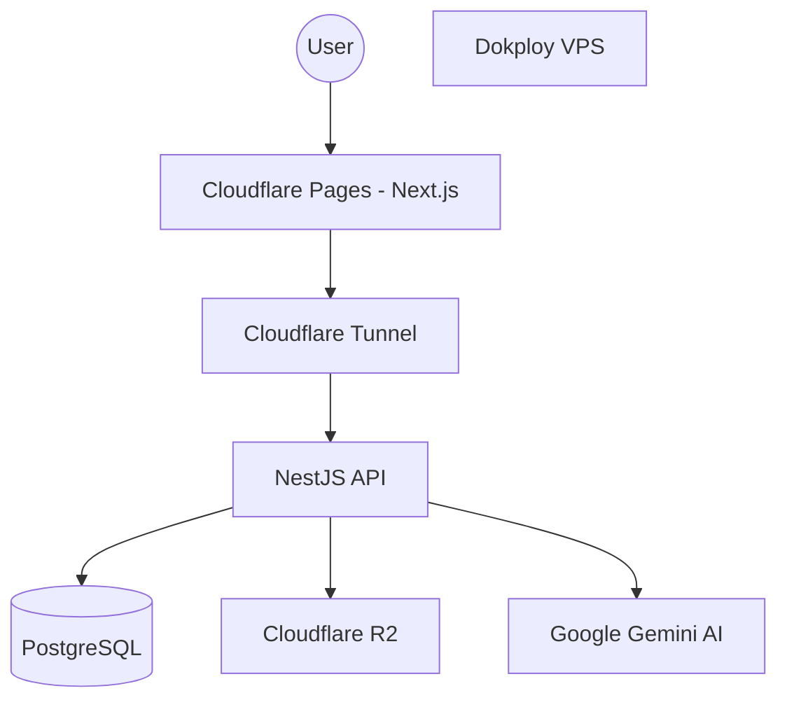
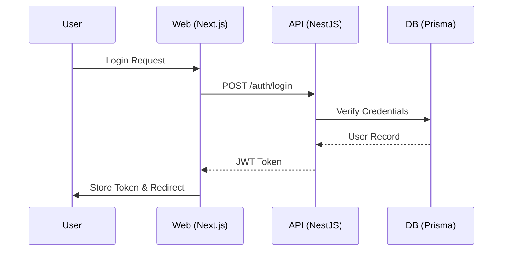

# Architecture Decision Records (ADR)

**Project:** V-EdFinance  
**Last Updated:** December 2025  
**Purpose:** Document key architectural decisions and their rationale for future reference.

---

## ADR-001: Next.js 15.1.2 + React 18.3.1 (Not Next.js 16)

**Date:** December 2025  
**Status:** ✅ Accepted  
**Decision Makers:** Technical Team

### Context
Next.js 16 was released with React 19 support, but caused critical issues in production:
- `next-intl` 3.26.3 was built for Next.js 15, causing incompatibility
- Missing root layout caused silent build failures (empty route manifests)
- Async params syntax changes broke existing code
- Unstable ecosystem (many libraries not yet compatible with React 19)

### Decision
**Stick with Next.js 15.1.2 + React 18.3.1** until the ecosystem stabilizes.

### Consequences
**Positive:**
- Proven stability with `next-intl` 3.26.3
- Mature ecosystem with extensive library support
- Predictable behavior, fewer edge cases
- Production-ready deployment confidence

**Negative:**
- Miss out on React 19 features (e.g., Server Actions improvements)
- Will need future migration when upgrading

### Migration Path
When upgrading to Next.js 16+ in the future:
1. Wait for `next-intl` official Next.js 16 support
2. Update all async params syntax (`Promise<{params}>`)
3. Ensure root layout exists
4. Test thoroughly with `pnpm build` verification

---

## ADR-002: Turborepo Monorepo Architecture

**Date:** December 2025  
**Status:** ✅ Accepted

### Context
Need to manage frontend (Next.js) and backend (NestJS) in a single repository with shared code.

### Decision
Use **Turborepo** for monorepo management with pnpm workspaces.

### Structure
```
apps/
  web/       # Next.js frontend (port 3000)
  api/       # NestJS backend (port 3001)
packages/
  ui/        # Shared React components (future)
  types/     # Shared TypeScript types (future)
```

### Rationale
- **Fast builds** with intelligent caching
- **Simple configuration** compared to Nx
- **Native pnpm support** for fast installs
- **Scalable** - can add more apps/packages easily

### Alternatives Considered
- **Nx:** More features but steeper learning curve
- **Lerna:** Less active development, slower builds
- **Separate repos:** Code duplication, harder to sync

---

## ADR-003: JSONB for Localized Content

**Date:** December 2025  
**Status:** ✅ Accepted

### Context
Need to support 3 languages (Vietnamese, English, Chinese) for course content.

### Decision
Use **PostgreSQL JSONB columns** for localized fields instead of separate translation tables.

### Schema Pattern
```prisma
model Course {
  title       Json  // { "vi": "...", "en": "...", "zh": "..." }
  description Json
}
```

### Rationale
**Pros:**
- Simpler queries (no JOINs)
- Atomic updates (all translations in one row)
- Flexible (easy to add new locales)
- Better performance for read-heavy workloads

**Cons:**
- Harder to query by specific language
- More complex validation logic
- Larger row sizes

### Alternatives Considered
- **Separate `translations` table:** More normalized but complex queries
- **Separate columns per locale:** Not scalable, schema changes for new languages
- **Separate tables per locale:** Difficult to maintain consistency

### Implementation Notes
```typescript
// Accessing localized content
const title = course.title[locale] || course.title['vi']; // Fallback to default

// Creating localized content
await prisma.course.create({
  data: {
    title: {
      vi: "Tài chính cơ bản",
      en: "Finance 101",
      zh: "金融基础"
    }
  }
});
```

---

## ADR-004: Cloudflare Pages + Dokploy VPS Deployment

**Date:** December 2025  
**Status:** ✅ Accepted

### Context
Need cost-effective, scalable deployment for global audience (Vietnam, China, International).

### Decision
**Frontend:** Cloudflare Pages (edge deployment)  
**Backend:** Dokploy on VPS (Docker orchestration)  
**Connection:** Cloudflare Tunnel (Argo)

### Architecture
```
User → Cloudflare Pages (Next.js SSR)
     → Cloudflare Tunnel → Dokploy VPS (NestJS + PostgreSQL)
```

### Rationale
**Cloudflare Pages:**
- Global CDN with edge locations in Asia
- Free tier generous for MVP
- Automatic HTTPS + DDoS protection
- Near-instant deployments

**Dokploy VPS:**
- Cheaper than managed PaaS for backend
- Full control over PostgreSQL
- Docker-based for easy scaling
- One-click GitHub deployments

**Cloudflare Tunnel:**
- Hides VPS IP from public internet (security)
- No need to open ports
- Automatic TLS encryption

### Alternatives Considered
- **Vercel:** More expensive for high traffic
- **AWS/GCP:** Overkill for MVP, complex billing
- **Heroku:** Deprecated free tier, expensive scaling
- **Railway/Render:** Good but less control than Dokploy

---

## ADR-005: Zustand for State Management

**Date:** December 2025  
**Status:** ✅ Accepted

### Context
Need lightweight state management for user authentication, course progress, and UI state.

### Decision
Use **Zustand** instead of Redux or Context API.

### Rationale
- **Minimal boilerplate** (20 lines vs 200 for Redux)
- **TypeScript-first** design
- **No providers** needed (unlike Context)
- **Devtools support** for debugging
- **Small bundle size** (~1KB)

### Example Usage
```typescript
// stores/authStore.ts
import { create } from 'zustand';

interface AuthState {
  user: User | null;
  login: (user: User) => void;
  logout: () => void;
}

export const useAuthStore = create<AuthState>((set) => ({
  user: null,
  login: (user) => set({ user }),
  logout: () => set({ user: null }),
}));
```

### Alternatives Considered
- **Redux Toolkit:** Overkill for edtech app size
- **Context API:** Re-render issues, verbose
- **Jotai/Recoil:** Atomic state not needed here

---

## ADR-006: Prisma ORM over TypeORM

**Date:** December 2025  
**Status:** ✅ Accepted

### Context
Need type-safe database access with good NestJS integration.

### Decision
Use **Prisma** as the ORM.

### Rationale
- **Type safety:** Auto-generated types from schema
- **Schema-first:** Declarative, easy to understand
- **Migrations:** Built-in, reliable
- **Prisma Studio:** GUI for database inspection
- **Better DX:** IntelliSense for queries

### Alternatives Considered
- **TypeORM:** More features but less type-safe, ActiveRecord pattern
- **MikroORM:** Good but smaller community
- **Raw SQL (pg):** Too low-level, no type safety

---

## ADR-007: Atomic Design Component Structure

**Date:** December 2025  
**Status:** ✅ Accepted

### Context
Need scalable, reusable component organization for growing frontend.

### Decision
Adopt **Atomic Design** methodology.

### Structure
```
components/
  atoms/       # Button, Input, Icon
  molecules/   # SearchBar, Card, FormField
  organisms/   # Navbar, CourseCard, LessonPlayer
  templates/   # PageLayout, DashboardLayout
```

### Rationale
- Clear hierarchy and responsibility
- Easy to find components
- Promotes reusability
- Industry standard pattern

---

## ADR-008: Google Gemini for AI Features

**Date:** December 2025  
**Status:** ✅ Accepted

### Context
Need AI for personalized learning, content generation, and Q&A.

### Decision
Use **Google Gemini 1.5 Pro** API.

### Rationale
- **Multimodal:** Text, images, video (future features)
- **Large context window:** 1M tokens (can process full courses)
- **Multilingual:** Native Vietnamese/Chinese support
- **Cost-effective:** Better pricing than GPT-4
- **JSON mode:** Structured outputs for quizzes, etc.

### Alternatives Considered
- **OpenAI GPT-4:** More expensive, weaker multilingual
- **Claude:** Not available in Vietnam
- **Open-source LLMs:** Require hosting, less capable

---

## Future ADRs to Document

- [x] ADR-009: Testing Strategy (Jest + Playwright)
- [x] ADR-010: Authentication (JWT vs Session)
- [x] ADR-011: File Storage (Cloudflare R2)
- [ ] ADR-012: Real-time Features (WebSockets vs SSE)
- [ ] ADR-013: Analytics Platform (Mixpanel vs PostHog)
- [x] ADR-014: Beads Task Management
- [x] ADR-015: R2 Integration Strategy
- [x] ADR-016: Beads CI/CD Integration

---

## ADR-011: File Storage (Cloudflare R2)
... [existing content] ...

---

## ADR-014: Beads Task Management
... [existing content] ...

---

## ADR-015: R2 Integration Strategy

**Date:** December 2025  
**Status:** ✅ Accepted

### Context
Need a standard way to handle large file uploads (course videos, high-res assets) avoiding server bottlenecks.

### Decision
Use **S3 Presigned URLs** via Cloudflare R2 for direct client-to-storage uploads.

### Rationale
- **Offload API**: Backend only generates signed URLs; heavy lifting is handled by Cloudflare.
- **Security**: Expiring tokens ensure uploads are authorized.

---

## ADR-016: Beads CI/CD Integration

**Date:** December 2025  
**Status:** ✅ Accepted

### Context
Ensure task status reflects actual development progress automatically.

### Decision
Integrate `bd` CLI into the development lifecycle via `AGENTS.md` protocols and git hooks.

### Rationale
- **Single Source of Truth**: Beads becomes the definitive state of the project.
- **Agent Accountability**: Automated `bd doctor` checks ensure zero-debt engineering.

---

## System Diagrams

### High-Level Architecture


### Authentication Flow


## How to Use This Document

1. **Before making major decisions:** Review existing ADRs
2. **When proposing changes:** Write a new ADR
3. **Update status:** Mark as `Accepted`, `Rejected`, or `Superseded`
4. **Reference in code:** Link to ADRs in comments for complex decisions

**Template for New ADRs:**
```markdown
## ADR-XXX: Title

**Date:** YYYY-MM
**Status:** 🔄 Proposed / ✅ Accepted / ❌ Rejected

### Context
[Why this decision is needed]

### Decision
[What was decided]

### Rationale
[Why this approach was chosen]

### Consequences
**Positive:** [Benefits]
**Negative:** [Tradeoffs]

### Alternatives Considered
[Other options evaluated]
```
