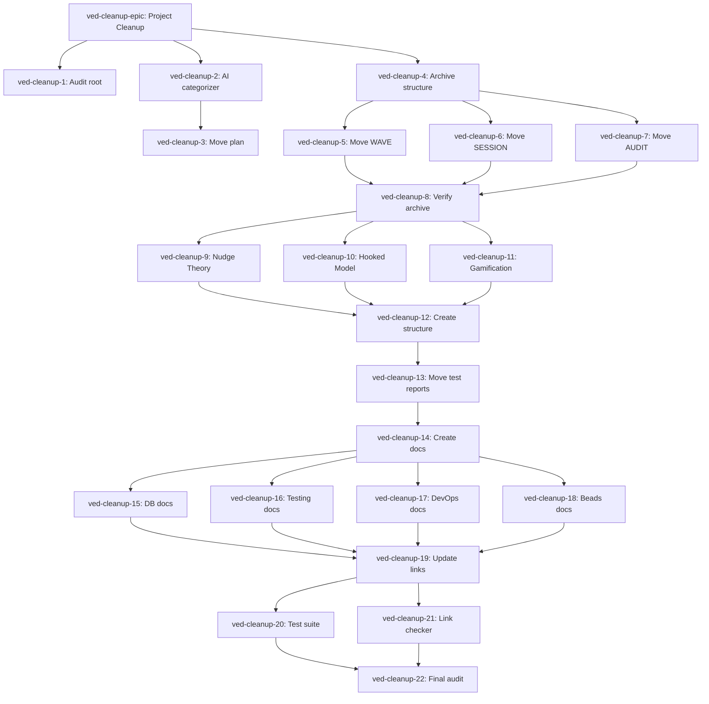

# 🗺️ Beads Task Execution Roadmap
**Date:** 2026-01-03 05:30  
**Total Tasks:** 22 tasks across 3 phases  
**Total Time:** 13 hours (3 sessions)

---

## 📊 QUICK REFERENCE

```
EPIC: ved-cleanup-epic
├─ PHASE 1 (5h): ved-cleanup-1  → ved-cleanup-8  (AI Categorization + Archive)
├─ PHASE 2 (4h): ved-cleanup-9  → ved-cleanup-13 (Extract EdTech Knowledge)
└─ PHASE 3 (4h): ved-cleanup-14 → ved-cleanup-22 (Consolidate + Verify)
```

---

## 🎯 TASK DEPENDENCY GRAPH



---

## 📋 PHASE 1: AI CATEGORIZATION + ARCHIVE (5 hours)

### Task Sequence

```
START
  ↓
[ved-cleanup-1] Audit root directory files (30 min)
  ├─ List all .md files in root
  ├─ Count: expect 201 files
  └─ Document file categories
  ↓
[ved-cleanup-2] Create AI categorization engine (1 hour) ⚡ AI-POWERED
  ├─ Build scripts/cleanup/ai-categorizer.ts
  ├─ Use Google Gemini 2.0 Flash API
  ├─ Categorize into: archive/edtech/testing/database/devops/core/delete
  └─ Output JSON categorization
  ↓
[ved-cleanup-3] Generate automated move plan (30 min)
  ├─ Read AI categorization output
  ├─ Generate PowerShell move script
  ├─ Include dry-run capability
  └─ Review generated script
  ↓
[ved-cleanup-4] Create archive directory structure (30 min)
  ├─ docs/archive/2025-12/session-reports/
  ├─ docs/archive/2025-12/test-waves/
  ├─ docs/archive/2025-12/completion-reports/
  └─ docs/archive/2025-12/audits/
  ↓
[ved-cleanup-5] Move WAVE reports (30 min)
[ved-cleanup-6] Move SESSION reports (30 min)
[ved-cleanup-7] Move AUDIT reports (30 min)
  ├─ Execute move script (dry-run first!)
  ├─ Review dry-run output
  └─ Execute live move
  ↓
[ved-cleanup-8] Verify archive integrity (30 min)
  ├─ Run verification script
  ├─ Check file counts
  ├─ Verify no orphans in root
  └─ Git commit: "chore: Archive historical reports"
  ↓
END PHASE 1
```

### Success Criteria Phase 1
```
✅ ~60 files moved to docs/archive/2025-12/
✅ Root directory reduced by ~30%
✅ Zero files lost
✅ Git committed
```

---

## 📋 PHASE 2: EXTRACT EDTECH KNOWLEDGE (4 hours)

### Task Sequence

```
START (after Phase 1 complete)
  ↓
[ved-cleanup-9]  Extract Nudge Theory (45 min) ⚡ AI-POWERED
[ved-cleanup-10] Extract Hooked Model (45 min) ⚡ AI-POWERED
[ved-cleanup-11] Extract Gamification (45 min) ⚡ AI-POWERED
  ├─ Build scripts/cleanup/extract-edtech-knowledge.ts
  ├─ Use Google Gemini 1.5 Pro API
  ├─ Extract from SPEC.md (lines 425-443)
  ├─ Generate markdown files
  └─ Review extracted content (human validation!)
  ↓
[ved-cleanup-12] Create behavioral-design structure (30 min)
  ├─ docs/behavioral-design/nudge-theory/
  ├─ docs/behavioral-design/hooked-model/
  ├─ docs/behavioral-design/gamification/
  ├─ docs/behavioral-design/ai-behavioral/
  └─ docs/behavioral-design/test-reports/
  ↓
[ved-cleanup-13] Move EdTech test reports (30 min)
  ├─ GAMIFICATION_TEST_REPORT.md
  ├─ LOSS_AVERSION_TEST_REPORT.md
  ├─ SOCIAL_PROOF_TEST_REPORT.md
  ├─ COMMITMENT_CONTRACTS_TEST_REPORT.md
  ├─ NUDGE_TRIGGER_TEST_REPORT.md
  └─ MARKET_SIMULATION_TEST_REPORT.md
  ↓
  Git commit: "docs: Extract EdTech behavioral design knowledge"
  ↓
END PHASE 2
```

### Success Criteria Phase 2
```
✅ docs/behavioral-design/ created with 4 categories
✅ All patterns extracted from SPEC.md
✅ 6 test reports moved
✅ Zero knowledge loss (human verified)
✅ Git committed
```

---

## 📋 PHASE 3: CONSOLIDATE + VERIFY (4 hours)

### Task Sequence

```
START (after Phase 2 complete)
  ↓
[ved-cleanup-14] Create complete docs structure (30 min)
  ├─ docs/behavioral-design/ (already created)
  ├─ docs/ai-behavioral/
  ├─ docs/testing/
  ├─ docs/database/ (verify existing)
  ├─ docs/beads/
  ├─ docs/devops/
  ├─ docs/git-workflows/
  └─ docs/ai-testing/
  ↓
[ved-cleanup-15] Move database docs (15 min)
[ved-cleanup-16] Move testing docs (30 min)
[ved-cleanup-17] Move DevOps docs (30 min)
[ved-cleanup-18] Move Beads docs (15 min)
  ├─ Execute consolidation script (dry-run)
  ├─ Review dry-run output
  └─ Execute live move
  ↓
[ved-cleanup-19] Update all documentation links (1 hour) ⚡ AUTOMATED
  ├─ Build scripts/cleanup/update-links.ts
  ├─ Scan AGENTS.md, SPEC.md, README.md
  ├─ Update all [text](old-path.md) → [text](docs/category/old-path.md)
  └─ Verify no broken links
  ↓
[ved-cleanup-20] Run test suite (30 min)
  ├─ pnpm test
  ├─ Verify 98.7% pass rate maintained
  └─ Fix any failures immediately
  ↓
[ved-cleanup-21] Check for broken links (30 min)
  ├─ Run link checker script
  ├─ Verify all links resolve
  └─ Fix broken links
  ↓
[ved-cleanup-22] Final cleanup audit (30 min)
  ├─ Count root .md files (expect ≤15)
  ├─ Run beads.exe doctor
  ├─ Verify all knowledge preserved
  ├─ Git status (should be clean)
  └─ Git commit: "docs: Complete documentation cleanup"
  ↓
  Git push (MANDATORY)
  ↓
END PHASE 3
```

### Success Criteria Phase 3
```
✅ Root directory: ≤15 .md files
✅ All tests passing (98.7%+)
✅ Zero broken links
✅ All documentation organized
✅ Git committed and pushed
```

---

## 🚀 EXECUTION COMMANDS

### Initial Setup
```powershell
# 1. Create all beads tasks
.\scripts\cleanup\create-beads-tasks.ps1

# 2. Verify tasks created
.\beads.exe list --tags cleanup

# 3. Get AI recommendation for first task
.\bv.exe --robot-next

# 4. View ready work
.\beads.exe ready
```

### During Execution
```powershell
# Start working on a task
.\beads.exe update ved-cleanup-1 --status in_progress

# Complete a task
.\beads.exe close ved-cleanup-1 --reason "Completed audit: 201 .md files in root"

# Get next task recommendation
.\bv.exe --robot-next

# Check dependency status
.\beads.exe show ved-cleanup-8
```

### Health Checks
```powershell
# Check beads health
.\beads.exe doctor

# View cleanup progress
.\beads.exe list --tags cleanup --status completed

# View graph insights
.\bv.exe --robot-insights
```

---

## 🎯 PRIORITY MATRIX

### Must Complete First (Blockers)
```
1. ved-cleanup-1  (Audit) - No dependencies
2. ved-cleanup-2  (AI categorizer) - No dependencies
3. ved-cleanup-4  (Archive structure) - No dependencies
```

### Can Run in Parallel
```
Phase 1: ved-cleanup-5, ved-cleanup-6, ved-cleanup-7 (after ved-cleanup-4)
Phase 2: ved-cleanup-9, ved-cleanup-10, ved-cleanup-11 (after ved-cleanup-8)
Phase 3: ved-cleanup-15, ved-cleanup-16, ved-cleanup-17, ved-cleanup-18 (after ved-cleanup-14)
```

### Critical Path (Must Not Fail)
```
ved-cleanup-2  (AI categorizer) → Foundation for all moves
ved-cleanup-8  (Verify archive) → Blocks Phase 2
ved-cleanup-19 (Update links)   → Prevents broken links
ved-cleanup-22 (Final audit)    → Deployment readiness
```

---

## ⏱️ TIME ESTIMATES

| Task ID | Name | Estimate | Type |
|---------|------|----------|------|
| ved-cleanup-1 | Audit | 30 min | Manual |
| ved-cleanup-2 | AI categorizer | 60 min | Coding + AI |
| ved-cleanup-3 | Move plan | 30 min | Automation |
| ved-cleanup-4 | Archive structure | 30 min | Setup |
| ved-cleanup-5 | Move WAVE | 30 min | Automated |
| ved-cleanup-6 | Move SESSION | 30 min | Automated |
| ved-cleanup-7 | Move AUDIT | 30 min | Automated |
| ved-cleanup-8 | Verify archive | 30 min | Verification |
| **PHASE 1 TOTAL** | | **5 hours** | |
| ved-cleanup-9 | Nudge Theory | 45 min | AI Extraction |
| ved-cleanup-10 | Hooked Model | 45 min | AI Extraction |
| ved-cleanup-11 | Gamification | 45 min | AI Extraction |
| ved-cleanup-12 | EdTech structure | 30 min | Setup |
| ved-cleanup-13 | Move reports | 30 min | Automated |
| **PHASE 2 TOTAL** | | **4 hours** | |
| ved-cleanup-14 | Docs structure | 30 min | Setup |
| ved-cleanup-15 | DB docs | 15 min | Verification |
| ved-cleanup-16 | Testing docs | 30 min | Automated |
| ved-cleanup-17 | DevOps docs | 30 min | Automated |
| ved-cleanup-18 | Beads docs | 15 min | Automated |
| ved-cleanup-19 | Update links | 60 min | Automation |
| ved-cleanup-20 | Test suite | 30 min | Verification |
| ved-cleanup-21 | Link checker | 30 min | Verification |
| ved-cleanup-22 | Final audit | 30 min | Verification |
| **PHASE 3 TOTAL** | | **4 hours** | |
| **GRAND TOTAL** | | **13 hours** | |

---

## 📝 SESSION PLANNING

### Session 1 (Friday Evening - 5 hours)
```
19:00 - 19:30  ved-cleanup-1  Audit
19:30 - 20:30  ved-cleanup-2  AI categorizer ⚡
20:30 - 21:00  ved-cleanup-3  Move plan
21:00 - 21:30  ved-cleanup-4  Archive structure
21:30 - 22:30  ved-cleanup-5,6,7  Move files
22:30 - 23:00  ved-cleanup-8  Verify archive
23:00 - 23:15  Git commit + break
✅ Phase 1 Complete
```

### Session 2 (Saturday Morning - 4 hours)
```
09:00 - 11:00  ved-cleanup-9,10,11  AI extraction ⚡
11:00 - 11:30  ved-cleanup-12  EdTech structure
11:30 - 12:00  ved-cleanup-13  Move reports
12:00 - 12:15  Git commit + break
✅ Phase 2 Complete
```

### Session 3 (Saturday Afternoon - 4 hours)
```
14:00 - 14:30  ved-cleanup-14  Docs structure
14:30 - 15:30  ved-cleanup-15,16,17,18  Move docs
15:30 - 16:30  ved-cleanup-19  Update links ⚡
16:30 - 17:00  ved-cleanup-20  Test suite
17:00 - 17:30  ved-cleanup-21  Link checker
17:30 - 18:00  ved-cleanup-22  Final audit
18:00 - 18:15  Git commit + push
✅ Phase 3 Complete
✅ PROJECT CLEANUP COMPLETE
```

---

## 🎯 QUICK START GUIDE

```powershell
# 1. Create all tasks
.\scripts\cleanup\create-beads-tasks.ps1

# 2. Verify tasks
.\beads.exe list --tags cleanup | measure

# Expected output: 22 tasks

# 3. Get AI recommendation
.\bv.exe --robot-next

# 4. Start first task
.\beads.exe update ved-cleanup-1 --status in_progress

# 5. Begin execution!
```

---

**Created:** 2026-01-03 05:30  
**Status:** 🎯 **READY FOR EXECUTION**  
**First Task:** ved-cleanup-1 (Audit root directory)  
**Estimated Completion:** 13 hours across 3 sessions
