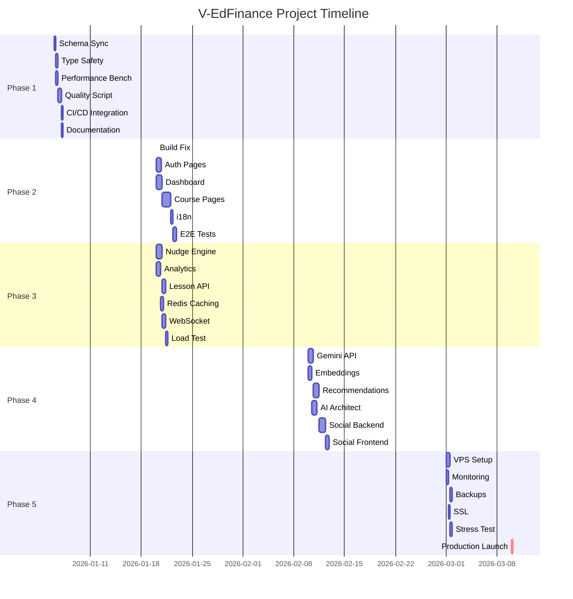

# 📅 Project Timeline - Gantt Chart (V-EdFinance)

**Epic:** ved-5ti - Project Analysis & Work Breakdown  
**Version:** 1.0  
**Date:** 2026-01-03  
**Timeline:** 8 weeks (Jan 6 - Mar 14, 2026)

---

## Executive Timeline Overview

```
Jan 6 ──────────────────────────────────────────────────── Mar 14
 │      Phase 1        Phase 2+3 (Parallel)   Phase 4    Phase 5
 │     1.5 weeks         2.5 weeks           2.5 weeks   1.5 weeks
 └──────────────────────────────────────────────────────────────→
        Quality         Frontend+Backend      AI Features  Production
```

---

## Gantt Chart (ASCII Visual)

```
Week      | 1    | 2    | 3    | 4    | 5    | 6    | 7    | 8    |
------------------------------------------------------------------------
Phase 1   |######|##    |      |      |      |      |      |      |
Phase 2   |      |      |######|######|##    |      |      |      |
Phase 3   |      |      |######|######|##    |      |      |      |
Phase 4   |      |      |      |      |      |######|######|##    |
Phase 5   |      |      |      |      |      |      |      |######|
------------------------------------------------------------------------
Milestones:
  W1.5: Quality Gate ✅
  W4.5: Frontend+Behavioral ✅
  W6.5: AI Features ✅
  W8: Production Launch 🚀
```

---

## Detailed Phase Timeline

### Week 1-2: Phase 1 - Quality Gate (1.5 weeks)

**Duration:** Jan 6-19, 2026  
**Owner:** Backend + QA Teams  
**Total Effort:** 40 hours

#### Week 1 (Jan 6-12)
```
Mon Jan 6:  
  - [Backend-1] Schema sync verification (4h)
  - [Backend-2] Type safety refactor START (8h task)

Tue Jan 7:
  - [Backend-2] Type safety refactor CONTINUE
  - [QA-1] Performance benchmarking START (8h task)

Wed Jan 8:
  - [Backend-2] Type safety refactor COMPLETE ✅
  - [QA-1] Performance benchmarking COMPLETE ✅
  - [Backend-3] Quality gate script START (12h task)

Thu Jan 9:
  - [Backend-3] Quality gate script CONTINUE

Fri Jan 10:
  - [Backend-3] Quality gate script CONTINUE
  - [Backend-4] Documentation START (4h task)

Sat-Sun Jan 11-12:
  - Buffer / Overflow work
```

#### Week 2 (Jan 13-19)
```
Mon Jan 13:
  - [Backend-3] Quality gate script COMPLETE ✅
  - [DevOps-1] CI/CD integration START (4h)

Tue Jan 14:
  - [DevOps-1] CI/CD integration COMPLETE ✅
  - [Backend-4] Documentation COMPLETE ✅

Wed Jan 15:
  - [QA-1,2] Full quality gate test run
  - Sprint review & retrospective

Thu Jan 16:
  - Phase 1 COMPLETE ✅
  - Phase 2+3 prep & kickoff meeting

Fri-Sun Jan 17-19:
  - Buffer (0.5 week contingency)
```

**Milestone:** ✅ Quality Gate Operational

---

### Week 3-4.5: Phase 2+3 - Frontend + Behavioral (2.5 weeks)

**Duration:** Jan 20 - Feb 9, 2026  
**Owner:** Frontend + Backend Teams (PARALLEL)  
**Total Effort:** 152 hours (80h Phase 2 + 72h Phase 3)

#### Week 3 (Jan 20-26) - Sprint 1

**Phase 2 (Frontend):**
```
Mon Jan 20:
  - [Frontend-1] Fix lucide-react build (1h) ✅
  - [Frontend-1] Auth pages START (16h task)
  - [Frontend-2] Dashboard layout START (20h task)

Tue Jan 21:
  - [Frontend-1] Auth pages CONTINUE
  - [Frontend-2] Dashboard layout CONTINUE
  - [Frontend-3] Course listing START (16h task)

Wed Jan 22:
  - [Frontend-1] Auth pages COMPLETE ✅
  - [Frontend-2] Dashboard layout CONTINUE
  - [Frontend-3] Course listing CONTINUE

Thu Jan 23:
  - [Frontend-2] Dashboard layout CONTINUE
  - [Frontend-3] Course listing COMPLETE ✅
  - [Frontend-3] Course detail START (12h)

Fri Jan 24:
  - [Frontend-2] Dashboard layout COMPLETE ✅
  - [Frontend-3] Course detail CONTINUE
  - [Backend-1] API integration START (8h)
```

**Phase 3 (Behavioral - PARALLEL):**
```
Mon Jan 20:
  - [Backend-2] Nudge engine START (20h task)
  - [Backend-3] Learning analytics START (16h task)

Tue Jan 21:
  - [Backend-2] Nudge engine CONTINUE
  - [Backend-3] Analytics CONTINUE
  - [Backend-4] Lesson player API START (12h)

Wed Jan 22:
  - [Backend-2] Nudge engine CONTINUE
  - [Backend-3] Analytics COMPLETE ✅
  - [Backend-4] Lesson API CONTINUE

Thu Jan 23:
  - [Backend-2] Nudge engine COMPLETE ✅
  - [Backend-3] WebSocket integration START (12h)
  - [Backend-4] Lesson API COMPLETE ✅

Fri Jan 24:
  - [Backend-2] Redis caching START (8h)
  - [Backend-3] WebSocket CONTINUE
```

#### Week 4 (Jan 27 - Feb 2) - Sprint 2

**Phase 2 (Frontend):**
```
Mon Jan 27:
  - [Frontend-3] Course detail COMPLETE ✅
  - [Frontend-2] i18n translation START (8h)
  - [Backend-1] API integration COMPLETE ✅

Tue Jan 28:
  - [Frontend-2] i18n translation COMPLETE ✅
  - [QA-2] E2E tests START (12h)

Wed Jan 29:
  - [QA-2] E2E tests CONTINUE
  - [Frontend-1] Performance optimization START (8h)

Thu Jan 30:
  - [QA-2] E2E tests COMPLETE ✅
  - [Frontend-1] Performance optimization COMPLETE ✅
```

**Phase 3 (Behavioral - PARALLEL):**
```
Mon Jan 27:
  - [Backend-2] Redis caching COMPLETE ✅
  - [Backend-3] WebSocket COMPLETE ✅
  - [QA-3] Load testing setup START (8h)

Tue Jan 28:
  - [QA-3] Load testing COMPLETE ✅
  - [QA-3] Stress test execution START (4h)

Wed Jan 29:
  - [QA-3] Stress test COMPLETE ✅
  - [Backend-4] Performance tuning START (8h)

Thu Jan 30:
  - [Backend-4] Performance tuning COMPLETE ✅
```

#### Week 4.5 (Feb 3-9) - Integration & Buffer

```
Mon Feb 3:
  - Phase 2+3 integration testing
  - Bug fixes & polish

Tue Feb 4:
  - Sprint review & demo
  - Retrospective

Wed-Sun Feb 5-9:
  - Buffer (0.5 week contingency)
  - Phase 4 prep
```

**Milestones:** 
- ✅ Frontend Live (Auth, Dashboard, Courses)
- ✅ Behavioral UX Operational (Nudges, Analytics)

---

### Week 5-6.5: Phase 4 - AI Features (2.5 weeks)

**Duration:** Feb 10-28, 2026  
**Owner:** AI/ML + Backend + Frontend Teams  
**Total Effort:** 80 hours

#### Week 5 (Feb 10-16) - AI Core

```
Mon Feb 10:
  - [AI-1] Gemini API integration START (16h)
  - [AI-2] PgvectorService embeddings START (12h)

Tue Feb 11:
  - [AI-1] Gemini integration CONTINUE
  - [AI-2] Embeddings CONTINUE

Wed Feb 12:
  - [AI-1] Gemini integration COMPLETE ✅
  - [AI-2] Embeddings COMPLETE ✅
  - [AI-1] Recommendation engine START (20h)

Thu Feb 13:
  - [AI-1] Recommendation engine CONTINUE
  - [AI-2] AI Database Architect START (16h)

Fri Feb 14:
  - [AI-1] Recommendation engine CONTINUE
  - [AI-2] AI Architect CONTINUE
  - [Backend-2] Buddy groups START (12h)
```

#### Week 6 (Feb 17-23) - Social & Integration

```
Mon Feb 17:
  - [AI-1] Recommendation engine COMPLETE ✅
  - [AI-2] AI Architect CONTINUE
  - [Backend-2] Buddy groups CONTINUE

Tue Feb 18:
  - [AI-2] AI Architect COMPLETE ✅
  - [Backend-2] Buddy groups COMPLETE ✅
  - [Backend-2] Social feed START (8h)

Wed Feb 19:
  - [Backend-2] Social feed COMPLETE ✅
  - [Frontend-2] Social UI START (12h)

Thu Feb 20:
  - [Frontend-2] Social UI CONTINUE
  - [DevOps-2] Staging deployment START (4h)

Fri Feb 21:
  - [Frontend-2] Social UI COMPLETE ✅
  - [DevOps-2] Staging COMPLETE ✅
  - [QA-2] Integration tests START (8h)
```

#### Week 6.5 (Feb 24-28) - Testing & Buffer

```
Mon Feb 24:
  - [QA-2] Integration tests COMPLETE ✅
  - Bug fixes

Tue Feb 25:
  - Sprint review & demo
  - Retrospective

Wed-Fri Feb 26-28:
  - Buffer (0.5 week contingency)
  - Phase 5 prep
```

**Milestone:** ✅ AI Features Live (Gemini, Recommendations, Social)

---

### Week 7-8: Phase 5 - Production Launch (1.5 weeks)

**Duration:** Mar 1-14, 2026  
**Owner:** DevOps + QA Teams  
**Total Effort:** 52 hours

#### Week 7 (Mar 1-7) - Infrastructure

```
Mon Mar 1:
  - [DevOps-1] VPS production setup START (12h)
  - [DevOps-2] Monitoring dashboards START (8h)

Tue Mar 2:
  - [DevOps-1] VPS setup CONTINUE
  - [DevOps-2] Monitoring CONTINUE

Wed Mar 3:
  - [DevOps-1] VPS setup COMPLETE ✅
  - [DevOps-2] Monitoring COMPLETE ✅
  - [DevOps-1] Backup automation START (8h)
  - [DevOps-2] SSL & security START (4h)

Thu Mar 4:
  - [DevOps-1] Backup automation COMPLETE ✅
  - [DevOps-2] SSL COMPLETE ✅
  - [QA-1] Production stress test START (8h)

Fri Mar 5:
  - [QA-1] Stress test COMPLETE ✅
  - [DevOps-1] DR drill START (4h)
  - [Backend-3] Security audit START (8h)
```

#### Week 8 (Mar 8-14) - Launch Week 🚀

```
Mon Mar 8:
  - [DevOps-1] DR drill COMPLETE ✅
  - [Backend-3] Security audit COMPLETE ✅
  - Final pre-launch checks

Tue Mar 9:
  - [DevOps-2] Production launch START (4h)
  - Go/No-go meeting

Wed Mar 10:
  - 🚀 PRODUCTION LAUNCH 🚀
  - [DevOps-2] Launch COMPLETE ✅
  - Post-launch monitoring (24h)

Thu Mar 11:
  - Production validation
  - Performance monitoring

Fri Mar 12:
  - Sprint review & retrospective
  - Project completion celebration 🎉

Sat-Sun Mar 13-14:
  - Buffer / stabilization
```

**Milestone:** 🚀 PRODUCTION LIVE (99.9% uptime target)

---

## Critical Path Analysis

### Longest Dependency Chain (56 hours)

```
Phase 1: Schema Sync (4h)
   ↓
Phase 1: Performance Benchmark (8h)
   ↓
Phase 1: Quality Script (12h)
   ↓
Phase 2: Build Fix (1h)
   ↓
Phase 2: Auth Pages (16h)
   ↓
Phase 2: E2E Tests (12h)
   ↓
Phase 5: Launch (4h)

TOTAL CRITICAL PATH: 57 hours
```

**Analysis:** 57h / 8 weeks = **7h per week minimum pace**

Any delay on critical path tasks impacts overall timeline.

---

## Parallel Work Streams

### Maximum Parallelization Windows

**Week 3-4 (Phase 2+3):**
- Stream 1: Frontend Team (3 agents)
- Stream 2: Backend Team (4 agents)
- Stream 3: QA Team (1 agent)
- **Total:** 8 agents working simultaneously

**Week 5-6 (Phase 4):**
- Stream 1: AI/ML Team (2 agents)
- Stream 2: Backend Team (1 agent)
- Stream 3: Frontend Team (1 agent)
- **Total:** 4 agents working simultaneously

---

## Buffer Management

### Built-in Buffers (Total: 2 weeks)

| Phase | Buffer | Purpose |
|-------|--------|---------|
| Phase 1 | 0.5 weeks | Schema migration issues |
| Phase 2+3 | 0.5 weeks | Integration complexity |
| Phase 4 | 0.5 weeks | AI API rate limits |
| Phase 5 | 0.5 weeks | Production issues |

**Usage Rule:** Only consume buffer if critical path delayed

---

## Milestone Tracking

### Weekly Check-ins (Every Friday)

```yaml
Week 1 (Jan 10):
  Status: Phase 1 in progress
  Blockers: None expected
  Next: Complete quality gate

Week 2 (Jan 17):
  Status: Phase 1 complete ✅
  Milestone: Quality gate operational
  Next: Start Phase 2+3

Week 3 (Jan 24):
  Status: Phase 2+3 50% complete
  Blockers: Monitor frontend complexity
  Next: Continue parallel work

Week 4 (Jan 31):
  Status: Phase 2+3 90% complete
  Milestone: Frontend + Behavioral ready
  Next: Integration testing

Week 5 (Feb 7):
  Status: Phase 2+3 complete ✅
  Milestone: Core features live
  Next: Start Phase 4 (AI)

Week 6 (Feb 14):
  Status: Phase 4 50% complete
  Blockers: Monitor Gemini API quota
  Next: Social features

Week 7 (Feb 21):
  Status: Phase 4 complete ✅
  Milestone: AI features live
  Next: Start Phase 5 (Production)

Week 8 (Feb 28):
  Status: Phase 5 in progress
  Blockers: VPS configuration
  Next: Production launch

Week 9 (Mar 7):
  Status: Phase 5 near complete
  Milestone: Pre-launch checks
  Next: Go/No-go decision

Week 10 (Mar 14):
  Status: PRODUCTION LIVE 🚀
  Milestone: Project complete
  Next: Monitoring & support
```

---

## Gantt Chart (Mermaid Diagram)



---

## Next Steps

1. **Share Timeline:** Distribute to all teams (Week 1, Day 1)
2. **Assign Tasks:** Map agents to tasks in Beads (Week 1, Day 1)
3. **Daily Standups:** 15-min sync (async via Beads dashboard)
4. **Weekly Reviews:** Friday retrospectives + planning
5. **Adjust as Needed:** Reallocate resources based on velocity

---

**Status:** 🟢 APPROVED FOR EXECUTION  
**Start Date:** January 6, 2026  
**Launch Date:** March 10, 2026 (Target)  
**Total Duration:** 8 weeks + 2 weeks buffer
