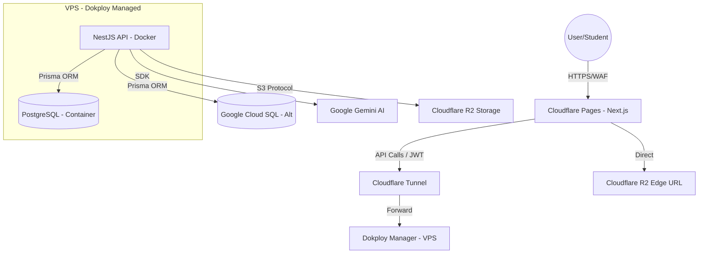

# Project Specification: Lúa Hóa Edtech (V-EdFinance)
**Version:** 1.1.0  
**Role:** Senior Software Architect Source of Truth  
**Supported Languages:** English (Technical), Tiếng Việt, 简体中文 (Operations)

---

## 1. Technology Stack & Version Constraints / Ngăn xếp Công nghệ & Ràng buộc Phiên bản / 技术栈与版本约束

To ensure long-term stability and prevent technical debt, the following versions MUST be strictly enforced:

### 1.1 Frontend Stack
- **Next.js:** `15.1.2` (App Router)
- **React:** `18.3.1`
- **React DOM:** `18.3.1`
- **@types/react:** `^18.3.12`
- **@types/react-dom:** `^18.3.1`
- **next-intl:** `3.26.3` (i18n library)
- **zustand:** `^5.0.2` (State management)
- **eslint-config-next:** `15.1.2`

### 1.2 Backend Stack
- **NestJS:** `^10.0.0`
- **Prisma:** `^5.0.0`
- **PostgreSQL:** `16` (Docker container)
- **Node.js:** `20.x LTS`

### 1.3 Required File Structure
```
apps/web/src/
├── app/
│   ├── layout.tsx           # ⚠️ MANDATORY: Root layout (returns children only)
│   ├── page.tsx             # Root redirect to default locale
│   └── [locale]/
│       ├── layout.tsx       # Locale-specific layout with next-intl provider
│       ├── page.tsx         # Home page
│       ├── (auth)/          # Auth route group
│       ├── dashboard/       # Dashboard routes
│       └── courses/         # Course routes
├── middleware.ts            # next-intl locale detection
└── messages/                # Translation files (en.json, vi.json, zh.json)
```

**CRITICAL:** The root `layout.tsx` is mandatory in Next.js 15+ App Router. Without it, the build will fail silently and no routes will be generated.

---

## 2. System Architecture Overview / Tổng quan Kiến trúc / 系统架构概览

The system follows a modern decoupled architecture, leveraging Cloudflare for edge performance and Dokploy for flexible VPS-based backend orchestration.



---

## 3. Database Schema (ERD-Ready) / Sơ đồ Cơ sở dữ liệu / 数据库架构

Designed for scalability, multi-role access, and high-resolution behavioral tracking. **Localized fields updated to JSONB.**

### 3.1 Core Entities (Prisma DSL Style)

#### **User & Authentication**
- `id`: UUID (Primary Key)
- `email`: String (Unique)
- `passwordHash`: String
- `role`: Enum (STUDENT, TEACHER, ADMIN)
- `points`: Int (Default 0)
- `preferredLocale`: String (Default 'vi', values: 'en', 'vi', 'zh')
- `metadata`: Json (Preferences, display name, etc.)

#### **Learning Content (Localized)**
- `Course`: 
    - `id`: UUID
    - `slug`: String
    - `title`: Json (e.g., `{ "en": "...", "vi": "...", "zh": "..." }`)
    - `description`: Json (Localized)
    - `thumbnailKey`: String
    - `price`: Int
    - `level`: Enum (BEGINNER, INTERMEDIATE, EXPERT)
- `Lesson`: 
    - `id`: UUID
    - `courseId`: UUID (FK)
    - `title`: Json (Localized)
    - `content`: Json (Localized Markdown/JSON)
    - `videoKey`: Json (Localized if different voiceovers, else String)
    - `order`: Int
    - `type`: Enum (VIDEO, READING, QUIZ)

#### **Progress & Gamification**
- `UserProgress`: 
    - `userId`: UUID (FK)
    - `lessonId`: UUID (FK)
    - `status`: Enum (STARTED, COMPLETED)
    - `durationSpent`: Int (Seconds)
- `Badge`: 
    - `id`: UUID
    - `name`: Json (Localized)
    - `iconKey`: String

#### **Fintech Behavioral Engine (BehavioralData)**
- `BehaviorLog`: `userId`, `sessionId`, `path`, `eventType` (Enum), `payload` (Json), `timestamp`.

#### **Investment Profile**
- `InvestmentProfile`: `userId`, `riskScore`, `investmentPhilosophy` (Localized Json), `financialGoals` (Json), `currentKnowledge`.

---

## 4. AI Generation JSON Interface (Gemini) / Giao diện AI / AI 接口

Integration with `gemini-1.5-pro` for personalized mentoring in the user's preferred language.

**Input (To Gemini):**
```json
{
  "context": {
    "module": "Technical Analysis 101",
    "lesson": "RSI Divergence",
    "user_query": "Tại sao RSI tăng mà giá lại giảm?",
    "locale": "vi" 
  },
  "user_profile": { "knowledge_level": "Beginner", "style_preference": "Witty" }
}
```

**Output (From Gemini):**
- Gemini will respond in the requested `locale`.
- Schema remains consistent as defined in Section 3 previous versions.

---

## 5. Component Hierarchy (Atomic Design) / Cấu trúc Thành phần / 组件层级

Next.js (App Router) structure. **Localization integrated into routing.**

```text
src/
├── messages/              # Translation files
│   ├── en.json
│   ├── vi.json
│   └── zh.json
├── app/
│   ├── [locale]/          # Dynamic route for en/vi/zh
│   │   ├── (auth)/        # login, register
│   │   ├── (dashboard)/   # user dashboard
│   │   └── layout.tsx     # Provides next-intl context
```

---

## 6. DevOps & Infrastructure / Vận hành & Hạ tầng / 运维与基础设施

### 6. DevOps & Infrastructure / Vận hành & Hạ tầng / 运维与基础设施

#### 6.1 Deployment Pipeline (Dokploy)
- Dockerized NestJS API. GitHub Webhooks trigger automatic builds on VPS.

#### 6.2 Monitoring & Observability (Grafana Stack)
- **Prometheus**: Aggregates metrics from `DiagnosticService` (/api/debug/metrics).
- **Grafana**: Visualizes EPS (Events Per Second), Error Rates, and WebSocket Concurrency.
- **Ports**: 
  - Prometheus: `9090`
  - Grafana: `3001` (Admin)

#### 6.3 Security
- Cloudflare Tunnel (Argo) ensures the VPS is hidden from the public internet.

---

## 7. Environment & Storage Logic / Môi trường & Lưu trữ / 环境与存储

- **R2 Path Logic:** `courses/{course_id}/{locale}/lessons/{lesson_id}.mp4` (Allows for separate video files for different languages if needed).

---

## 8. Scaling Roadmap / Lộ trình Phát triển / 发展蓝图

- **Phase 1:** Monolith + i18n MVP (EN/VI/ZH).
- **Phase 2:** AI Agents + Multi-lingual Voice Synthesis.

---

## 9. API Standards / Tiêu chuẩn API / API 标准

Unified response format with localized error messages.

---

## 10. Quality Assurance / Quy trình Đảm bảo Chất lượng / 质量保证

To prevent technical debt and ensure data safety, the following protocols must be strictly followed during the development lifecycle.

### 10.1 The "Definition of Done" (DoD)
A task or feature is considered **COMPLETE** only when:
1.  **Type Safety:** No `any` types remain in the code.
2.  **Linting:** `pnpm lint` returns zero errors.
3.  **Unit Tests:** Business logic (Services) has accompanying `.spec.ts` files.
4.  **Local Test:** The feature works in the Docker container.
5.  **i18n Verified:** Labels must exist in `en.json`, `vi.json`, and `zh.json`.

### 10.2 Testing Strategy Matrix

| Test Level | Scope | Tools | Trigger Point |
| :--- | :--- | :--- | :--- |
| **Unit Testing** | Individual Functions | Jest | After finishing any Service function. |
| **Integration Testing** | API Endpoints | Supertest | After completing a Controller/Module. |
| **E2E Testing** | Full User Flow | Playwright | Before merging to `main` branch. |
| **Smoke Testing** | Basic Health Check | Bash Script | After every deployment to VPS. |

### 10.3 Database Integrity & Backup Strategy

| Action | Description | Command/Tool | Trigger Point |
| :--- | :--- | :--- | :--- |
| **Migration Create** | Generate SQL for changes | `npx prisma migrate dev` | Whenever schema is modified. |
| **Pre-Migration Backup** | Dump DB before changes | `pg_dump` | Before `prisma migrate deploy`. |
| **Daily Backup** | Automated VPS snapshot | Dokploy/Cron | Automatically at 02:00 AM daily. |
| **Seed Data Check** | Verify app with dummy data | `npx prisma db seed` | After a major schema change. |

### 10.4 Git Operations with Beads Integration

**CRITICAL:** This project uses [beads_viewer](https://github.com/Dicklesworthstone/beads_viewer) for task tracking. Follow these protocols to prevent git conflicts:

#### Never Run Beads Daemon During Git Operations
```bash
# ✅ CORRECT: Use --no-daemon flag
beads sync --no-daemon

# ❌ WRONG: Daemon will lock .beads/daemon.lock
beads sync
```

#### Gitignore Beads Daemon Files
Add to `.gitignore`:
```gitignore
# beads daemon files
.beads/daemon.lock
.beads/daemon.pid
.beads/daemon.log
.beads/beads.db*
.beads/bd.sock
```

#### Pre-Merge Checklist
Before merging branches (especially spike branches to main):
1. ✅ Run `beads sync --no-daemon` to commit beads state
2. ✅ Check for large files: `git ls-files -s | awk '$5 > 100000000'`
3. ✅ Kill any beads daemon processes: `tasklist | findstr beads` (Windows) or `ps aux | grep beads` (Linux)
4. ✅ Create agent-mail notification for blocking operations
5. ✅ Use git worktrees for complex merges to avoid stash conflicts

#### Agent-Mail Protocol for Critical Git Operations
For merge/cleanup/deployment operations, create `.beads/agent-mail/<operation>.json`:
```json
{
  "task": "ved-xxxx",
  "status": "in_progress",
  "issue": "Brief description",
  "blocking": ["ved-yyyy"],
  "eta": "X minutes",
  "agent": "Agent Name"
}
```

Update to `completed` with `resolution` and `actions_completed` when done.

#### Lessons Learned: Git + Beads Conflicts (2026-01-05)
**Issue:** Beads daemon locked `.beads/daemon.lock` during merge, blocking git operations.

**Prevention:**
- Always use `--no-daemon` during git operations
- Kill daemon before complex git operations
- Add daemon files to `.gitignore` immediately after setup
- Use P0 beads tasks for git cleanup operations
- Check file sizes before commit (GitHub limit: 100MB)

### 10.5 Refactoring Protocol (Anti-Tech Debt)
Before starting a complex new feature (estimated > 2 hours), issue this prompt to the AI:
> "Analyze the current codebase for potential duplications or messy logic in [Target Module]. Refactor and clean up first before implementing [New Feature]."

---

## 11. Long-term Governance / Quản trị Dự án / 长期治理

### 11.1 Observability & Monitoring
- **Error Tracking:** Sentry (Next.js & NestJS).
- **Uptime:** Cloudflare Health Checks for `api.v-edfinance.com`.

### 11.2 AI-First Documentation
Write code comments and READMEs as if an AI agent is reading them.
- **Context:** Why was this specific formula used?
- **Bounds:** What are the min/max values?

### 11.3 Infrastructure as Code (IaC)
Keep `docker-compose.yml` and `dokploy` configs in the repo. No manual VPS changes.

---

## 12. Internationalization (i18n) Strategy / Chiến lược Đa ngôn ngữ / 多语言策略

To support users from Vietnam, China, and international markets:

### 12.1 Frontend (Next.js)
- **Library:** `next-intl`.
- **Logic:** Middleware detects locale from URL or Cookie.
- **Files:** `src/messages/vi.json`, `src/messages/zh.json`.

### 12.2 Backend (NestJS)
- **Locale Detection:** Header `accept-language`.
- **Content:** Serve JSONB fields from DB based on the detected locale.

### 12.3 Database Strategy
- **JSONB for Content:** Title/Description stored as `{ "en": "...", "vi": "...", "zh": "..." }`.
- **Fallback:** Default to `en` or `vi` if a specific language is missing.
