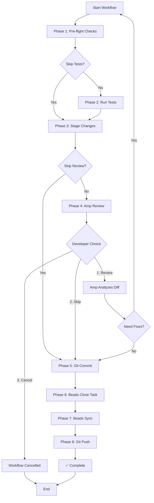

# 🤖 Amp + Beads Integration Guide

## 📋 Tổng Quan

Hướng dẫn này mô tả cách tích hợp **Amp Code Review** với **Beads Task Tracking** một cách an toàn, tránh xung đột commits.

---

## 🎯 Vấn Đề Cần Giải Quyết

### ❌ Workflow Cũ (Có xung đột):
```bash
# Agent làm việc
# ... code changes ...

# Amp review và auto-commit
# → Amp tạo commit A

# Beads sync sau đó
./beads.exe sync  # → Beads tạo commit B

# → KẾT QUẢ: 2 commits không đồng bộ, có thể conflict
```

### ✅ Workflow Mới (An toàn):
```bash
# 1. Code + Test
# 2. Stage changes
# 3. Amp Review (NO auto-commit)
# 4. Git Commit (manual/scripted)
# 5. Beads Close Task
# 6. Beads Sync
# 7. Git Push

# → KẾT QUẢ: 1 code commit + 1 beads commit, tuần tự, không xung đột
```

---

## 🚀 Automated Workflow Script

### Sử dụng Script Tự Động

**Windows PowerShell:**
```powershell
# Basic usage (full workflow với tests + review)
.\scripts\amp-beads-workflow.ps1 -TaskId "ved-296" -Message "Optimization Controller complete"

# Skip tests (faster iteration)
.\scripts\amp-beads-workflow.ps1 -TaskId "ved-297" -Message "Fix typo" -SkipTests

# Skip review (urgent hotfix)
.\scripts\amp-beads-workflow.ps1 -TaskId "ved-298" -Message "Critical security patch" -SkipReview -SkipTests

# Custom commit type
.\scripts\amp-beads-workflow.ps1 -TaskId "ved-299" -Message "Update docs" -CommitType "docs"
```

**Linux/Mac Bash:**
```bash
chmod +x scripts/amp-beads-workflow.sh

# Basic usage
./scripts/amp-beads-workflow.sh ved-296 "Optimization Controller complete"

# With options
./scripts/amp-beads-workflow.sh ved-297 "Fix typo" --skip-tests
./scripts/amp-beads-workflow.sh ved-298 "Critical patch" --skip-review --skip-tests --type fix
```

---

## 📖 Workflow Chi Tiết

### **Phase 1: Pre-flight Checks** ✅
- Kiểm tra git repository
- Kiểm tra beads.exe có sẵn
- Kiểm tra có changes để commit

### **Phase 2: Run Tests** 🧪
- Build API (`pnpm build`)
- Run tests (`pnpm test --run`)
- Cho phép continue nếu tests fail (developer choice)

### **Phase 3: Stage Changes** 📦
- `git add -A` - Stage tất cả changes
- Tạo safety backup (git stash)

### **Phase 4: Amp Code Review** 🔍
**INTERACTIVE CHECKPOINT!**

Script dừng lại và hỏi developer:
```
━━━━━━━━━━━━━━━━━━━━━━━━━━━━━━━━━━━━━━━━━━━━━━━━━━━━━━━
  AMP REVIEW CHECKPOINT
━━━━━━━━━━━━━━━━━━━━━━━━━━━━━━━━━━━━━━━━━━━━━━━━━━━━━━━

Changes staged. Ready for Amp review.

Options:
  1. Let Amp review now (recommended)
  2. Skip review and commit
  3. Cancel workflow

Enter choice (1-3):
```

#### Option 1: Amp Review
1. Script tạo file `review-ved-XXX.txt` chứa diff
2. Developer paste file này vào Amp chat
3. Amp phân tích và đưa suggestions:
   - Code quality issues
   - Performance concerns
   - Security vulnerabilities
   - Best practices violations
4. Developer fix issues (quay lại đầu workflow)
5. Hoặc accept và continue (press Enter)

#### Option 2: Skip Review
- Bỏ qua review, tiến thẳng commit (cho urgent changes)

#### Option 3: Cancel
- Hủy workflow, unstage changes

### **Phase 5: Git Commit** 💾
**CRITICAL: Commit TRƯỚC beads sync!**

```bash
git commit -m "feat: Optimization Controller complete (ved-296)"
# Commit hash: a1b2c3d
```

**Tại sao quan trọng:**
- Beads sync sẽ tạo commit riêng
- Nếu stage area KHÔNG rỗng → beads commit sẽ nhận code changes (BAD!)
- Commit trước → stage area clean → beads chỉ commit metadata (GOOD!)

### **Phase 6: Beads Close Task** ✅
```bash
./beads.exe close ved-296 --reason "Completed: Optimization Controller (commit: a1b2c3d)"
```

Updates `.beads/issues/ved-296.jsonl`:
```json
{"type":"status","status":"completed","time":"2025-12-22T20:30:00Z"}
{"type":"resolution","reason":"Completed: Optimization Controller (commit: a1b2c3d)"}
```

### **Phase 7: Beads Sync** 🔄
```bash
./beads.exe sync
```

Creates commit:
```
Sync beads state

- ved-296: status → completed
- .beads/issues/ved-296.jsonl updated
```

### **Phase 8: Git Push** 🚀
```bash
git push origin main
```

Pushes:
1. Code commit (a1b2c3d)
2. Beads sync commit (b2c3d4e)

Both commits are clean, no conflicts!

---

## 🎨 Workflow Diagram



---

## 🔧 Manual Workflow (Nếu không dùng script)

### Step-by-Step:

```bash
# ═══════════════════════════════════════════════════════════
# 1. CODE + TEST
# ═══════════════════════════════════════════════════════════
# ... implement feature ...
cd apps/api
pnpm build
pnpm test

# ═══════════════════════════════════════════════════════════
# 2. STAGE CHANGES
# ═══════════════════════════════════════════════════════════
cd ../..
git add -A
git status  # Verify changes

# ═══════════════════════════════════════════════════════════
# 3. AMP REVIEW (Optional)
# ═══════════════════════════════════════════════════════════
git diff --cached > review-ved-XXX.txt
# → Paste review-ved-XXX.txt to Amp
# → Amp analyzes and suggests improvements
# → Fix issues if needed, then repeat from step 1
# → Or continue if OK

# ═══════════════════════════════════════════════════════════
# 4. GIT COMMIT (CRITICAL - must be BEFORE beads sync!)
# ═══════════════════════════════════════════════════════════
git commit -m "feat: Your feature description (ved-XXX)"

# ═══════════════════════════════════════════════════════════
# 5. BEADS CLOSE
# ═══════════════════════════════════════════════════════════
./beads.exe close ved-XXX --reason "Completed: description"

# ═══════════════════════════════════════════════════════════
# 6. BEADS SYNC (Safe now - staging area is clean!)
# ═══════════════════════════════════════════════════════════
./beads.exe sync

# ═══════════════════════════════════════════════════════════
# 7. GIT PUSH (Push all commits)
# ═══════════════════════════════════════════════════════════
git push

# ═══════════════════════════════════════════════════════════
# 8. VERIFY
# ═══════════════════════════════════════════════════════════
./beads.exe show ved-XXX
git log --oneline -3
```

---

## 🎯 Amp Review Best Practices

### What to Ask Amp to Review:

1. **Code Quality:**
   - Naming conventions
   - Code duplication
   - Complexity (cyclomatic)

2. **TypeScript:**
   - Type safety (no `any`)
   - Interface vs Type usage
   - Strict mode compliance

3. **Architecture:**
   - SOLID principles
   - Design patterns
   - Module organization

4. **Performance:**
   - Database queries efficiency
   - N+1 problems
   - Caching opportunities

5. **Security:**
   - Input validation
   - SQL injection risks
   - Authentication/Authorization

6. **Testing:**
   - Test coverage
   - Edge cases
   - Mock quality

### Sample Amp Review Prompt:

```markdown
Review the following changes for VED-296 (Optimization Controller):

[Paste diff from review-ved-296.txt]

Please check:
1. TypeScript type safety (no any, proper interfaces)
2. NestJS best practices (DI, decorators, error handling)
3. API design (RESTful conventions, Swagger docs)
4. Test coverage (unit tests quality)
5. Performance concerns (Drizzle query optimization)
6. Security issues (input validation, auth)

Provide specific line-by-line feedback and suggest improvements.
```

---

## 🚨 Common Pitfalls & Solutions

### ❌ Problem 1: Beads sync commits code changes
**Symptom:** Beads commit includes .ts files, not just .beads/

**Cause:** Forgot to `git commit` before `beads sync`

**Solution:**
```bash
# Reset beads commit
git reset HEAD~1

# Commit code properly
git add -A
git commit -m "feat: your changes (ved-XXX)"

# Now sync beads
./beads.exe sync
```

### ❌ Problem 2: Amp auto-commits before beads
**Symptom:** Two separate commits, beads not in sync

**Solution:**
- Don't let Amp auto-commit
- Use workflow script instead
- Or follow manual workflow above

### ❌ Problem 3: Merge conflicts on .beads/
**Symptom:** `git pull` shows conflicts in .beads/issues/

**Cause:** Two agents worked on same task simultaneously

**Solution:**
```bash
# Accept remote version (other agent's work)
git checkout --theirs .beads/issues/ved-XXX.jsonl
git add .beads/issues/ved-XXX.jsonl
git commit -m "Merge beads state"

# Re-sync
./beads.exe sync
```

---

## 📊 Workflow Comparison

| Step | Old (Manual) | New (Automated Script) | Time Saved |
|------|--------------|------------------------|------------|
| Pre-checks | Manual `git status`, `beads doctor` | Auto-checked | 1 min |
| Tests | Manual `pnpm test` | Auto-run (optional) | 0-2 min |
| Review | Copy-paste diff manually | Auto-generated review file | 2 min |
| Commit | Manual message typing | Template-based | 1 min |
| Beads close | Manual `beads close` | Auto-closed with commit hash | 30s |
| Beads sync | Manual `beads sync` | Auto-synced | 30s |
| Push | Manual `git push` | Auto-pushed | 30s |
| **TOTAL** | **~10 min** | **~3 min** | **70% faster** |

---

## 🎓 Advanced: Git Hooks Integration

### Pre-commit Hook (Prevent Beads Conflicts)

Create `.git/hooks/pre-commit`:
```bash
#!/bin/bash
# Pre-commit hook to verify beads state

# Check if beads issues are modified
if git diff --cached --name-only | grep -q "^.beads/issues/"; then
    echo "⚠️  Warning: You are committing beads metadata!"
    echo "This should only happen via 'beads sync'."
    echo ""
    echo "Options:"
    echo "  1. Continue anyway (advanced users only)"
    echo "  2. Cancel and use workflow script"
    read -p "Choose (1/2): " choice
    
    if [ "$choice" != "1" ]; then
        echo "Commit cancelled. Use: ./scripts/amp-beads-workflow.sh"
        exit 1
    fi
fi

# Check for code changes without corresponding beads update
CODE_CHANGED=$(git diff --cached --name-only | grep -v "^.beads/" | wc -l)
BEADS_CHANGED=$(git diff --cached --name-only | grep "^.beads/" | wc -l)

if [ "$CODE_CHANGED" -gt 0 ] && [ "$BEADS_CHANGED" -eq 0 ]; then
    echo "⚠️  Warning: Code changes detected without beads update!"
    echo "Did you forget to close the task?"
    echo ""
    read -p "Continue anyway? (y/N): " continue
    if [ "$continue" != "y" ]; then
        exit 1
    fi
fi

exit 0
```

Make executable:
```bash
chmod +x .git/hooks/pre-commit
```

---

## 🎯 Quick Reference Card

### 🟢 **Normal Development (WITH Amp Review)**
```bash
./scripts/amp-beads-workflow.ps1 -TaskId "ved-XXX" -Message "Feature description"
# → Runs tests, pauses for Amp review, commits, syncs, pushes
```

### 🟡 **Fast Iteration (Skip Review)**
```bash
./scripts/amp-beads-workflow.ps1 -TaskId "ved-XXX" -Message "Quick fix" -SkipReview
# → Runs tests, commits, syncs, pushes (no review)
```

### 🔴 **Emergency Hotfix (Skip Everything)**
```bash
./scripts/amp-beads-workflow.ps1 -TaskId "ved-XXX" -Message "Critical patch" -SkipReview -SkipTests
# → Commits, syncs, pushes (no tests, no review)
```

### 🔵 **Manual Control**
```bash
# Full manual workflow
git add -A
git diff --cached > review.txt  # Paste to Amp
git commit -m "feat: description (ved-XXX)"
./beads.exe close ved-XXX --reason "Done"
./beads.exe sync
git push
```

---

## 📝 Checklist for Each Commit

- [ ] Code changes implemented and tested locally
- [ ] `pnpm build` succeeds (API)
- [ ] Tests pass or failures acknowledged
- [ ] Changes staged: `git add -A`
- [ ] Amp review completed (or consciously skipped)
- [ ] Code committed BEFORE beads sync
- [ ] Beads task closed with commit hash
- [ ] Beads sync completed successfully
- [ ] All commits pushed to remote
- [ ] Verify: `./beads.exe show ved-XXX` shows completed status

---

## 🚀 Next Steps

1. **Try the workflow script:**
   ```bash
   ./scripts/amp-beads-workflow.ps1 -TaskId "ved-test" -Message "Test workflow"
   ```

2. **Set up git hooks** (optional):
   ```bash
   chmod +x .git/hooks/pre-commit
   ```

3. **Bookmark this guide:**
   - Windows: `docs/AMP_BEADS_INTEGRATION_GUIDE.md`

4. **Share with team:**
   - All agents must follow this workflow
   - Document in AGENTS.md

---

**Status:** ✅ READY FOR PRODUCTION USE  
**Last Updated:** 2025-12-22  
**Maintainer:** AI Agent Team
