# 🚀 Deployment & Periodic Maintenance Master Plan
## V-EdFinance - Optimized Operations Strategy

**Version:** 2.0  
**Date:** 2026-01-04  
**Status:** 🟢 **ACTIVE** - Strategic Roadmap  
**Owner:** Platform Engineering Team

---

## 📋 Executive Summary

### Current State Analysis

**Deployment Architecture:**
- ✅ **Dokploy VPS**: 3 environments (dev/staging/prod)
- ✅ **Cloudflare Pages**: Frontend auto-deploy
- ✅ **PostgreSQL + Redis**: Shared infrastructure
- ✅ **Zero-downtime**: Rolling deployment (maxUnavailable: 0)
- ✅ **Health Checks**: 30s intervals on all services
- ⚠️ **Monitoring**: Uptime Kuma only (basic)
- ❌ **CI/CD**: Manual deployments via Dokploy UI

**Key Metrics (Current):**
- Deployment Frequency: Manual (2-3x/week)
- Lead Time: 15-30 min (build + deploy)
- MTTR: Unknown (no incident tracking)
- Availability: Unknown (no SLA monitoring)

---

## 🎯 Optimization Goals

### Phase 0: Foundation (Week 1-2) - 🔴 PRIORITY
**Goal:** Establish automated deployment pipeline

1. **Automated CI/CD** (4 hours)
   - GitHub Actions workflow for each environment
   - Quality gates before deploy
   - Slack/Discord notifications

2. **Health Monitoring** (3 hours)
   - Expand Uptime Kuma checks
   - Add Grafana + Prometheus
   - Database performance dashboards

3. **Incident Response** (2 hours)
   - Create runbooks for common failures
   - Rollback procedures
   - On-call rotation setup

**Success Criteria:**
- ✅ Zero-touch deployment to dev/staging
- ✅ Prod deployment requires 1-click approval
- ✅ All services have health endpoints monitored

---

### Phase 1: Optimization (Week 3-4)
**Goal:** Improve deployment speed and reliability

1. **Build Optimization** (6 hours)
   - Docker layer caching (25% faster builds)
   - Turborepo remote cache (40% faster monorepo builds)
   - Parallel test execution (50% faster CI)

2. **Database Migration Safety** (4 hours)
   - Pre-flight schema validation
   - Automated backup before migrations
   - Canary testing on staging DB

3. **Feature Flags** (8 hours)
   - Implement feature toggle system
   - Gradual rollouts (10% → 50% → 100%)
   - A/B testing infrastructure

**Success Criteria:**
- ✅ Deploy time: 30min → 10min
- ✅ Zero failed deployments from schema drift
- ✅ 90% of features use gradual rollout

---

### Phase 2: Excellence (Month 2-3)
**Goal:** World-class observability and automation

1. **Predictive Monitoring** (12 hours)
   - AI-powered anomaly detection
   - Capacity planning alerts
   - Cost optimization recommendations

2. **Self-Healing Systems** (16 hours)
   - Auto-restart failed containers
   - Auto-scale based on load
   - Circuit breakers for external services

3. **Chaos Engineering** (8 hours)
   - Monthly chaos drills
   - Network partition tests
   - Database failover tests

**Success Criteria:**
- ✅ 99.9% uptime SLA
- ✅ MTTR < 5 minutes
- ✅ Zero manual interventions for common issues

---

## 📅 Periodic Maintenance Schedule

### Daily Automated Tasks (Cron Jobs)

```bash
# 3:00 AM UTC - Database Backup
0 3 * * * /home/deployer/scripts/backup-to-r2.sh

# 3:30 AM UTC - Log Rotation
30 3 * * * /home/deployer/scripts/rotate-logs.sh

# Every 4 hours - Health Check Summary
0 */4 * * * /home/deployer/scripts/health-check-report.sh

# Every hour - Beads Sync Verification
0 * * * * cd /app && ./beads.exe doctor --auto-fix
```

**Scripts to Create:**
1. ✅ `backup-to-r2.sh` (exists)
2. 🆕 `rotate-logs.sh`
3. 🆕 `health-check-report.sh`
4. 🆕 `beads-auto-fix.sh`

---

### Weekly Automated Tasks (Sundays 2AM UTC)

```bash
# Week 1: Security Audit
0 2 * * 0 [ $(date +\%W) -eq 1 ] && /home/deployer/scripts/security-audit.sh

# Every Sunday: Database Optimization
0 2 * * 0 /home/deployer/scripts/db-architect-weekly.sh

# Every Sunday: Dependency Updates Check
0 3 * * 0 /home/deployer/scripts/check-updates.sh

# Every Sunday: Performance Benchmarks
0 4 * * 0 /home/deployer/scripts/performance-benchmark.sh
```

**Scripts to Create:**
1. 🆕 `security-audit.sh` (scan secrets, CVEs, auth logs)
2. ✅ `db-architect-weekly.sh` (exists)
3. 🆕 `check-updates.sh` (pnpm outdated, security patches)
4. 🆕 `performance-benchmark.sh` (API response times, DB query perf)

---

### Monthly Manual Reviews (1st Monday)

**Engineering Team Review (2 hours):**
1. **Incident Retrospectives**
   - Review all P0/P1 incidents
   - Update runbooks
   - Identify automation opportunities

2. **Capacity Planning**
   - Database growth trends
   - API traffic patterns
   - Cost optimization opportunities

3. **Technical Debt Audit**
   - Run `beads.exe doctor`
   - Review P0/P1 blockers
   - Prioritize debt paydown

4. **Security Review**
   - Rotate secrets (JWT, R2 keys)
   - Review auth logs for anomalies
   - Update dependencies

**Deliverables:**
- ✅ Monthly Health Report (PDF)
- ✅ Updated Incident Response Playbook
- ✅ Capacity Planning Forecast (3 months)

---

## 🔄 Deployment Workflow (Optimized)

### Current Workflow (Manual - 30 min)
```
Developer → Git Push → Dokploy UI → Click Deploy → Wait 15-30 min
```

### Optimized Workflow (Automated - 10 min)

```mermaid
graph LR
    A[Git Push] --> B{Branch?}
    B -->|develop| C[Dev Auto-Deploy]
    B -->|staging| D[Staging Auto-Deploy]
    B -->|main| E[Quality Gates]
    
    C --> C1[Health Check]
    D --> D1[E2E Tests]
    
    E --> E1[Build Verification]
    E1 --> E2[Test Suite Pass?]
    E2 -->|No| F[❌ Block Deploy]
    E2 -->|Yes| E3[Schema Sync?]
    E3 -->|No| F
    E3 -->|Yes| E4[Beads P0 = 0?]
    E4 -->|No| F
    E4 -->|Yes| G[✅ Ready for Prod]
    
    G --> H[Manual Approval]
    H --> I[Canary Deploy 10%]
    I --> I1{Health OK?}
    I1 -->|No| J[Auto-Rollback]
    I1 -->|Yes| K[Full Deploy 100%]
    K --> L[Post-Deploy Checks]
    
    F --> M[Notify Slack]
    J --> M
```



**Quality Gates (Pre-Deploy):**
1. ✅ Build passes (API + Web)
2. ✅ Tests pass (90% unit, 85% E2E)
3. ✅ Lint passes (0 errors)
4. ✅ Schema sync verified (Prisma/Drizzle)
5. ✅ No P0/P1 beads blockers
6. ✅ Security scan passes (no exposed secrets)

**Post-Deploy Verification:**
1. ✅ Health endpoints return 200
2. ✅ Database migrations applied
3. ✅ Cache cleared (Redis)
4. ✅ Smoke tests pass (critical paths)
5. ✅ Error rate < 1% (first 10 min)

---

## 🛡️ Incident Response Playbook

### Severity Levels

| Level | Definition | Response Time | Example |
|-------|-----------|---------------|---------|
| **P0** | Service down | 5 min | API unreachable, DB offline |
| **P1** | Critical feature broken | 30 min | Login fails, payments down |
| **P2** | Major degradation | 4 hours | Slow page loads, cache misses |
| **P3** | Minor issue | 2 days | Typo in UI, non-critical bug |

---

### P0 Incident: Service Down

**Detection:**
- Uptime Kuma alerts (3 consecutive failures)
- Slack notification: `@channel 🔴 P0 INCIDENT`

**Immediate Actions (First 5 min):**
```bash
# 1. Check service health
curl http://103.54.153.248:3001/api/health

# 2. View recent logs
ssh deployer@103.54.153.248 'docker logs vedfinance-api --tail 100'

# 3. Check resource usage
ssh deployer@103.54.153.248 'docker stats --no-stream'

# 4. Quick restart (if OOM/crash)
ssh deployer@103.54.153.248 'docker restart vedfinance-api'
```

**If Restart Fails (Rollback):**
```bash
# Dokploy UI: Applications → api-production → Rollback to Previous Version
# Or CLI:
ssh deployer@103.54.153.248 'docker tag vedfinance-api:previous vedfinance-api:latest && docker restart vedfinance-api'
```

**Post-Incident (Within 24 hours):**
1. ✅ Root cause analysis (RCA) document
2. ✅ Update runbook with lessons learned
3. ✅ Create beads issue for prevention

---

### P1 Incident: Critical Feature Broken

**Example: Login Failing**

**Diagnosis:**
```bash
# 1. Check JWT service
curl http://103.54.153.248:3001/api/auth/health

# 2. Check database connection
ssh deployer@103.54.153.248 'docker exec vedfinance-postgres pg_isready'

# 3. Check Redis
ssh deployer@103.54.153.248 'docker exec vedfinance-redis redis-cli ping'

# 4. Review auth logs
ssh deployer@103.54.153.248 'docker logs vedfinance-api | grep "auth"'
```

**Common Fixes:**
- JWT secret mismatch → Restore from `.env.production`
- Database migration failed → Rollback schema: `npx prisma migrate resolve --rolled-back <migration-id>`
- Redis connection lost → Restart Redis container

---

## 📊 Monitoring Dashboard (Grafana)

### Key Metrics to Track

**Infrastructure:**
- CPU usage (API, Web, DB, Redis)
- Memory usage (Alert at 85%)
- Disk usage (Alert at 80%)
- Network I/O

**Application:**
- Request rate (RPM)
- Error rate (%)
- Response time (p50, p95, p99)
- Database query performance

**Business:**
- Active users (DAU/MAU)
- Course enrollments
- Payment transactions
- User retention

**Alerts Configuration:**
```yaml
# Prometheus Alert Rules
groups:
  - name: vedfinance-critical
    rules:
      - alert: HighErrorRate
        expr: rate(http_requests_total{status="5xx"}[5m]) > 0.05
        for: 5m
        labels:
          severity: critical
        annotations:
          summary: "Error rate > 5% for 5 minutes"

      - alert: DatabaseDown
        expr: up{job="postgres"} == 0
        for: 1m
        labels:
          severity: critical
        annotations:
          summary: "PostgreSQL is down"

      - alert: HighMemoryUsage
        expr: container_memory_usage_bytes / container_spec_memory_limit_bytes > 0.85
        for: 10m
        labels:
          severity: warning
        annotations:
          summary: "Memory usage > 85%"
```

---

## 🔧 Automation Scripts Roadmap

### Priority 1 (Week 1) - 8 hours

**1. CI/CD Pipeline** (4 hours)
```yaml
# .github/workflows/deploy-staging.yml
name: Deploy Staging
on:
  push:
    branches: [staging]
jobs:
  deploy:
    runs-on: ubuntu-latest
    steps:
      - uses: actions/checkout@v3
      - run: pnpm install
      - run: pnpm --filter api build
      - run: pnpm --filter web build
      - run: pnpm test
      - name: Deploy to Dokploy
        run: curl -X POST https://dokploy.v-edfinance.com/api/deploy/staging
```

**2. Health Check Report** (2 hours)
```bash
#!/bin/bash
# scripts/health-check-report.sh
# Generates hourly health summary

API_HEALTH=$(curl -s http://103.54.153.248:3001/api/health | jq -r '.status')
DB_HEALTH=$(docker exec vedfinance-postgres pg_isready | grep "accepting connections")
REDIS_HEALTH=$(docker exec vedfinance-redis redis-cli ping)

if [[ "$API_HEALTH" != "ok" ]] || [[ -z "$DB_HEALTH" ]]; then
  # Send alert to Slack
  curl -X POST $SLACK_WEBHOOK -d "{\"text\":\"⚠️ Health Check Failed\"}"
fi

# Log to file
echo "$(date) | API: $API_HEALTH | DB: $DB_HEALTH | Redis: $REDIS_HEALTH" >> /var/log/health.log
```

**3. Auto-Rollback Script** (2 hours)
```bash
#!/bin/bash
# scripts/auto-rollback.sh
# Triggered when health checks fail post-deploy

# Check error rate in last 5 minutes
ERROR_RATE=$(curl -s http://103.54.153.248:3001/metrics | grep http_5xx | awk '{print $2}')

if (( $(echo "$ERROR_RATE > 0.05" | bc -l) )); then
  echo "🔴 Error rate $ERROR_RATE > 5% threshold"
  echo "⏪ Rolling back to previous version..."
  
  # Dokploy rollback API
  curl -X POST https://dokploy.v-edfinance.com/api/rollback/api-production
  
  # Notify team
  curl -X POST $SLACK_WEBHOOK -d "{\"text\":\"🔴 Auto-rollback triggered\"}"
fi
```

---

### Priority 2 (Week 2) - 12 hours

**4. Security Audit Script** (4 hours)
```bash
#!/bin/bash
# scripts/security-audit.sh
# Weekly security scan

echo "🔍 Security Audit - $(date)"

# 1. Scan for exposed secrets
./scripts/scan-secrets.sh

# 2. Check for outdated dependencies with CVEs
pnpm audit --audit-level=high

# 3. Review auth logs for anomalies
ssh deployer@103.54.153.248 'docker logs vedfinance-api | grep "401\|403" | tail -100'

# 4. Verify JWT rotation
LAST_ROTATION=$(cat .env.production | grep JWT_LAST_ROTATED)
# Alert if > 90 days

# Generate report
echo "Report saved to /reports/security-$(date +%Y-%m-%d).pdf"
```

**5. Performance Benchmark Script** (4 hours)
```bash
#!/bin/bash
# scripts/performance-benchmark.sh
# Weekly performance baseline

echo "🏎️ Performance Benchmark - $(date)"

# 1. API response time (Vegeta load test)
echo "GET http://103.54.153.248:3001/api/health" | vegeta attack -duration=60s -rate=100 | tee results.bin | vegeta report

# 2. Database query performance
curl http://103.54.153.248:3001/debug/query-optimizer/analyze

# 3. Frontend Lighthouse score
lighthouse https://staging.v-edfinance.com --output=json --output-path=./lighthouse.json

# Store results for trend analysis
```

**6. Dependency Update Script** (4 hours)
```bash
#!/bin/bash
# scripts/check-updates.sh
# Weekly dependency check

echo "📦 Dependency Update Check - $(date)"

# 1. Check for outdated packages
pnpm outdated > /tmp/outdated.txt

# 2. Separate by severity
MAJOR=$(cat /tmp/outdated.txt | grep "major")
MINOR=$(cat /tmp/outdated.txt | grep "minor")

# 3. Auto-update patch versions (safe)
pnpm update --latest --filter=patch

# 4. Create beads tasks for major/minor updates
if [[ -n "$MAJOR" ]]; then
  ./beads.exe create "Update major dependencies" --type task --priority 2
fi

# 5. Notify team
echo "Report: /reports/dependencies-$(date +%Y-%m-%d).md"
```

---

### Priority 3 (Month 2) - 20 hours

**7. Canary Deployment System** (8 hours)
- Nginx traffic splitting (10% → 50% → 100%)
- Automated health monitoring during rollout
- Instant rollback if metrics degrade

**8. AI Anomaly Detection** (12 hours)
- Train ML model on normal traffic patterns
- Alert on statistical deviations (3σ)
- Integrate with Grafana alerts

---

## 📈 Success Metrics Dashboard

### Deployment Velocity
| Metric | Baseline | Target (1 month) | Target (3 months) |
|--------|----------|------------------|-------------------|
| Deploy Frequency | 2-3x/week | 5x/week | 10x/week (on-demand) |
| Lead Time | 30 min | 10 min | 5 min |
| Deployment Success Rate | Unknown | 95% | 99% |
| Rollback Rate | Unknown | <5% | <1% |

### System Reliability
| Metric | Baseline | Target (1 month) | Target (3 months) |
|--------|----------|------------------|-------------------|
| Uptime | Unknown | 99.5% | 99.9% |
| MTTR | Unknown | 15 min | 5 min |
| P0 Incidents/month | Unknown | <2 | <1 |
| Failed Deployments | Unknown | 0 | 0 |

### Operational Excellence
| Metric | Baseline | Target (1 month) | Target (3 months) |
|--------|----------|------------------|-------------------|
| Automated Tasks | 20% | 60% | 90% |
| Manual Interventions/week | Unknown | <5 | <2 |
| Security Audit Score | Unknown | 90/100 | 95/100 |
| Cost per Request | Unknown | -20% | -40% |

---

## 🚦 Implementation Roadmap

### Week 1-2: Foundation Setup
- [ ] Deploy CI/CD pipelines (GitHub Actions)
- [ ] Setup Grafana + Prometheus monitoring
- [ ] Create incident response runbooks
- [ ] Implement health check automation
- [ ] Configure Slack alerts

**Estimated Time:** 20 hours  
**Team:** 2 engineers  
**Beads Epic:** `ved-deploy-phase0`

---

### Week 3-4: Optimization
- [ ] Enable Docker layer caching
- [ ] Setup Turborepo remote cache
- [ ] Implement feature flags system
- [ ] Create database migration safety checks
- [ ] Setup automated backups verification

**Estimated Time:** 25 hours  
**Team:** 2 engineers  
**Beads Epic:** `ved-deploy-phase1`

---

### Month 2: Excellence
- [ ] Canary deployment system
- [ ] AI anomaly detection
- [ ] Self-healing automation
- [ ] Chaos engineering setup
- [ ] Cost optimization analysis

**Estimated Time:** 40 hours  
**Team:** 3 engineers  
**Beads Epic:** `ved-deploy-phase2`

---

## 📚 Reference Documentation

**Internal Docs:**
- [dokploy.yaml](file:///c:/Users/luaho/Demo%20project/v-edfinance/dokploy.yaml) - Deployment config
- [quality-gate.sh](file:///c:/Users/luaho/Demo%20project/v-edfinance/scripts/quality-gate.sh) - Quality checks
- [STRATEGIC_DEBT_PAYDOWN_PLAN.md](file:///c:/Users/luaho/Demo%20project/v-edfinance/STRATEGIC_DEBT_PAYDOWN_PLAN.md) - Debt protocol
- [AGENTS.md](file:///c:/Users/luaho/Demo%20project/v-edfinance/AGENTS.md) - Agent workflows

**External References:**
- [Dokploy Docs](https://dokploy.com/docs)
- [GitHub Actions](https://docs.github.com/en/actions)
- [Prometheus Alerting](https://prometheus.io/docs/alerting/latest/overview/)
- [Grafana Dashboards](https://grafana.com/docs/grafana/latest/dashboards/)

---

## 📞 Support & Contact

**On-Call Rotation:**
- Week 1-2: [TBD]
- Week 3-4: [TBD]

**Escalation Path:**
1. On-call engineer (Slack: `@on-call`)
2. Platform Lead (P0/P1 incidents)
3. CTO (Multi-hour outages)

**Communication Channels:**
- Incidents: `#incidents` (Slack)
- Deployments: `#deployments` (Slack)
- Monitoring: Grafana dashboards
- Status Page: status.v-edfinance.com (TBD)

---

## ✅ Approval & Sign-Off

**Reviewed By:**
- [ ] Platform Engineering Lead
- [ ] DevOps Lead
- [ ] Security Lead
- [ ] CTO

**Approved Date:** [Pending]

**Next Review:** [Monthly - 1st Monday]

---

**Document History:**
- v2.0 (2026-01-04): Comprehensive deployment + maintenance plan
- v1.0 (2025-12-15): Initial deployment guide
