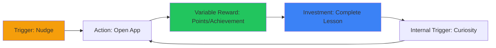
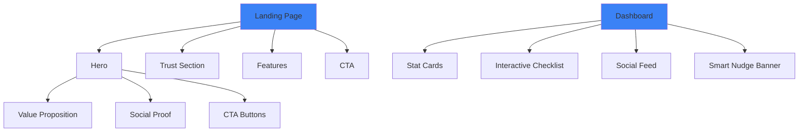

# 🎨 V-EdFinance Frontend UI/UX Optimization Plan

> **Thread Focus:** Frontend Enhancement với Behavioral Economics  
> **Target:** EdTech Platform với Fintech Security  
> **Timeline:** 3-4 Weeks Implementation

---

## 📊 Current State Analysis

### ✅ Strengths
- **Atomic Design Structure**: `atoms/` → `molecules/` → `organisms/`
- **Behavioral Features**: Gamification, Nudge System, Social Feed
- **i18n Support**: `vi`, `en`, `zh` (3 locales)
- **Dark Mode**: Implemented across components
- **Dynamic Loading**: Performance-optimized with Next.js dynamic imports

### 🔴 Areas for Improvement
- **No Landing Page**: Missing professional marketing page
- **Inconsistent Design System**: No unified color palette/tokens
- **Limited Gamification UI**: Basic achievement modal only
- **Nudge System**: Simple banner, needs enhancement
- **No Mobile-First Optimization**: Desktop-focused design
- **Missing Trust Elements**: No security badges, testimonials, social proof

---

## 🎯 Phase 1: Design System & Foundations (Week 1)

### 1.1 Design Tokens System

**Create:** `apps/web/src/lib/design-tokens.ts`

```typescript
export const tokens = {
  // Color Palette: Fintech + EdTech Hybrid
  colors: {
    // Primary: Trust & Security (Blue)
    primary: {
      50: '#EFF6FF',
      100: '#DBEAFE',
      200: '#BFDBFE',
      300: '#93C5FD',
      400: '#60A5FA',
      500: '#3B82F6', // Main brand
      600: '#2563EB',
      700: '#1D4ED8',
      800: '#1E40AF',
      900: '#1E3A8A',
    },
    // Secondary: Growth & Success (Green)
    secondary: {
      50: '#F0FDF4',
      100: '#DCFCE7',
      500: '#22C55E', // Achievement, streak
      700: '#15803D',
    },
    // Accent: Energy & Gamification (Purple)
    accent: {
      50: '#FAF5FF',
      100: '#F3E8FF',
      500: '#A855F7', // Rewards, points
      700: '#7E22CE',
    },
    // Warning: Loss Aversion (Amber)
    warning: {
      50: '#FFFBEB',
      500: '#F59E0B', // Nudges, alerts
      700: '#B45309',
    },
    // Neutral: Professional
    neutral: {
      50: '#FAFAFA',
      100: '#F4F4F5',
      200: '#E4E4E7',
      500: '#71717A',
      900: '#18181B',
    },
  },

  // Typography: Educational & Approachable
  typography: {
    fonts: {
      display: '"Inter", "SF Pro Display", system-ui, sans-serif',
      body: '"Inter", system-ui, sans-serif',
      mono: '"JetBrains Mono", "Fira Code", monospace',
    },
    sizes: {
      xs: '0.75rem',    // 12px
      sm: '0.875rem',   // 14px
      base: '1rem',     // 16px
      lg: '1.125rem',   // 18px
      xl: '1.25rem',    // 20px
      '2xl': '1.5rem',  // 24px
      '3xl': '1.875rem',// 30px
      '4xl': '2.25rem', // 36px
      '5xl': '3rem',    // 48px
    },
    weights: {
      normal: '400',
      medium: '500',
      semibold: '600',
      bold: '700',
    },
  },

  // Spacing: 8px Grid System
  spacing: {
    xs: '0.25rem',  // 4px
    sm: '0.5rem',   // 8px
    md: '1rem',     // 16px
    lg: '1.5rem',   // 24px
    xl: '2rem',     // 32px
    '2xl': '3rem',  // 48px
    '3xl': '4rem',  // 64px
  },

  // Shadows: Depth & Elevation
  shadows: {
    sm: '0 1px 2px 0 rgba(0, 0, 0, 0.05)',
    md: '0 4px 6px -1px rgba(0, 0, 0, 0.1)',
    lg: '0 10px 15px -3px rgba(0, 0, 0, 0.1)',
    xl: '0 20px 25px -5px rgba(0, 0, 0, 0.1)',
    glow: '0 0 20px rgba(59, 130, 246, 0.3)', // Trust glow
  },

  // Borders & Radius
  borders: {
    radius: {
      sm: '0.375rem',  // 6px
      md: '0.5rem',    // 8px
      lg: '0.75rem',   // 12px
      xl: '1rem',      // 16px
      full: '9999px',
    },
  },

  // Animation: Smooth & Professional
  animation: {
    duration: {
      fast: '150ms',
      base: '200ms',
      slow: '300ms',
    },
    easing: {
      smooth: 'cubic-bezier(0.4, 0, 0.2, 1)',
      bounce: 'cubic-bezier(0.68, -0.55, 0.265, 1.55)',
    },
  },
};
```

### 1.2 Component Library Enhancement

**Upgrade Atoms:**

```typescript
// apps/web/src/components/atoms/Card.tsx
interface CardProps {
  variant?: 'default' | 'elevated' | 'bordered' | 'glass';
  glowOnHover?: boolean;
  children: React.ReactNode;
}

export function Card({ variant = 'default', glowOnHover, children }: CardProps) {
  const variants = {
    default: 'bg-white dark:bg-zinc-900 border border-zinc-200 dark:border-zinc-800',
    elevated: 'bg-white dark:bg-zinc-900 shadow-lg',
    bordered: 'bg-white dark:bg-zinc-900 border-2 border-primary-500',
    glass: 'bg-white/70 dark:bg-zinc-900/70 backdrop-blur-xl border border-white/20',
  };

  return (
    <div 
      className={cn(
        'rounded-xl p-6 transition-all',
        variants[variant],
        glowOnHover && 'hover:shadow-glow hover:border-primary-400'
      )}
    >
      {children}
    </div>
  );
}
```

---

## 🚀 Phase 2: Landing Page Design (Week 1-2)

### 2.1 Hero Section (Above the Fold)

**File:** `apps/web/src/app/[locale]/page.tsx`

```typescript
export default function LandingPage() {
  return (
    <main className="bg-gradient-to-b from-blue-50 via-white to-purple-50 dark:from-zinc-950 dark:via-zinc-900 dark:to-purple-950">
      {/* Hero Section */}
      <section className="relative overflow-hidden px-6 py-20 lg:py-32">
        {/* Background Elements */}
        <div className="absolute inset-0 -z-10">
          <div className="absolute top-1/4 left-1/4 w-96 h-96 bg-blue-500/10 rounded-full blur-3xl" />
          <div className="absolute bottom-1/4 right-1/4 w-96 h-96 bg-purple-500/10 rounded-full blur-3xl" />
        </div>

        <div className="mx-auto max-w-7xl">
          <div className="grid lg:grid-cols-2 gap-12 items-center">
            {/* Left: Value Proposition */}
            <div className="space-y-8">
              <div className="inline-flex items-center gap-2 px-4 py-2 rounded-full bg-blue-100 dark:bg-blue-950 text-blue-700 dark:text-blue-300 text-sm font-medium">
                <Sparkles className="w-4 h-4" />
                AI-Powered Financial Education
              </div>

              <h1 className="text-5xl lg:text-6xl font-bold leading-tight">
                Master Your Money,
                <span className="bg-gradient-to-r from-blue-600 to-purple-600 bg-clip-text text-transparent">
                  {' '}Master Your Future
                </span>
              </h1>

              <p className="text-xl text-zinc-600 dark:text-zinc-400">
                Learn financial literacy through interactive simulations, AI mentorship, 
                and gamified learning paths. Built for Vietnam, designed for the world.
              </p>

              {/* CTA Buttons */}
              <div className="flex flex-col sm:flex-row gap-4">
                <Button size="lg" className="group">
                  Start Learning Free
                  <ArrowRight className="ml-2 w-5 h-5 group-hover:translate-x-1 transition" />
                </Button>
                <Button size="lg" variant="outline">
                  Watch Demo (2 min)
                  <Play className="ml-2 w-5 h-5" />
                </Button>
              </div>

              {/* Social Proof */}
              <div className="flex items-center gap-6 pt-4">
                <div className="flex -space-x-2">
                  {[1,2,3,4,5].map(i => (
                    <div key={i} className="w-10 h-10 rounded-full bg-gradient-to-br from-blue-400 to-purple-600 border-2 border-white dark:border-zinc-900" />
                  ))}
                </div>
                <div>
                  <p className="font-semibold text-lg">10,000+ Learners</p>
                  <div className="flex items-center gap-1 text-yellow-500">
                    {[1,2,3,4,5].map(i => <Star key={i} fill="currentColor" className="w-4 h-4" />)}
                    <span className="text-sm text-zinc-600 dark:text-zinc-400 ml-1">4.9/5</span>
                  </div>
                </div>
              </div>
            </div>

            {/* Right: Interactive Preview */}
            <div className="relative">
              <div className="relative z-10 rounded-2xl overflow-hidden shadow-2xl border border-zinc-200 dark:border-zinc-800">
                <DashboardPreview />
              </div>
              {/* Floating Elements */}
              <div className="absolute -top-6 -right-6 bg-green-500 text-white px-4 py-2 rounded-lg shadow-lg animate-bounce">
                💰 +500 Points Earned!
              </div>
              <div className="absolute -bottom-4 -left-4 bg-purple-500 text-white px-4 py-2 rounded-lg shadow-lg">
                🔥 7 Day Streak
              </div>
            </div>
          </div>
        </div>
      </section>

      {/* Trust Indicators */}
      <TrustSection />

      {/* Features */}
      <FeaturesSection />

      {/* How It Works */}
      <HowItWorksSection />

      {/* Testimonials */}
      <TestimonialsSection />

      {/* Pricing */}
      <PricingSection />

      {/* Final CTA */}
      <FinalCTASection />
    </main>
  );
}
```

### 2.2 Trust Section (Security Focus)

```typescript
function TrustSection() {
  const trustBadges = [
    { icon: Shield, label: 'Bank-Grade Security', desc: 'AES-256 Encryption' },
    { icon: Lock, label: 'Privacy First', desc: 'GDPR Compliant' },
    { icon: Award, label: 'ISO Certified', desc: 'Quality Assured' },
    { icon: Users, label: '10K+ Active Users', desc: 'Trusted Community' },
  ];

  return (
    <section className="py-12 bg-white dark:bg-zinc-900 border-y border-zinc-200 dark:border-zinc-800">
      <div className="mx-auto max-w-7xl px-6">
        <p className="text-center text-sm text-zinc-500 dark:text-zinc-400 mb-8">
          TRUSTED BY LEADING INSTITUTIONS
        </p>
        <div className="grid grid-cols-2 md:grid-cols-4 gap-8">
          {trustBadges.map((badge, i) => (
            <div key={i} className="flex flex-col items-center text-center">
              <badge.icon className="w-8 h-8 text-blue-600 mb-2" />
              <p className="font-semibold text-sm">{badge.label}</p>
              <p className="text-xs text-zinc-500 dark:text-zinc-400">{badge.desc}</p>
            </div>
          ))}
        </div>
      </div>
    </section>
  );
}
```

---

## 🎮 Phase 3: Gamification UI Enhancement (Week 2)

### 3.1 Progress Visualization System

**File:** `apps/web/src/components/molecules/ProgressRing.tsx`

```typescript
interface ProgressRingProps {
  progress: number; // 0-100
  size?: 'sm' | 'md' | 'lg';
  showLabel?: boolean;
  color?: 'blue' | 'green' | 'purple';
}

export function ProgressRing({ progress, size = 'md', showLabel = true, color = 'blue' }: ProgressRingProps) {
  const sizes = {
    sm: { ring: 60, stroke: 4, text: 'text-lg' },
    md: { ring: 120, stroke: 8, text: 'text-2xl' },
    lg: { ring: 180, stroke: 12, text: 'text-4xl' },
  };

  const { ring, stroke, text } = sizes[size];
  const radius = (ring - stroke) / 2;
  const circumference = radius * 2 * Math.PI;
  const offset = circumference - (progress / 100) * circumference;

  const colors = {
    blue: 'stroke-blue-600',
    green: 'stroke-green-500',
    purple: 'stroke-purple-500',
  };

  return (
    <div className="relative inline-flex items-center justify-center">
      <svg width={ring} height={ring} className="transform -rotate-90">
        {/* Background Circle */}
        <circle
          cx={ring / 2}
          cy={ring / 2}
          r={radius}
          stroke="currentColor"
          strokeWidth={stroke}
          fill="none"
          className="text-zinc-200 dark:text-zinc-800"
        />
        {/* Progress Circle */}
        <circle
          cx={ring / 2}
          cy={ring / 2}
          r={radius}
          stroke="currentColor"
          strokeWidth={stroke}
          fill="none"
          strokeDasharray={circumference}
          strokeDashoffset={offset}
          className={cn(colors[color], 'transition-all duration-500 ease-out')}
          strokeLinecap="round"
        />
      </svg>
      {showLabel && (
        <div className="absolute inset-0 flex items-center justify-center">
          <span className={cn('font-bold', text)}>{Math.round(progress)}%</span>
        </div>
      )}
    </div>
  );
}
```

### 3.2 Achievement Celebration System

**File:** `apps/web/src/components/organisms/AchievementCelebration.tsx`

```typescript
import Confetti from 'react-confetti-explosion';

interface Achievement {
  id: string;
  title: string;
  description: string;
  icon: string; // emoji
  rarity: 'common' | 'rare' | 'epic' | 'legendary';
  points: number;
}

export function AchievementCelebration({ achievement, onClose }: Props) {
  const rarityColors = {
    common: 'from-gray-500 to-gray-600',
    rare: 'from-blue-500 to-blue-600',
    epic: 'from-purple-500 to-purple-600',
    legendary: 'from-yellow-500 to-orange-600',
  };

  return (
    <Dialog open onOpenChange={onClose}>
      <DialogContent className="max-w-md">
        {/* Confetti Effect */}
        <div className="absolute top-1/2 left-1/2">
          <Confetti particleCount={100} duration={3000} />
        </div>

        <div className="text-center space-y-6 py-8">
          {/* Icon with Glow */}
          <div className="relative mx-auto w-32 h-32">
            <div className={cn(
              'absolute inset-0 rounded-full blur-2xl opacity-50',
              `bg-gradient-to-br ${rarityColors[achievement.rarity]}`
            )} />
            <div className={cn(
              'relative w-full h-full rounded-full flex items-center justify-center text-6xl',
              `bg-gradient-to-br ${rarityColors[achievement.rarity]}`
            )}>
              {achievement.icon}
            </div>
          </div>

          {/* Achievement Info */}
          <div className="space-y-2">
            <p className="text-sm uppercase font-bold tracking-wider text-zinc-500">
              {achievement.rarity} Achievement Unlocked
            </p>
            <h2 className="text-3xl font-bold">{achievement.title}</h2>
            <p className="text-zinc-600 dark:text-zinc-400">{achievement.description}</p>
          </div>

          {/* Points Earned */}
          <div className="flex items-center justify-center gap-2 text-2xl font-bold text-purple-600">
            <Zap className="w-6 h-6" />
            +{achievement.points} Points
          </div>

          {/* Share Button */}
          <div className="flex gap-3 justify-center pt-4">
            <Button onClick={onClose}>Continue Learning</Button>
            <Button variant="outline">
              <Share2 className="w-4 h-4 mr-2" />
              Share
            </Button>
          </div>
        </div>
      </DialogContent>
    </Dialog>
  );
}
```

---

## 🔔 Phase 4: Smart Nudge System (Week 3)

### 4.1 Contextual Nudge Engine

**File:** `apps/web/src/lib/nudge-engine.ts`

```typescript
interface NudgeConfig {
  type: 'streak' | 'social' | 'loss_aversion' | 'milestone' | 'reminder';
  trigger: () => boolean;
  message: (data: any) => string;
  action: { label: string; href: string };
  priority: number; // 1-5
  variant: 'info' | 'warning' | 'success';
}

export class NudgeEngine {
  private nudges: NudgeConfig[] = [
    // Loss Aversion: Streak at Risk
    {
      type: 'streak',
      trigger: () => {
        const lastActive = localStorage.getItem('lastActiveDate');
        const today = new Date().toDateString();
        return lastActive !== today;
      },
      message: (data) => `🔥 Don't break your ${data.streak}-day streak! Complete one lesson today.`,
      action: { label: 'Continue Learning', href: '/courses' },
      priority: 5,
      variant: 'warning',
    },

    // Social Proof
    {
      type: 'social',
      trigger: () => true,
      message: (data) => `👥 ${data.count} learners just completed "${data.course}" this hour`,
      action: { label: 'Join Them', href: `/courses/${data.courseId}` },
      priority: 3,
      variant: 'info',
    },

    // Milestone Celebration
    {
      type: 'milestone',
      trigger: () => {
        const points = parseInt(localStorage.getItem('points') || '0');
        const lastMilestone = parseInt(localStorage.getItem('lastMilestone') || '0');
        return points >= lastMilestone + 1000;
      },
      message: (data) => `🎉 You're only ${1000 - data.pointsToNext} points from unlocking Premium Badge!`,
      action: { label: 'View Rewards', href: '/rewards' },
      priority: 4,
      variant: 'success',
    },
  ];

  async getTopNudge(userData: any): Promise<NudgeConfig | null> {
    const activeNudges = this.nudges.filter(n => n.trigger());
    if (activeNudges.length === 0) return null;

    // Sort by priority
    activeNudges.sort((a, b) => b.priority - a.priority);
    return activeNudges[0];
  }
}
```

### 4.2 Enhanced Nudge Banner Component

```typescript
// apps/web/src/components/molecules/SmartNudgeBanner.tsx
export function SmartNudgeBanner() {
  const [nudge, setNudge] = useState<Nudge | null>(null);
  const { user } = useAuthStore();

  useEffect(() => {
    const engine = new NudgeEngine();
    engine.getTopNudge(user).then(setNudge);
  }, [user]);

  if (!nudge) return null;

  const variants = {
    info: 'bg-blue-50 border-blue-200 text-blue-900 dark:bg-blue-950 dark:border-blue-800 dark:text-blue-100',
    warning: 'bg-amber-50 border-amber-200 text-amber-900 dark:bg-amber-950 dark:border-amber-800 dark:text-amber-100',
    success: 'bg-green-50 border-green-200 text-green-900 dark:bg-green-950 dark:border-green-800 dark:text-green-100',
  };

  return (
    <div className={cn(
      'rounded-xl border p-4 mb-6 flex items-center justify-between',
      variants[nudge.variant]
    )}>
      <p className="flex-1 font-medium">{nudge.message(user)}</p>
      <Button 
        size="sm" 
        variant="outline"
        onClick={() => window.location.href = nudge.action.href}
      >
        {nudge.action.label}
        <ChevronRight className="w-4 h-4 ml-1" />
      </Button>
    </div>
  );
}
```

---

## 📱 Phase 5: Mobile-First Optimization (Week 3-4)

### 5.1 Responsive Navigation

```typescript
// apps/web/src/components/organisms/MobileNav.tsx
export function MobileNav() {
  return (
    <nav className="fixed bottom-0 left-0 right-0 z-50 lg:hidden bg-white dark:bg-zinc-900 border-t border-zinc-200 dark:border-zinc-800 safe-area-bottom">
      <div className="flex items-center justify-around h-16">
        {navItems.map(item => (
          <Link 
            key={item.href}
            href={item.href}
            className="flex flex-col items-center gap-1 px-4 py-2 rounded-lg hover:bg-zinc-100 dark:hover:bg-zinc-800 transition"
          >
            <item.icon className="w-5 h-5" />
            <span className="text-xs font-medium">{item.label}</span>
          </Link>
        ))}
      </div>
    </nav>
  );
}
```

---

## 🎨 Visual Examples (Mermaid Diagrams)

### User Journey - Hooked Loop



### Component Hierarchy



---

## 📋 Implementation Checklist

### Week 1: Foundation
- [ ] Create design tokens system
- [ ] Build component library (Card, Button, Badge)
- [ ] Setup color palette (Fintech + EdTech)
- [ ] Implement typography system

### Week 2: Landing Page
- [ ] Hero section with gradient background
- [ ] Trust indicators section
- [ ] Features showcase
- [ ] Testimonials carousel
- [ ] Pricing table

### Week 3: Gamification
- [ ] Progress ring component
- [ ] Achievement celebration modal
- [ ] Streak counter with animations
- [ ] Leaderboard UI

### Week 4: Mobile & Polish
- [ ] Mobile navigation
- [ ] Touch-friendly interactions
- [ ] Performance optimization
- [ ] A/B testing setup

---

## 🎯 Success Metrics

### Conversion
- **Landing Page Bounce Rate**: < 40%
- **Sign-up Conversion**: > 5%
- **Time on Page**: > 2 minutes

### Engagement
- **Daily Active Users**: +30%
- **Streak Retention**: > 60% at Day 7
- **Nudge Click-Through**: > 15%

### Performance
- **Lighthouse Score**: > 90
- **First Contentful Paint**: < 1.5s
- **Mobile Usability**: 100/100

---

## 🔧 Tools & Resources

- **UI/UX Pro Max Skill**: Fintech color palettes, typography
- **Shadcn/UI**: Component primitives
- **Tailwind CSS**: Utility-first styling
- **Framer Motion**: Smooth animations
- **React Confetti**: Celebration effects

---

**Status:** 📝 Ready for Implementation  
**Next Step:** Create design tokens and start Phase 1
