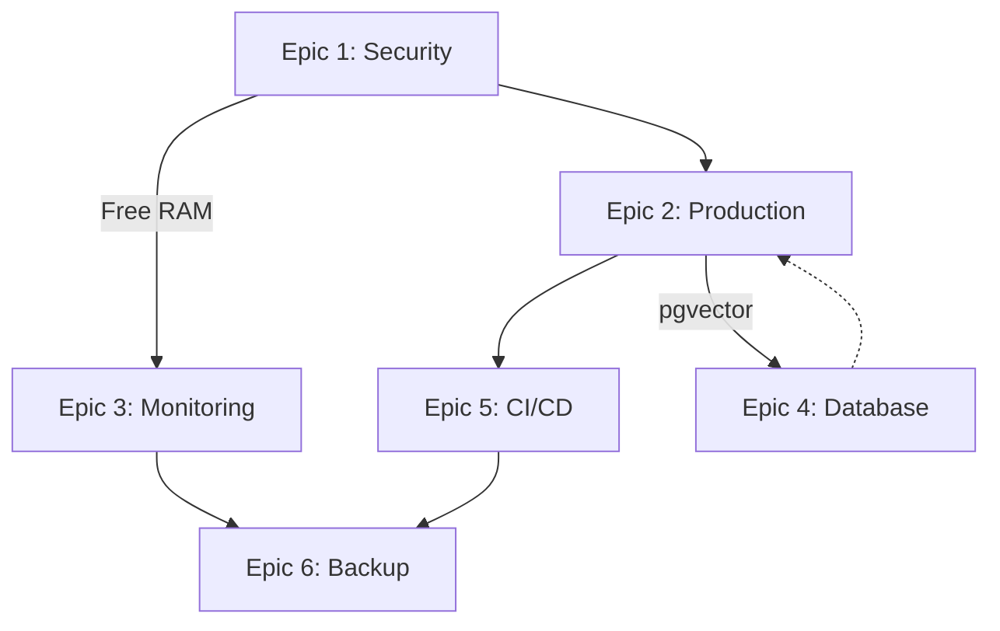

# DevOps Optimization Epic Tasks - Beads Management Plan

**Created:** 2025-12-23  
**Based On:** DEVOPS_INFRASTRUCTURE_AUDIT_2025-12-23.md  
**Total Epics:** 6 | **Total Tasks:** 24

---

## Epic Overview

```
📊 Priority Distribution:
- P0 (Critical): 11 tasks (46%)
- P1 (High):     10 tasks (42%)
- P2 (Medium):   3 tasks (12%)

⏱️ Estimated Timeline:
- Week 1: P0 tasks (Security + Production)
- Week 2: P1 tasks (Monitoring + CI/CD)
- Week 3: P2 tasks (Long-term improvements)
```

---

## Epic 1: Security Hardening & Critical Fixes 🔴

**Priority:** P0 CRITICAL  
**Duration:** 2 days  
**Impact:** Fix security vulnerabilities + free 600MB RAM

### Tasks

```bash
# Epic creation
bd create "Epic: Security Hardening & Critical Fixes" --type epic --priority 0

# Task 1.1: Close public port
bd create "Close Dokploy Dashboard Port 3000" --type task --priority 0
# ETA: 5 minutes
# Impact: Security - prevents unauthorized access
# Steps:
#   1. ssh deployer@103.54.153.248
#   2. sudo ufw delete allow 3000/tcp
#   3. Verify: ufw status

# Task 1.2: Security scanning
bd create "Add Security Scanning to CI/CD" --type task --priority 0
# ETA: 30 minutes
# Impact: Auto-detect vulnerabilities
# Implementation:
#   - Add Trivy container scanning
#   - Add npm audit to CI
#   - Upload results to GitHub Security

# Task 1.3: Secrets audit
bd create "Audit & Rotate Secrets in Git History" --type task --priority 0
# ETA: 1 hour
# Impact: Prevent leaked secrets
# Steps:
#   1. git log --all --full-history -- .env
#   2. If found: BFG Repo-Cleaner
#   3. Rotate all secrets immediately
#   4. Update .gitignore

# Task 1.4: WAF configuration
bd create "Configure Cloudflare WAF Rules" --type task --priority 1
# ETA: 30 minutes
# Impact: Block common attacks (SQLi, XSS)
# Steps:
#   1. Cloudflare Dashboard → Security → WAF
#   2. Enable OWASP Core ruleset
#   3. Rate limiting: 100 req/min per IP
```

**Success Criteria:**
- ✅ Dokploy accessible only via SSH tunnel
- ✅ CI fails on high/critical vulnerabilities
- ✅ No secrets in git history
- ✅ WAF blocking test attacks

---

## Epic 2: Production Environment Deployment 🚀

**Priority:** P0 CRITICAL  
**Duration:** 1 day  
**Impact:** Unblock production deployment

### Tasks

```bash
# Epic creation
bd create "Epic: Production Environment Deployment" --type epic --priority 0

# Task 2.1: Production config
bd create "Add Production Config to dokploy.yaml" --type task --priority 0
# ETA: 30 minutes
# Impact: Enable production deployments
# Config:
#   - Branch: main
#   - Domain: api.v-edfinance.com
#   - Resources: 1536MB RAM, 1.5 CPU
#   - Replicas: 2

# Task 2.2: pgvector extension
bd create "Install pgvector Extension on PostgreSQL" --type task --priority 0
# ETA: 10 minutes
# Impact: Unlock AI features (semantic search, embeddings)
# Steps:
#   1. docker exec -it vedfinance-postgres bash
#   2. apt-get update && apt-get install -y postgresql-17-pgvector
#   3. psql -U postgres -c "CREATE EXTENSION vector;"
#   4. Verify: \dx in psql

# Task 2.3: Resource limits
bd create "Increase Production Resource Limits" --type task --priority 0
# ETA: 15 minutes
# Impact: Prevent OOM under load
# Changes:
#   - api-production: 1536MB (was 768MB)
#   - web-production: 1024MB (was 768MB)

# Task 2.4: Production deployment
bd create "Deploy Production Environment to VPS" --type task --priority 0
# ETA: 1 hour
# Impact: Launch production
# Steps:
#   1. Update dokploy.yaml
#   2. Push to main branch
#   3. Monitor deployment
#   4. Run smoke tests
#   5. Verify DNS propagation
```

**Success Criteria:**
- ✅ Production accessible at api.v-edfinance.com
- ✅ pgvector queries working
- ✅ No OOM crashes under load
- ✅ Health checks passing

---

## Epic 3: Monitoring Stack Optimization 📊

**Priority:** P0 CRITICAL (resource saving)  
**Duration:** 3 hours  
**Impact:** Free 600MB RAM (15% of VPS)

### Tasks

```bash
# Epic creation
bd create "Epic: Monitoring Stack Optimization" --type epic --priority 0

# Task 3.1: Remove redundancy
bd create "Remove Redundant Monitoring Tools (Glances, Beszel)" --type task --priority 0
# ETA: 15 minutes
# Impact: Free 600MB RAM
# Steps:
#   1. docker stop v-edfinance-glances v-edfinance-beszel v-edfinance-beszel-agent
#   2. docker rm v-edfinance-glances v-edfinance-beszel v-edfinance-beszel-agent
#   3. Update docker-compose.monitoring.yml
#   4. Verify RAM freed: free -h

# Task 3.2: Add Prometheus
bd create "Add Prometheus + Grafana for Metrics" --type task --priority 1
# ETA: 1 hour
# Impact: Long-term metrics (30 days)
# Resources: 256MB RAM, 0.25 CPU each
# Config:
#   - Prometheus: scrape every 30s
#   - Grafana: admin dashboard
#   - Retention: 30 days

# Task 3.3: Dashboards
bd create "Configure Grafana Dashboards" --type task --priority 1
# ETA: 1 hour
# Impact: Visual metrics
# Dashboards:
#   1. System overview (CPU, RAM, Disk)
#   2. PostgreSQL metrics (connections, queries/sec)
#   3. API performance (latency, errors)
#   4. Container stats (per-service resources)
```

**Success Criteria:**
- ✅ RAM usage: 4GB → 3.4GB (600MB freed)
- ✅ Prometheus scraping all targets
- ✅ Grafana dashboards accessible
- ✅ 30-day metric retention working

---

## Epic 4: Database Triple-ORM Hardening 🗄️

**Priority:** P1 HIGH  
**Duration:** 2 days  
**Impact:** Prevent schema drift + optimize queries

### Tasks

```bash
# Epic creation
bd create "Epic: Database Triple-ORM Hardening" --type epic --priority 1

# Task 4.1: Schema sync CI
bd create "Add Schema Sync Verification to CI" --type task --priority 1
# ETA: 1 hour
# Impact: Prevent Prisma/Drizzle/Kysely drift
# CI Job:
#   - pnpm prisma generate
#   - pnpm drizzle-kit generate:pg
#   - pnpm kysely-codegen
#   - git diff --exit-code (fail if uncommitted changes)

# Task 4.2: pg_stat_statements
bd create "Enable pg_stat_statements in PostgreSQL" --type task --priority 1
# ETA: 20 minutes
# Impact: Query performance tracking
# Steps:
#   1. Create init-pg-stat.sql
#   2. Add to postgres volumes
#   3. Restart container
#   4. Verify: SELECT * FROM pg_stat_statements LIMIT 1;

# Task 4.3: Weekly optimization
bd create "Run Database Architect Weekly Scan" --type task --priority 2
# ETA: 30 minutes setup, then automated
# Impact: Autonomous query optimization
# Cron:
#   - Every Monday 9AM
#   - Analyze slow queries
#   - Generate index recommendations
#   - Create beads tasks for manual fixes
```

**Success Criteria:**
- ✅ CI fails on schema drift
- ✅ pg_stat_statements tracking queries
- ✅ Weekly DB Architect reports

---

## Epic 5: CI/CD Pipeline Optimization ⚡

**Priority:** P1 HIGH  
**Duration:** 1 day  
**Impact:** 50% faster builds + deployment safety

### Tasks

```bash
# Epic creation
bd create "Epic: CI/CD Pipeline Optimization" --type epic --priority 1

# Task 5.1: Parallel builds
bd create "Parallelize Build Workflows" --type task --priority 1
# ETA: 30 minutes
# Impact: 4 minutes faster (50% reduction)
# Changes:
#   - Split build-api and build-web into separate jobs
#   - Run tests in parallel with builds
#   - Use GitHub Actions matrix strategy

# Task 5.2: Smoke tests
bd create "Add Post-Deployment Smoke Tests" --type task --priority 1
# ETA: 20 minutes
# Impact: Catch deployment failures early
# Tests:
#   - curl -f https://api.v-edfinance.com/health
#   - curl -f https://v-edfinance.com
#   - Rollback on failure

# Task 5.3: Cleanup
bd create "Remove Unused Kamal Workflow" --type task --priority 2
# ETA: 2 minutes
# Impact: Reduce confusion
# Command: rm .github/workflows/deploy-kamal.yml
```

**Success Criteria:**
- ✅ CI runtime: 8min → 4min
- ✅ Deployments auto-rollback on health check failure
- ✅ No unused workflows

---

## Epic 6: Backup & Disaster Recovery 💾

**Priority:** P1 HIGH  
**Duration:** 4 hours  
**Impact:** Ensure backups work + faster recovery

### Tasks

```bash
# Epic creation
bd create "Epic: Backup & Disaster Recovery" --type epic --priority 1

# Task 6.1: Automated restore testing
bd create "Automated Weekly Backup Restore Testing" --type task --priority 0
# ETA: 2 hours
# Impact: Verify backups actually work
# Workflow:
#   - Weekly Sunday 5AM
#   - Download latest R2 backup
#   - Restore to test postgres container
#   - Verify table counts
#   - Alert on failure

# Task 6.2: Encryption verification
bd create "Verify R2 Backup Encryption" --type task --priority 1
# ETA: 30 minutes
# Impact: Security compliance
# Tests:
#   - Download backup
#   - Verify openssl enc'd data
#   - Test decryption with key

# Task 6.3: DR runbook
bd create "Create DR Runbook Documentation" --type task --priority 1
# ETA: 2 hours
# Impact: Faster recovery (30min RTO)
# Scenarios:
#   1. VPS hardware failure
#   2. Database corruption
#   3. Accidental data deletion
# Include step-by-step procedures

# Task 6.4: Retention policy
bd create "Implement Backup Retention Policy" --type task --priority 2
# ETA: 1 hour
# Impact: Cost optimization + compliance
# Policy:
#   - Daily: 7 days
#   - Weekly: 4 weeks
#   - Monthly: 12 months
```

**Success Criteria:**
- ✅ Weekly restore tests passing
- ✅ Backups encrypted (verified)
- ✅ DR runbook documented
- ✅ Retention policy automated

---

## Beads Commands Cheat Sheet

```bash
# Create all epics and tasks (run these manually)
cd "c:\Users\luaho\Demo project\v-edfinance"

# Epic 1: Security
bd create "Epic: Security Hardening & Critical Fixes" --type epic --priority 0
bd create "Close Dokploy Dashboard Port 3000" --type task --priority 0
bd create "Add Security Scanning to CI/CD" --type task --priority 0
bd create "Audit & Rotate Secrets in Git History" --type task --priority 0
bd create "Configure Cloudflare WAF Rules" --type task --priority 1

# Epic 2: Production
bd create "Epic: Production Environment Deployment" --type epic --priority 0
bd create "Add Production Config to dokploy.yaml" --type task --priority 0
bd create "Install pgvector Extension on PostgreSQL" --type task --priority 0
bd create "Increase Production Resource Limits" --type task --priority 0
bd create "Deploy Production Environment to VPS" --type task --priority 0

# Epic 3: Monitoring
bd create "Epic: Monitoring Stack Optimization" --type epic --priority 0
bd create "Remove Redundant Monitoring Tools (Glances, Beszel)" --type task --priority 0
bd create "Add Prometheus + Grafana for Metrics" --type task --priority 1
bd create "Configure Grafana Dashboards" --type task --priority 1

# Epic 4: Database
bd create "Epic: Database Triple-ORM Hardening" --type epic --priority 1
bd create "Add Schema Sync Verification to CI" --type task --priority 1
bd create "Enable pg_stat_statements in PostgreSQL" --type task --priority 1
bd create "Run Database Architect Weekly Scan" --type task --priority 2

# Epic 5: CI/CD
bd create "Epic: CI/CD Pipeline Optimization" --type epic --priority 1
bd create "Parallelize Build Workflows" --type task --priority 1
bd create "Add Post-Deployment Smoke Tests" --type task --priority 1
bd create "Remove Unused Kamal Workflow" --type task --priority 2

# Epic 6: Backup
bd create "Epic: Backup & Disaster Recovery" --type epic --priority 1
bd create "Automated Weekly Backup Restore Testing" --type task --priority 0
bd create "Verify R2 Backup Encryption" --type task --priority 1
bd create "Create DR Runbook Documentation" --type task --priority 1
bd create "Implement Backup Retention Policy" --type task --priority 2

# View all tasks
bd ready

# Sync to git
bd sync
```

---

## Execution Timeline (7 Days)

### Day 1: Security & Critical (P0)
```
Morning:
- Close Dokploy port
- Install pgvector
- Remove redundant monitoring (free 600MB)

Afternoon:
- Add security scanning to CI
- Audit secrets in git history
```

### Day 2: Production Environment (P0)
```
Morning:
- Add production config to dokploy.yaml
- Increase resource limits

Afternoon:
- Deploy production environment
- Run smoke tests
- Verify health checks
```

### Day 3: Monitoring Upgrade (P1)
```
Morning:
- Add Prometheus + Grafana

Afternoon:
- Configure Grafana dashboards
- Set up alerting rules
```

### Day 4: Database Hardening (P1)
```
Morning:
- Add schema sync verification to CI
- Enable pg_stat_statements

Afternoon:
- Set up weekly DB Architect scan
```

### Day 5: CI/CD Optimization (P1)
```
Morning:
- Parallelize build workflows

Afternoon:
- Add post-deployment smoke tests
- Remove unused Kamal workflow
```

### Day 6: Backup & DR (P1)
```
Morning:
- Implement automated backup restore testing
- Verify R2 encryption

Afternoon:
- Create DR runbook documentation
```

### Day 7: P2 Tasks + Buffer
```
Morning:
- Implement backup retention policy
- Configure Cloudflare WAF

Afternoon:
- Final testing
- Documentation updates
```

---

## Dependencies Map



**Critical Path:**
1. Epic 1 (Security) → Epic 2 (Production) → Epic 5 (CI/CD) → Epic 6 (Backup)
2. Epic 3 (Monitoring) can run in parallel after Day 1

---

## Success Metrics

**Week 1 Targets:**
- ✅ Production environment live
- ✅ 600MB RAM freed
- ✅ Security vulnerabilities = 0
- ✅ pgvector enabled

**Week 2 Targets:**
- ✅ CI/CD runtime: -50%
- ✅ Monitoring: 30-day retention
- ✅ Backup restore tests: passing

**Final Grade Target:** B+ → A (Production-ready)

---

**Next Action:** Run beads commands manually to create all tasks, then execute Day 1 plan.
