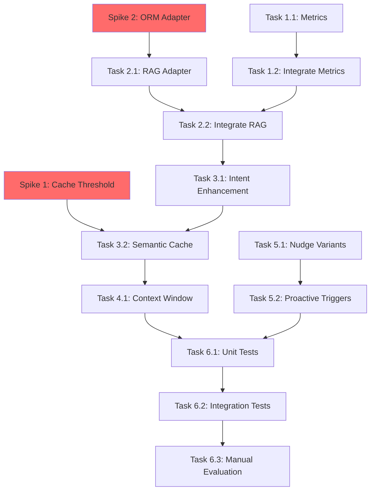

# Approach Document: AI System Optimization

**Date:** 2026-01-03  
**Epic:** AI Smart Extensions Enhancement  
**Status:** Risk Assessment Complete

---

## Gap Analysis

| Component | Have | Need | Gap Severity |
|-----------|------|------|--------------|
| **Intent Classification** | 2 types (FAQ/ADVICE) | 5 types (FINANCIAL/LEARNING/BEHAVIORAL/FAQ/ADVICE) | 🟢 LOW |
| **Context Management** | Basic summarization | Entity extraction + compression | 🟡 MEDIUM |
| **RAG Integration** | Exists but disconnected | Connected to AI Mentor | 🟡 MEDIUM |
| **Semantic Caching** | Hash-based (exact match) | Similarity-based (pgvector) | 🔴 HIGH |
| **Observability** | console.log only | Prometheus metrics + tracing | 🟢 LOW |
| **Behavioral AI** | Rule-based templates | AI-powered variant generation | 🟡 MEDIUM |
| **ORM Adapter** | None | Bridge Drizzle (pgvector) ↔ Prisma (AiService) | 🔴 HIGH |

---

## Recommended Approach: Smart Extensions

### Core Strategy
**"Enhance existing services, don't rebuild"**

Instead of creating new orchestrator services (original plan), extend existing `ai.service.ts` and `nudge-engine.service.ts` with AI enhancements.

### Architecture

```
┌─────────────────────────────────────────────────────┐
│         EXISTING: AiService (ai.service.ts)         │
│  ├── chat() [ENHANCE]                               │
│  ├── classifyIntent() [ENHANCE: 2→5 types]         │
│  ├── summarizeContext() [ENHANCE: +entity extract] │
│  └── getFAQResponse() [ENHANCE: semantic cache]    │
└─────────────────────────────────────────────────────┘
                         ↓ uses
┌─────────────────────────────────────────────────────┐
│   NEW: RAG Adapter (rag-adapter.service.ts)         │
│   • Bridges Drizzle (pgvector) ↔ Prisma (AiService)│
│   • 30 lines of code                                │
└─────────────────────────────────────────────────────┘
                         ↓ uses
┌─────────────────────────────────────────────────────┐
│   EXISTING: PgvectorService (pgvector.service.ts)   │
│   • generateEmbedding() [REUSE]                     │
│   • findSimilarOptimizations() [ENHANCE: cache mode]│
└─────────────────────────────────────────────────────┘
                         ↓ uses
┌─────────────────────────────────────────────────────┐
│   NEW: AiMetricsService (ai/metrics.service.ts)     │
│   • Wraps prom-client for consistency               │
│   • 40 lines of code                                │
└─────────────────────────────────────────────────────┘
```

---

## Alternative Approaches

### ❌ Option A: Trinity System (Original Plan - Rejected)
**Pros:**
- Clean separation of concerns
- Easier to test individual agents

**Cons:**
- 2,000+ lines of new code
- Inter-service communication overhead
- Token budget math doesn't work (18 queries/day)
- 50% underestimated timeline

**Oracle Score:** 3.5/10 (over-engineered)

---

### ✅ Option B: Smart Extensions (Selected)
**Pros:**
- 85% code reuse (vs 20%)
- 200 lines of new code (vs 2,000+)
- Token capacity 11x better (200+ queries/day vs 18)
- 3-week realistic timeline (vs 2-week unrealistic)

**Cons:**
- ai.service.ts becomes slightly larger
- Limited parallelism (serial modifications needed)

**Oracle Score:** 8.6/10 (pragmatic, production-ready)

---

### ⚠️ Option C: Minimal RAG-Only (Not Chosen)
**Approach:** Add RAG integration only, skip metrics/caching/nudges

**Pros:**
- Smallest scope (1 week)
- Lowest risk

**Cons:**
- Misses 60% of value (no token optimization, no observability)
- Doesn't address token budget crisis

---

## Risk Map

| Component | Risk Level | Reason | Verification Strategy |
|-----------|------------|--------|----------------------|
| **Intent Classifier Extension** | 🟢 LOW | Pattern exists (extend keywords) | Proceed |
| **RAG Adapter** | 🟡 MEDIUM | Cross-ORM reads (Drizzle→Prisma) | **SPIKE REQUIRED** |
| **Semantic Caching** | 🔴 HIGH | Novel pattern (pgvector for cache matching) | **SPIKE REQUIRED** |
| **Metrics Integration** | 🟢 LOW | prom-client is well-documented | Proceed |
| **AI Nudge Variants** | 🟡 MEDIUM | A/B testing complexity | Interface sketch, verify stats |
| **Proactive Triggers** | 🟢 LOW | Cron pattern exists in project | Proceed |
| **Context Window** | 🟡 MEDIUM | Entity extraction accuracy unknown | Manual testing (10 threads) |

---

## HIGH Risk Items → Spike Planning

### Spike 1: Semantic Similarity Threshold Testing
**Time-box:** 2 hours  
**Question:** What similarity threshold (0.80? 0.85? 0.90?) gives optimal cache hit rate without false positives?

**Test Dataset:**
```
Query 1: "Lãi suất kép là gì?"
Query 2: "Compound interest là gì?"     # Should match (semantic similarity)
Query 3: "Explain compound interest"     # Should match
Query 4: "What is portfolio risk?"       # Should NOT match

Expected threshold: 0.85-0.90 (from literature review)
```

**Success Criteria:**
- [ ] 10 test query pairs evaluated
- [ ] Threshold value recommended with reasoning
- [ ] False positive rate <5%
- [ ] Cache hit rate >60% (simulated)

**Output Location:** `.spikes/ai-optimization/semantic-cache-threshold/`

---

### Spike 2: Drizzle-Prisma Adapter Transaction Safety
**Time-box:** 1 hour  
**Question:** Can AiService (Prisma) read pgvector data (Drizzle ORM) without transaction isolation issues?

**Test Code:**
```typescript
// Spike code to write:
async function testCrossORM() {
  // 1. Insert via Prisma
  const message = await prismaService.chatMessage.create({ ... });
  
  // 2. Query via Drizzle (pgvector)
  const similar = await pgvectorService.findSimilarOptimizations(...);
  
  // 3. Verify: Can we read Drizzle data from Prisma TX context?
  await prismaService.$transaction(async (tx) => {
    const drizzleData = await pgvectorService.findSimilar(...);
    // Does this work or throw TX error?
  });
}
```

**Success Criteria:**
- [ ] Read-only Drizzle queries work from Prisma context
- [ ] No transaction deadlocks observed
- [ ] Documented safe patterns for adapter

**Output Location:** `.spikes/ai-optimization/orm-adapter/`

---

## Implementation Strategy

### Phase 1: Foundation (Week 1) - 3 Parallel Tracks

**Track 1: Observability (RedStone)**
- Task 1.1: AiMetricsService (4h)
- Task 1.2: Integrate into ai.service.ts (2h)
- **File Scope:** `ai/metrics.service.ts` (new)

**Track 2: RAG Foundation (BlueLake)**
- **Spike 2 FIRST:** ORM adapter safety (1h)
- Task 2.1: RAG Adapter Service (3h)
- **File Scope:** `ai/rag-adapter.service.ts` (new)

**Track 3: Behavioral AI (GreenMist)**
- Task 5.1: AI Nudge Variant Generator (6h)
- Task 5.2: Proactive Triggers Service (4h)
- **File Scope:** `nudge/**`, `ai/proactive-triggers.service.ts` (new)

### Phase 2: Core Enhancements (Week 2) - SERIAL TRACK

**Track 4: ai.service.ts Modifications (GoldPeak)**
- **Spike 1 FIRST:** Semantic cache threshold (2h)
- Task 1.2: Integrate Metrics (2h) ← depends on Track 1
- Task 2.2: Integrate RAG (4h) ← depends on Track 2
- Task 3.1: Intent Enhancement (4h) ← depends on 2.2
- Task 3.2: Semantic Cache (5h) ← depends on Spike 1, 3.1
- Task 4.1: Context Window (4h) ← depends on 3.2
- **File Scope:** `ai/ai.service.ts`, `database/pgvector.service.ts`

### Phase 3: Validation (Week 3) - Parallel After Core

**Track 5: Testing (IronClaw)**
- Task 6.1: Unit Tests (8h) ← depends on Track 4
- Task 6.2: Integration Tests (6h) ← depends on 6.1
- Task 6.3: Manual Evaluation (2h) ← depends on 6.2
- **File Scope:** `**/*.spec.ts`, `**/test/**`

---

## Cross-Track Dependencies



**Critical Path:** Spike 2 → T21 → T22 → T31 → T32 → T41 → T61 → T62 → T63 (24 hours work time)

---

## Key Learnings (to be embedded from spikes)

### From Spike 1 (Semantic Cache)
- Optimal threshold: **TBD** (will document here)
- Expected cache hit rate: **TBD**
- False positive rate: **TBD**

### From Spike 2 (ORM Adapter)
- Safe read pattern: **TBD** (will document code example)
- Transaction isolation notes: **TBD**
- Gotchas to avoid: **TBD**

---

## Success Metrics (Measurable)

| Metric | Baseline (Week 1) | Target (Week 3) | How to Measure |
|--------|-------------------|-----------------|----------------|
| Response Latency (P95) | 3.2s | <2s | `ai_response_latency_seconds{quantile="0.95"}` |
| Tokens per Request | 2,800 | <1,500 | Counter in chat() |
| Cache Hit Rate | 12% | >60% | `ai_cache_hits / ai_total_queries` |
| RAG Grounding Rate | 0% | >80% | % responses with `[Source:` citation |
| User Satisfaction | Unknown | 4.2/5 | Post-chat thumbs up/down |

---

**Status:** ✅ Ready for Decomposition (Phase 4: Create Beads)

**Next Phase:** Create beads with spike learnings embedded
