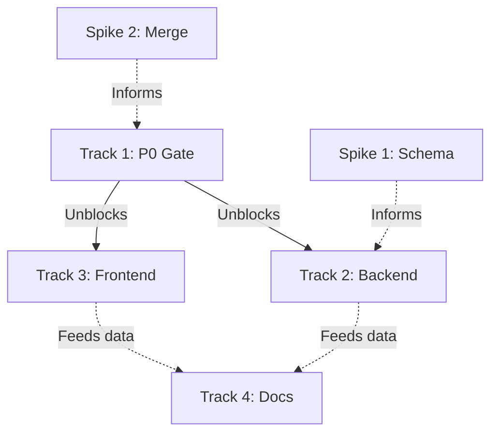

# Approach: V-EdFinance Project Audit & Technical Debt Cleanup

**Epic:** VED-3GAT  
**Generated:** 2026-01-05  
**Based on:** [discovery.md](file:///c:/Users/luaho/Demo%20project/v-edfinance/history/audit/discovery.md)

---

## Gap Analysis

| Component                  | Have                                  | Need                                       | Gap                                        |
|----------------------------|---------------------------------------|--------------------------------------------|--------------------------------------------|
| **P0 Blockers**            | 2 merge conflicts (open)              | Clean merges, builds pass                  | Resolve VED-P0A, VED-P0B                   |
| **TypeScript Errors**      | 57 errors (mostly tests)              | Zero errors                                | Fix test types, schema mismatches          |
| **Schema Validation**      | Manual checks                         | Automated integrity check                  | Use /api/debug/diagnostics endpoint        |
| **Database Migrations**    | Partial migrations                    | All migrations validated                   | Audit schema vs migrations folder          |
| **JSONB Schema Registry**  | Exists but incomplete                 | All JSONB fields registered                | Audit SchemaRegistry completeness          |
| **TODO Comments**          | 40 items (some critical)              | All documented or resolved                 | Categorize + create tech debt register     |
| **Temp Files**             | 5 temp dirs + archive dirs            | Clean repo                                 | Remove temp_*, consolidate archive/        |
| **Build System**           | Builds with warnings                  | Clean builds                               | Fix all TypeScript + lint errors           |
| **VPS Deployment**         | Manual steps                          | Documented runbook                         | Create deployment runbook                  |

---

## Recommended Approach

### Strategy: **Parallel Track Execution with Dependency Gates**

Execute cleanup in **4 parallel tracks** with clear file scopes to avoid conflicts:

1. **Track 1: Critical Blockers** (P0 Gate)  
   → Fix merge conflicts → Enable builds

2. **Track 2: Backend Quality** (API Scope)  
   → Fix TS errors → Validate schema → Document migrations

3. **Track 3: Frontend Quality** (Web Scope)  
   → Fix test errors → Clean temp files

4. **Track 4: Documentation & Observability** (Docs/Monitoring Scope)  
   → Create runbooks → Update AGENTS.md → Tech debt register

---

## Alternative Approaches (Rejected)

### Option A: Sequential Cleanup
- **Pros:** Simpler coordination
- **Cons:** 8-11 hours → 3+ days total time
- **Rejected:** Too slow, blocks Track 4 deployment

### Option B: "Big Bang" Refactor
- **Pros:** Could redesign problem areas
- **Cons:** High risk, scope creep, no validation
- **Rejected:** Violates "zero debt" principle from AGENTS.md

---

## Risk Map

| Component                           | Risk   | Reason                                        | Verification                                          |
|-------------------------------------|--------|-----------------------------------------------|-------------------------------------------------------|
| **P0 Merge Conflicts**              | HIGH   | Blocks pnpm install → All builds fail         | Spike: Test merge strategies                          |
| **Schema Drift (Prisma)**           | HIGH   | Tests show missing fields (thumbnailKey, etc.)| Spike: Run schema validation diagnostic               |
| **Test Type Errors (57 total)**     | MEDIUM | Broken tests → No CI/CD confidence            | Proceed (patterns exist in working tests)             |
| **JSONB SchemaRegistry Gaps**       | MEDIUM | Runtime validation could fail                 | Spike: Audit all JSONB fields vs registry             |
| **TODO Comments (Payment/AI)**      | MEDIUM | Unfinished features in critical modules       | Proceed (document in tech debt register)              |
| **Temp File Cleanup**               | LOW    | Clutter but not blocking                      | Proceed (simple file removal)                         |
| **VPS Deployment Runbook**          | LOW    | Manual knowledge exists                       | Proceed (transcribe from history/)                    |

---

## Detailed Track Breakdown

### Track 1: P0 Critical Blockers (File Scope: Root + apps/web/package.json)

**Priority:** 0 (Must complete first)  
**Estimated Time:** 30 minutes  
**Agent:** RedGate (blocking gate for other tracks)

**Beads:**
1. **VED-P0A:** Resolve root package.json merge
   - Keep upstream (Updated) version
   - Preserve workspaces array: `["apps/*", "packages/*"]`
   - Verify: `pnpm install` succeeds

2. **VED-P0B:** Resolve apps/web/package.json merge
   - Merge both dependency sets (UI + testing libs)
   - Verify: `pnpm --filter web build` succeeds

**Cross-Track Dependency:** Track 2 & 3 BLOCKED until Track 1 completes

---

### Track 2: Backend Quality (File Scope: apps/api/**)

**Priority:** 1  
**Estimated Time:** 4-5 hours  
**Agent:** BlueLake

**Beads:**
1. **Fix API Test Type Errors** (3 hours)
   - scenario-generator.service.spec.ts (13 errors)
   - auth.service.spec.ts (1 error)
   - dynamic-config.service.spec.ts (4 errors)
   - ai-course-flow.e2e-spec.ts (3 errors)
   
2. **Validate Prisma Schema** (1 hour)
   - Compare schema.prisma vs migrations/ folder
   - Run GET /api/debug/diagnostics/verify-integrity
   - Document intentional schema subsets (dev vs production)
   
3. **Audit JSONB SchemaRegistry** (30 min)
   - List all JSONB fields in schema.prisma
   - Check SchemaRegistry for completeness
   - Add missing validators
   
4. **Categorize TODO Comments** (30 min)
   - Extract all TODO/FIXME from apps/api
   - Categorize: P0 (blocking), P1 (feature debt), P2 (nice-to-have)
   - Create tech-debt-register.md

**Acceptance Criteria:**
- `pnpm --filter api build` succeeds with zero errors
- Schema validation endpoint returns green
- All TODO items documented

---

### Track 3: Frontend Quality (File Scope: apps/web/**)

**Priority:** 1  
**Estimated Time:** 2-3 hours  
**Agent:** GreenCastle

**Beads:**
1. **Fix Frontend Test Errors** (2 hours)
   - YouTubeErrorBoundary.test.tsx (29 errors)
   - Add missing Vitest matchers (toBeInTheDocument, toHaveAttribute)
   
2. **Clean Temp Files** (30 min)
   - Remove: temp_ai_gallery/, temp_beads_viewer/, temp_gemini_chatbot/, temp_indie_tools/, temp_skills/
   - Archive: Move .spike/, .spikes/ content to archive/spikes/
   - Verify git status clean
   
3. **Frontend TODO Audit** (30 min)
   - Extract TODO comments from apps/web
   - Document in tech-debt-register.md

**Acceptance Criteria:**
- `pnpm --filter web build` succeeds
- All tests pass or have documented skips
- No temp_* directories in root

---

### Track 4: Documentation & Observability (File Scope: docs/, AGENTS.md, monitoring/)

**Priority:** 2  
**Estimated Time:** 2-3 hours  
**Agent:** PurpleBear

**Beads:**
1. **Create VPS Deployment Runbook** (1.5 hours)
   - Extract steps from history/vps-deployment/
   - Include: Dokploy setup, Cloudflare Tunnel, DB migrations
   - Add to runbooks/vps-deployment.md
   
2. **Update AGENTS.md** (30 min)
   - Add recent learnings (P0 gate pattern, schema validation)
   - Update quality checklist with new diagnostics
   
3. **Create Tech Debt Register** (1 hour)
   - Consolidate TODO items from Track 2 & 3
   - Categorize by priority and module
   - Add to docs/TECH_DEBT.md
   
4. **Audit Monitoring Setup** (30 min)
   - Verify docker-compose.monitoring.yml works
   - Document Grafana/Prometheus access
   - Add to runbooks/monitoring.md

**Acceptance Criteria:**
- VPS deployment runbook complete
- AGENTS.md updated with audit learnings
- Tech debt register created

---

## Spikes Required (HIGH Risk Items)

### Spike 1: Schema Drift Validation
**Question:** Does schema.prisma match all migration files? Are there orphaned migrations?

**Time-box:** 30 minutes  
**Output:** `.spikes/schema-validation/`

**Steps:**
1. Generate Prisma client from current schema
2. Compare with migrations/ folder
3. Run diagnostic endpoint: `GET /api/debug/diagnostics/verify-integrity`
4. Document findings

**Success Criteria:**
- [ ] Working validation script exists
- [ ] Answer: YES (schema matches) or NO (drift found)
- [ ] Learnings captured for Track 2 Bead 2

### Spike 2: Merge Conflict Strategy
**Question:** What's the safest merge strategy for package.json conflicts?

**Time-box:** 15 minutes  
**Output:** `.spikes/merge-strategy/`

**Steps:**
1. Test `git checkout --theirs` on package.json
2. Verify workspaces array presence
3. Test `pnpm install`
4. Document resolution steps

**Success Criteria:**
- [ ] Merge strategy validated
- [ ] pnpm install succeeds
- [ ] Learnings captured for Track 1

---

## Cross-Track Dependencies

**Legend:**
- Solid arrows (→): Hard blocking dependencies
- Dotted arrows (⋯→): Soft dependencies (data sharing)

**Execution Order:**
1. **Parallel Spikes:** S1 + S2 (45 min total)
2. **Track 1:** P0 Gate (30 min) → BLOCKS all others
3. **Parallel Tracks:** T2 + T3 (5 hours max)
4. **Track 4:** Documentation (3 hours, can start after T2/T3 data available)

---

## Success Metrics

### Build Quality
- [ ] `pnpm build` succeeds with zero errors
- [ ] `pnpm --filter api build` - no TypeScript errors
- [ ] `pnpm --filter web build` - no TypeScript errors

### Database Integrity
- [ ] Schema validation endpoint: `GET /api/debug/diagnostics/verify-integrity` returns green
- [ ] All JSONB fields registered in SchemaRegistry
- [ ] Migration audit complete (no orphaned files)

### Code Quality
- [ ] Zero TypeScript `any` types in new/fixed code
- [ ] All TODO comments documented in tech debt register
- [ ] No temp_* directories in root

### Documentation
- [ ] VPS deployment runbook complete
- [ ] AGENTS.md updated with audit learnings
- [ ] Tech debt register created (docs/TECH_DEBT.md)

### Clean Git State
- [ ] No merge conflict markers
- [ ] All changes committed
- [ ] Beads daemon files in .gitignore (already done per AGENTS.md)

---

## Estimated Timeline

| Track  | Agent        | Time    | Dependencies             |
|--------|--------------|---------|--------------------------|
| Spikes | Main Agent   | 45 min  | None (run in parallel)   |
| Track 1| RedGate      | 30 min  | After Spike 2            |
| Track 2| BlueLake     | 5 hours | After Track 1            |
| Track 3| GreenCastle  | 3 hours | After Track 1            |
| Track 4| PurpleBear   | 3 hours | After Track 2 & 3 start  |

**Critical Path:** Spikes (45min) → Track 1 (30min) → Track 2 (5hr) = **6.25 hours**  
**Total Calendar Time:** ~8 hours (with parallel execution)  
**With Breaks:** 1.5 days

---

## Next Steps

1. **Phase 3 (Verification):** Execute Spike 1 + Spike 2
2. **Phase 4 (Decomposition):** Create .beads/*.md files for each track
3. **Phase 5 (Validation):** Run `bv --robot-plan` to validate dependency graph
4. **Phase 6 (Track Planning):** Generate execution-plan.md for orchestrator
