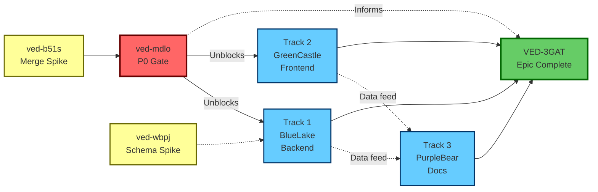

# Execution Plan: V-EdFinance Project Audit

**Epic:** VED-3GAT  
**Generated:** 2026-01-05  
**Status:** Ready for Orchestrator

---

## Tracks Overview

| Track | Agent       | Beads (in order)                          | File Scope                  | Est. Time |
|-------|-------------|-------------------------------------------|-----------------------------|-----------|
| 0     | RedGate     | ved-b51s → ved-mdlo (P0A, P0B embedded)  | package.json, apps/web/     | 45 min    |
| 1     | BlueLake    | API quality beads (TBD after spikes)     | apps/api/**                 | 5 hours   |
| 2     | GreenCastle | Frontend quality beads (TBD)             | apps/web/**                 | 3 hours   |
| 3     | PurpleBear  | Documentation beads (TBD)                | docs/, AGENTS.md, runbooks/ | 3 hours   |

---

## Track 0: P0 Critical Gate - RedGate

**Purpose:** Unblock all builds - MUST complete before other tracks start  
**File Scope:** 
- `package.json` (root)
- `apps/web/package.json`

**Beads (Execution Order):**

### 1. ved-b51s: Spike - Test merge conflict resolution
**Type:** Spike (Time-box: 15 min)  
**Priority:** P0  
**Output:** `.spikes/merge-strategy/`

**Task:**
- Test `git checkout --theirs package.json`
- Verify workspaces array: `["apps/*", "packages/*"]` is preserved
- Run `pnpm install` to validate
- Document safe merge strategy

**Success Criteria:**
- [ ] Merge strategy validated
- [ ] `pnpm install` succeeds
- [ ] Resolution steps documented in `.spikes/merge-strategy/FINDINGS.md`

**On Complete:**
- Close with: `bd close ved-b51s --reason "Strategy: [details]"`
- Send to Agent Mail epic thread

---

### 2. ved-mdlo: Fix P0 merge conflicts (Epic container)

**Sub-tasks (embedded):**

#### A. VED-P0A: Resolve root package.json
**File:** `package.json`  
**Strategy (from spike ved-b51s):**
1. `git checkout --theirs package.json`
2. Manually verify/add workspaces array if missing:
   ```json
   "workspaces": ["apps/*", "packages/*"]
   ```
3. `pnpm install` to verify

**Acceptance:**
- [ ] No merge conflict markers
- [ ] `pnpm install` completes without errors
- [ ] workspaces array present

#### B. VED-P0B: Resolve apps/web/package.json
**File:** `apps/web/package.json`  
**Strategy:** Merge BOTH dependency sets
- Keep @radix-ui/* (UI components)
- Keep date-fns, framer-motion, zustand
- Keep testing libraries from both sides

**Acceptance:**
- [ ] No merge conflict markers
- [ ] All UI dependencies present
- [ ] `cd apps/web && pnpm build` succeeds

**On Complete:**
- Close: `bd close ved-mdlo --reason "Both package.json conflicts resolved, builds working"`
- Unblocks: Track 1, 2, 3

---

## Track 1: Backend Quality - BlueLake

**File Scope:** `apps/api/**`  
**Depends On:** Track 0 (ved-mdlo) complete

**Beads (TO BE CREATED after spike ved-wbpj):**

### Planned Beads (from approach.md):
1. **Fix API Test Type Errors** (3 hours)
   - scenario-generator.service.spec.ts (13 errors)
   - auth.service.spec.ts (1 error)
   - dynamic-config.service.spec.ts (4 errors)
   - ai-course-flow.e2e-spec.ts (3 errors)

2. **Validate Prisma Schema** (1 hour)
   - Run spike ved-wbpj first
   - Compare schema.prisma vs migrations/
   - Run `GET /api/debug/diagnostics/verify-integrity`
   - Document intentional subsets

3. **Audit JSONB SchemaRegistry** (30 min)
   - List all JSONB fields
   - Check SchemaRegistry coverage
   - Add missing validators

4. **Categorize Backend TODOs** (30 min)
   - Extract 40 TODO/FIXME comments
   - Create tech-debt-register.md

**Acceptance:**
- `pnpm --filter api build` succeeds (zero errors)
- Schema validation endpoint green
- All TODOs documented

---

## Track 2: Frontend Quality - GreenCastle

**File Scope:** `apps/web/**`  
**Depends On:** Track 0 (ved-mdlo) complete

**Beads (TO BE CREATED):**

### Planned Beads:
1. **Fix Frontend Test Errors** (2 hours)
   - YouTubeErrorBoundary.test.tsx (29 errors)
   - Add Vitest matchers

2. **Clean Temp Files** (30 min)
   - Remove: temp_ai_gallery/, temp_beads_viewer/, etc.
   - Archive spikes

3. **Frontend TODO Audit** (30 min)
   - Extract TODOs from apps/web
   - Add to tech-debt-register.md

**Acceptance:**
- `pnpm --filter web build` succeeds
- No temp_* in root
- All tests pass or documented

---

## Track 3: Documentation - PurpleBear

**File Scope:** `docs/`, `AGENTS.md`, `runbooks/`, `history/`  
**Depends On:** Track 1 & 2 data available (soft dependency)

**Beads (TO BE CREATED):**

### Planned Beads:
1. **VPS Deployment Runbook** (1.5 hours)
   - Extract from history/vps-deployment/
   - Add to runbooks/vps-deployment.md

2. **Update AGENTS.md** (30 min)
   - Add audit learnings
   - Update quality checklist

3. **Tech Debt Register** (1 hour)
   - Consolidate TODOs from Track 1 & 2
   - Create docs/TECH_DEBT.md

4. **Monitoring Audit** (30 min)
   - Document Grafana/Prometheus
   - Add to runbooks/monitoring.md

**Acceptance:**
- Runbooks complete
- AGENTS.md updated
- Tech debt register exists

---

## Cross-Track Dependencies



**Legend:**
- Solid arrows (→): Hard blocking dependencies
- Dotted arrows (⋯→): Soft dependencies (data sharing)

---

## Execution Protocol (Beads Trinity)

### For Each Track Agent:

#### 1. Start Bead
```bash
# Register agent identity
# (Agent Mail registration - TBD when orchestrator spawns workers)

# Reserve files
# Use Agent Mail file reservation protocol

# Claim bead
bd update <bead-id> --status in_progress --no-daemon
```

#### 2. Work on Bead
- Use preferred tools from AGENTS.md
- Check Agent Mail inbox periodically
- Report blockers immediately to orchestrator

#### 3. Complete Bead
```bash
# Close bead
bd close <bead-id> --reason "Summary of work" --no-daemon

# Report to orchestrator via Agent Mail
# (Create message in .beads/agent-mail/<epic-id>/)

# Save context for next bead
# (Write to track thread)

# Move to next bead in track
```

#### 4. Track Complete
- Send track completion message to orchestrator
- Return summary of all work

---

## Agent Mail Structure

### Epic Thread: `ved-3gat`
**Purpose:** Cross-track coordination, blocker resolution

**Message Types:**
- `[<bead-id>] COMPLETE` - Bead completion notifications
- `[<bead-id>] BLOCKED` - Blocker reports (importance: high)
- `[Track N] COMPLETE` - Track completion

### Track Threads:
- `track:RedGate:ved-3gat` - Track 0 context
- `track:BlueLake:ved-3gat` - Track 1 context
- `track:GreenCastle:ved-3gat` - Track 2 context
- `track:PurpleBear:ved-3gat` - Track 3 context

**Purpose:** Sequential context passing between beads in same track

---

## Success Metrics (Epic-Level)

### Build Quality
- [ ] `pnpm build` succeeds (zero errors)
- [ ] `pnpm --filter api build` - no TypeScript errors
- [ ] `pnpm --filter web build` - no TypeScript errors

### Database Integrity
- [ ] `GET /api/debug/diagnostics/verify-integrity` returns green
- [ ] All JSONB fields in SchemaRegistry
- [ ] Migration audit complete

### Code Quality
- [ ] Zero TypeScript `any` in new code
- [ ] All TODOs documented
- [ ] No temp_* directories

### Documentation
- [ ] VPS runbook complete
- [ ] AGENTS.md updated
- [ ] Tech debt register created

### Git State
- [ ] No merge conflicts
- [ ] All changes committed
- [ ] Beads daemon files in .gitignore ✓

---

## Timeline Estimate

| Phase                  | Time    | Parallelizable? |
|------------------------|---------|-----------------|
| Spikes (ved-b51s, ved-wbpj) | 45 min  | Yes             |
| Track 0 (P0 Gate)      | 45 min  | No (sequential) |
| Track 1 (Backend)      | 5 hours | Yes (after T0)  |
| Track 2 (Frontend)     | 3 hours | Yes (after T0)  |
| Track 3 (Docs)         | 3 hours | Yes (after T1/T2 start) |

**Critical Path:** Spikes (45min) → Track 0 (45min) → Track 1 (5hr) = **6.5 hours**  
**Total Calendar Time:** ~8 hours with parallel execution  
**With Breaks:** 1.5 days

---

## Next Steps for Orchestrator

1. **Execute Spikes First:**
   - Spawn Task() for ved-b51s (merge strategy)
   - Spawn Task() for ved-wbpj (schema validation)
   - Wait for both to complete (~45 min)

2. **Spawn Track 0 (Blocking Gate):**
   - Agent RedGate executes ved-mdlo
   - MUST complete before other tracks

3. **Create Remaining Beads:**
   - Use spike learnings to finalize Track 1, 2, 3 beads
   - Add to .beads/ with proper dependencies

4. **Spawn Parallel Tracks:**
   - BlueLake (Track 1)
   - GreenCastle (Track 2)
   - PurpleBear (Track 3)

5. **Monitor via Agent Mail:**
   - Check epic thread for blockers
   - Coordinate file conflicts if needed

6. **Epic Completion:**
   - Verify all success metrics
   - Close VED-3GAT
   - Send completion summary

---

## Key Learnings (For Workers)

### From Spike ved-b51s (Merge Strategy):
- **TBD after spike execution**
- Will embed in ved-mdlo description

### From Spike ved-wbpj (Schema Validation):
- **TBD after spike execution**
- Will inform Track 1 Bead 2 (Validate Prisma Schema)

### From AGENTS.md:
- Always use `--no-daemon` flag with beads commands during git operations
- Check .gitignore for daemon files (already present)
- Use Anti-Hallucination Protocol: Read files before editing
- Cite file paths in completion messages

---

## Status

- [x] Discovery complete
- [x] Approach defined
- [x] Epic created (VED-3GAT)
- [x] P0 Gate epic created (ved-mdlo)
- [x] Spike beads created (ved-b51s, ved-wbpj)
- [x] Dependencies mapped
- [ ] **NEXT:** Execute spikes to finalize learnings
- [ ] **THEN:** Create Track 1, 2, 3 beads
- [ ] **THEN:** Run `bv --robot-plan` to validate
- [ ] **FINALLY:** Spawn orchestrator workers
