# Execution Plan: Phase 1 MVP Launch - Feature Optimization
**Epic:** Phase 1 MVP Launch (4 weeks)  
**Generated:** 2026-01-04  
**Strategy:** Multi-Agent Parallel Execution via Beads Trinity

---

## Executive Summary

**Goal:** Launch MVP with core student learning experience in 4 weeks  
**Approach:** 5 parallel tracks + 2 spike tracks for high-risk validation  
**Agents:** 7 autonomous workers coordinated via Agent Mail  
**Success Criteria:** 100 beta users, 5 courses, 80% Week 2 retention

---

## Risk Assessment & Spikes Required

### HIGH Risk Features (Require Spikes)

| Feature | Risk Factor | Spike Required | Time-box |
|---------|-------------|----------------|----------|
| **Quiz System** | New interactive component type | ✅ Spike: Quiz rendering engine | 1 hour |
| **Certificate PDF Generation** | External library (PDFKit/Puppeteer) | ✅ Spike: PDF generation workflow | 1 hour |
| **Payment Gateway (Stripe)** | External integration + webhook security | ✅ Spike: Stripe SDK + webhook verification | 2 hours |
| **Course Enrollment Flow** | Transaction integrity (payment → enrollment) | ✅ Spike: Payment → DB atomicity | 1 hour |

### MEDIUM Risk Features (Interface Sketch + Type-check)

| Feature | Risk Factor | Mitigation |
|---------|-------------|------------|
| Student Roster | New UI table component | Use existing table patterns from BehaviorLog |
| Progress Monitoring | Complex Prisma aggregations | Use Kysely service (already exists) |
| Quiz Builder | Form builder complexity | Follow existing lesson builder patterns |

### LOW Risk Features (Existing Patterns)

✅ All features marked as "Implemented" in COMPREHENSIVE_FEATURE_PLAN.md

---

## Dependency Analysis

### Critical Path (Must Complete First)

```mermaid
graph LR
    A[Auth System ✅] --> B[User Management]
    B --> C[Course Creation ✅]
    C --> D[Lesson Builder ✅]
    D --> E[Quiz System 🔄]
    E --> F[Progress Tracking ✅]
    F --> G[Certificate Generation 🔄]
    
    B --> H[Payment Gateway 🔄]
    H --> I[Course Enrollment 🔄]
    I --> F
```



### Parallelization Opportunities

**Can Start Immediately (No Blockers):**
- Track 1: Quiz System (after spike)
- Track 2: Certificate Generation (after spike)
- Track 3: Student Roster UI
- Track 4: Payment Gateway Integration (after spike)
- Track 5: AI Testing Setup (independent)

**Must Wait:**
- Course Enrollment → Requires Payment Gateway complete
- Teacher Revenue Dashboard → Requires Payment + Enrollment

---

## Track Assignments

### Track 1: QuizMaster - Quiz System Implementation
**Agent:** BlueLake  
**File Scope:** `apps/web/src/components/quiz/**, apps/api/src/modules/quiz/**`  
**Duration:** 1.5 weeks  
**Priority:** P0 (Blocks certificates)

**Beads (in order):**
1. `ved-quiz-spike` - Spike: Test quiz rendering engine (1 hour)
2. `ved-quiz-schema` - Add Quiz model to Prisma schema (4 hours)
3. `ved-quiz-backend` - Create Quiz CRUD API endpoints (6 hours)
4. `ved-quiz-builder` - Teacher quiz builder UI (8 hours)
5. `ved-quiz-player` - Student quiz player component (8 hours)
6. `ved-quiz-grading` - Auto-grading logic (6 hours)
7. `ved-quiz-tests` - E2E tests for quiz flow (4 hours)

**Spike Learnings to Embed:**
- Which quiz rendering library (react-quiz-component vs custom)
- State management approach (Zustand vs local state)
- Validation schema (Zod patterns)

---

### Track 2: CertificateForge - Certificate Generation
**Agent:** GreenCastle  
**File Scope:** `apps/api/src/modules/certificate/**, apps/web/src/components/certificate/**`  
**Duration:** 1 week  
**Priority:** P0 (User-facing feature)

**Beads (in order):**
1. `ved-cert-spike` - Spike: Test PDF generation (PDFKit vs Puppeteer) (1 hour)
2. `ved-cert-schema` - Add Certificate model to Prisma (3 hours)
3. `ved-cert-template` - Design certificate template (HTML/CSS) (4 hours)
4. `ved-cert-generator` - PDF generation service (6 hours)
5. `ved-cert-storage` - Upload to R2 storage (3 hours)
6. `ved-cert-endpoint` - API endpoint: `/api/certificates/generate` (4 hours)
7. `ved-cert-ui` - Student certificate download UI (3 hours)
8. `ved-cert-i18n` - Multi-language certificate support (vi/en/zh) (4 hours)

**Spike Learnings to Embed:**
- Library choice (PDFKit for performance vs Puppeteer for complex layouts)
- Template variables (student name, course title, completion date)
- Signature/seal image handling

---

### Track 3: RosterView - Student Management UI
**Agent:** RedStone  
**File Scope:** `apps/web/src/app/[locale]/teacher/**, apps/api/src/modules/teacher/**`  
**Duration:** 1 week  
**Priority:** P1 (Teacher essential)

**Beads (in order):**
1. `ved-roster-api` - API: Get enrolled students per course (4 hours)
2. `ved-roster-table` - Student roster table component (6 hours)
3. `ved-roster-filters` - Filters: status, date, name search (4 hours)
4. `ved-roster-export` - Export roster to CSV (3 hours)
5. `ved-progress-api` - API: Student progress summary (5 hours)
6. `ved-progress-ui` - Progress monitoring dashboard (6 hours)
7. `ved-engagement-analytics` - Time spent, completion rate charts (5 hours)

**Pattern Reuse:**
- Table component: Follow `BehaviorLog` analytics table pattern
- Charts: Use existing Chart.js setup from admin analytics

---

### Track 4: PaymentGateway - Stripe Integration
**Agent:** PurpleBear  
**File Scope:** `apps/api/src/modules/payment/**, apps/web/src/app/[locale]/checkout/**`  
**Duration:** 1.5 weeks  
**Priority:** P0 (Blocks enrollment)

**Beads (in order):**
1. `ved-stripe-spike` - Spike: Stripe SDK + webhook verification (2 hours)
2. `ved-stripe-setup` - Install Stripe SDK, configure keys (2 hours)
3. `ved-stripe-schema` - Add Transaction model to Prisma (3 hours)
4. `ved-stripe-checkout` - Create checkout session API (6 hours)
5. `ved-stripe-webhook` - Webhook handler: `/api/webhooks/stripe` (6 hours)
6. `ved-stripe-ui` - Checkout page UI (8 hours)
7. `ved-stripe-security` - Webhook signature verification (4 hours)
8. `ved-stripe-tests` - Integration tests with Stripe test mode (5 hours)

**Spike Learnings to Embed:**
- Webhook secret storage (env vars)
- Raw body requirement for signature verification
- Event types to handle: `checkout.session.completed`, `invoice.paid`

---

### Track 5: EnrollmentFlow - Course Enrollment
**Agent:** OrangeRiver  
**File Scope:** `apps/api/src/modules/enrollment/**, apps/web/src/app/[locale]/courses/**`  
**Duration:** 1 week  
**Priority:** P0 (Core user flow)  
**Blocker:** Requires `ved-stripe-webhook` (Track 4) complete

**Beads (in order):**
1. `ved-enroll-spike` - Spike: Payment → Enrollment atomicity (1 hour)
2. `ved-enroll-schema` - Add Enrollment model to Prisma (3 hours)
3. `ved-enroll-logic` - Enrollment service (handle payment webhook) (6 hours)
4. `ved-enroll-validation` - Check duplicate enrollment, course limits (4 hours)
5. `ved-enroll-ui` - "Enroll Now" button + confirmation modal (5 hours)
6. `ved-enroll-email` - Send confirmation email (3 hours)
7. `ved-enroll-tests` - E2E test: Payment → Enrollment → Access (5 hours)

**Spike Learnings to Embed:**
- Use Prisma transaction for atomicity: `db.$transaction([...])`
- Handle race conditions (double-click prevention)
- Idempotency key from Stripe

---

### Track 6 (Parallel): AITestingArmy - E2E Test Automation
**Agent:** SilverEagle  
**File Scope:** `tests/e2e/**, scripts/**, .env.testing`  
**Duration:** Ongoing (2 hours/week maintenance)  
**Priority:** P1 (Quality gate)

**Beads (in order):**
1. `ved-e2e-quiz` - E2E test: Quiz creation + taking (3 hours)
2. `ved-e2e-cert` - E2E test: Certificate generation (2 hours)
3. `ved-e2e-payment` - E2E test: Checkout flow (Stripe test mode) (4 hours)
4. `ved-e2e-enrollment` - E2E test: Full enrollment journey (3 hours)
5. `ved-e2e-roster` - E2E test: Teacher views student roster (2 hours)

**Independent:** Can run in parallel with all other tracks

---

### Track 7 (Parallel): DatabaseOptimization - Performance Tuning
**Agent:** GoldMountain  
**File Scope:** `apps/api/src/database/**, apps/api/prisma/**`  
**Duration:** Ongoing (as needed)  
**Priority:** P2 (Performance enhancement)  
**Status:** ON HOLD until ved-gdvp (Drizzle schema drift) fixed

**Beads (deferred to Phase 2):**
1. `ved-db-indexes` - Add missing indexes from audit
2. `ved-db-kysely` - Migrate complex queries to Kysely
3. `ved-db-drizzle` - Use Drizzle for high-frequency CRUD

---

## Cross-Track Dependencies

| Track | Depends On | Reason |
|-------|------------|--------|
| Track 5 (Enrollment) | Track 4 (Payment) bead `ved-stripe-webhook` | Needs webhook handler to trigger enrollment |
| Track 1 (Quiz) | No dependencies | Can start immediately after spike |
| Track 2 (Certificate) | Track 1 (Quiz) optional | Certificate can generate without quiz (based on lessons only) |
| Track 3 (Roster) | Track 5 (Enrollment) optional | Roster works with existing user data, enhanced after enrollment |

**Optimization:** Tracks 1, 2, 3, 4, 6 can run **fully in parallel**. Track 5 joins after Track 4 bead 5 completes.

---

## Spike Execution Plan (Pre-Work)

**Execute ALL spikes BEFORE spawning main tracks** (4 hours total):

```bash
# Create spike epic
bd create "Phase 1 Spikes - MVP Pre-Validation" --type epic --priority 0

# Create individual spike beads
bd create "Spike: Quiz rendering engine" --type task --blocks <spike-epic> --priority 0
bd create "Spike: PDF generation (PDFKit vs Puppeteer)" --type task --blocks <spike-epic> --priority 0
bd create "Spike: Stripe SDK + webhook verification" --type task --blocks <spike-epic> --priority 0
bd create "Spike: Payment → Enrollment atomicity" --type task --blocks <spike-epic> --priority 0
```

**Spike Outputs:**
- `.spikes/phase1-mvp/quiz-spike/` - Working quiz component prototype
- `.spikes/phase1-mvp/cert-spike/` - Sample PDF generation code
- `.spikes/phase1-mvp/stripe-spike/` - Webhook verification test
- `.spikes/phase1-mvp/enroll-spike/` - Prisma transaction example

**Success Criteria:**
- All 4 spikes answer "YES" (approach validated)
- Learnings documented in spike closure reasons
- Reference code available for main implementation

---

## Execution Timeline (4 Weeks)

### Week 1: Spikes + Foundation
- **Days 1-2:** Execute all 4 spikes (parallel)
- **Days 3-5:** Spawn Tracks 1, 2, 3, 4, 6 (parallel)
- **Milestone:** Quiz spike validated, Certificate spike validated, Payment spike validated

### Week 2: Core Features
- **Track 1:** Quiz backend + builder (50% complete)
- **Track 2:** Certificate generator + template (80% complete)
- **Track 3:** Roster API + table UI (70% complete)
- **Track 4:** Stripe checkout session (60% complete)
- **Milestone:** Certificate generation live, Roster viewable

### Week 3: Integration
- **Track 1:** Quiz player + grading (100% complete)
- **Track 2:** Certificate i18n (100% complete)
- **Track 3:** Progress monitoring + analytics (100% complete)
- **Track 4:** Webhook handler + security (100% complete)
- **Track 5 STARTS:** Enrollment flow (after webhook ready)
- **Milestone:** Payment gateway live, Quiz system live

### Week 4: Testing + Polish
- **Track 5:** Enrollment logic + email (100% complete)
- **Track 6:** E2E tests for all flows (100% complete)
- **Track 7:** Database optimization (if needed)
- **Final Integration:** Full user journey test (signup → browse → pay → enroll → learn → quiz → certificate)
- **Milestone:** MVP ready for beta launch

---

## Resource Allocation

### Agent Workload Distribution

| Agent | Track | Features | Est. Hours | Complexity |
|-------|-------|----------|------------|------------|
| BlueLake | Quiz System | 7 beads | 40 hours | HIGH |
| GreenCastle | Certificates | 8 beads | 32 hours | MEDIUM |
| RedStone | Roster/Progress | 7 beads | 38 hours | MEDIUM |
| PurpleBear | Payment Gateway | 8 beads | 42 hours | HIGH |
| OrangeRiver | Enrollment | 7 beads | 32 hours | MEDIUM |
| SilverEagle | E2E Testing | 5 beads | 16 hours | LOW |
| GoldMountain | DB Optimization | 3 beads | 20 hours | LOW (deferred) |

**Total:** 220 agent-hours over 4 weeks = **55 hours/week capacity**

---

## Agent Mail Coordination

### Epic Thread: `phase1-mvp`
**Purpose:** Progress reports, blockers, completion announcements

**Expected Messages:**
- Daily: "[Track N] Progress: X% complete, next: <bead-id>"
- On Blocker: "[BLOCKED] Track N waiting on Track M bead <id>"
- On Complete: "[Track N] COMPLETE - Summary: ..."

### Track Threads
**Format:** `track:<AgentName>:phase1-mvp`

**Purpose:** Intra-track context (learnings, gotchas, next bead notes)

**Example:** `track:BlueLake:phase1-mvp`
- Bead complete → Write learnings for next bead
- Next bead start → Read previous learnings

---

## Quality Gates

### Per-Bead Completion Criteria
- ✅ Code passes TypeScript type-check
- ✅ Code passes ESLint
- ✅ Unit tests written and passing (if backend logic)
- ✅ Manual smoke test performed
- ✅ Learnings documented in track thread

### Per-Track Completion Criteria
- ✅ All beads in track closed
- ✅ Integration test passes (E2E test from Track 6)
- ✅ No P0/P1 bugs reported
- ✅ Code reviewed (via Amp workflow)
- ✅ Documentation updated (API docs, README)

### Phase 1 MVP Completion Criteria
- ✅ All 5 main tracks complete (Quiz, Cert, Roster, Payment, Enrollment)
- ✅ E2E tests pass (Track 6)
- ✅ Performance acceptable (<500ms API response p95)
- ✅ 0 build errors (web + api)
- ✅ 0 P0 beads blockers
- ✅ Beta test with 10 users successful

---

## Risk Mitigation

### Technical Risks

| Risk | Probability | Impact | Mitigation |
|------|-------------|--------|------------|
| Quiz rendering performance issues | MEDIUM | HIGH | Spike validates approach early |
| PDF generation OOM (large certificates) | LOW | MEDIUM | Use streaming PDF generation |
| Stripe webhook failures (network issues) | MEDIUM | HIGH | Implement retry queue (Bull/BullMQ) |
| Race conditions in enrollment | MEDIUM | HIGH | Spike validates Prisma transaction approach |
| E2E tests flaky | HIGH | MEDIUM | Use Playwright auto-retry, stable selectors |

### Process Risks

| Risk | Probability | Impact | Mitigation |
|------|-------------|--------|------------|
| Cross-track coordination delays | MEDIUM | MEDIUM | Agent Mail + clear dependencies |
| Scope creep during implementation | HIGH | HIGH | Beads locked after spike phase |
| Blocker escalation delays | LOW | HIGH | Orchestrator monitors epic thread |
| Agent context drift (hallucinations) | MEDIUM | HIGH | Enforce "read track thread" protocol |

---

## Success Metrics

### Phase 1 MVP Launch KPIs

**User Adoption:**
- 100 beta users enrolled (Week 4)
- 5 courses published by teachers (Week 4)
- 80% student retention (Week 2 → Week 3)

**System Health:**
- 99.5% uptime during beta (Week 4)
- <500ms API response time p95
- 0 critical bugs (P0) in production
- 95% E2E test pass rate

**Feature Completion:**
- ✅ Quiz System operational
- ✅ Certificate generation working (3 languages)
- ✅ Payment gateway processing transactions
- ✅ Course enrollment flow complete
- ✅ Teacher roster/progress monitoring live

---

## Next Steps (Immediate Actions)

### 1. Execute Spike Phase (This Week)
```bash
# Create spike epic
bd create "Phase 1 Spikes - MVP Pre-Validation" --type epic --priority 0

# Spawn 4 spike agents in parallel (using Task tool)
# Time-box: 4 hours total
```

### 2. Validate Spike Results
```bash
# Check all spikes closed successfully
bv --robot-triage --graph-root <spike-epic-id>

# Read spike learnings
bd show <spike-id> --reason
```

### 3. Create Main Beads
```bash
# Use file-beads skill or manual creation
# Embed spike learnings in bead descriptions
# Total: 42 beads across 7 tracks
```

### 4. Spawn Worker Agents (Week 1 Day 3)
```bash
# Use orchestrator skill
# Spawn Tracks 1, 2, 3, 4, 6 in parallel
# Track 5 waits for Track 4 bead 5
```

### 5. Monitor Progress
```bash
# Daily check epic thread
# Weekly bv health check
# Resolve blockers within 2 hours
```

---

## Appendix A: File Scope Matrix

| Directory | Tracks Using | Conflict Risk |
|-----------|--------------|---------------|
| `apps/api/src/modules/quiz/**` | Track 1 only | LOW |
| `apps/api/src/modules/certificate/**` | Track 2 only | LOW |
| `apps/api/src/modules/teacher/**` | Track 3 only | LOW |
| `apps/api/src/modules/payment/**` | Track 4 only | LOW |
| `apps/api/src/modules/enrollment/**` | Track 5 only | LOW |
| `apps/api/prisma/schema.prisma` | Tracks 1,2,3,4,5 | **HIGH** ⚠️ |
| `apps/web/src/components/**` | Tracks 1,2,3 | MEDIUM |
| `tests/e2e/**` | Track 6 only | LOW |

**⚠️ HIGH RISK:** `schema.prisma` touched by 5 tracks  
**Mitigation:** Sequential schema changes via Agent Mail coordination protocol

---

## Appendix B: Beads Checklist

**Total Beads:** 42  
**P0 (Critical):** 28  
**P1 (High):** 10  
**P2 (Medium):** 4

**Beads by Track:**
- Track 1 (Quiz): 7 beads
- Track 2 (Certificate): 8 beads
- Track 3 (Roster): 7 beads
- Track 4 (Payment): 8 beads
- Track 5 (Enrollment): 7 beads
- Track 6 (Testing): 5 beads
- Track 7 (DB Optimization): 3 beads (deferred)

---

**Document Maintained By:** AI Agent Orchestrator  
**Last Updated:** 2026-01-04  
**Next Review:** After spike phase completion
