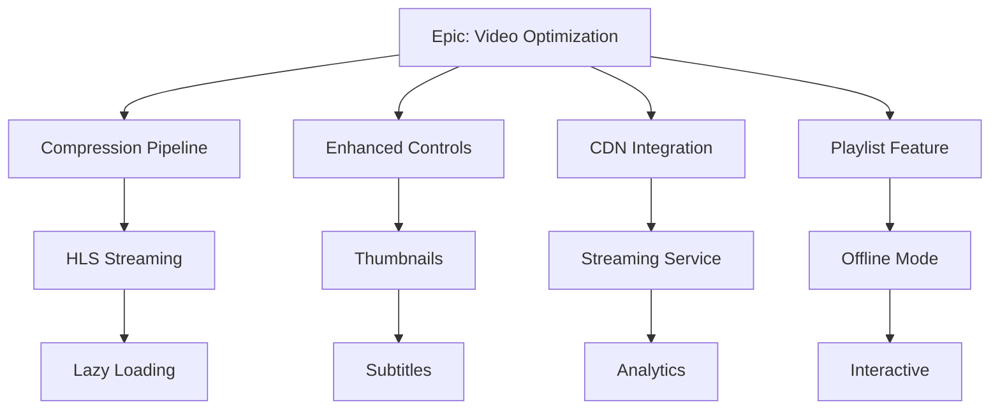

# Execution Plan: Video System Optimization

**Epic**: ved-59th  
**Generated**: 2026-01-06  
**Objective**: Optimize video system for better performance, UX, and reliability

## Current State Analysis

### Existing Video Features
1. **YouTube Integration**:
   - YouTubeEmbed component with ad-blocker detection
   - YouTube API v3 integration for metadata
   - Progress tracking with useYouTubeProgress
   
2. **Local Video Support**:
   - HTML5 video player (LessonPlayer.tsx)
   - File upload via storage API
   - Basic playback controls

3. **Progress Tracking**:
   - Anti-cheat validation (VideoCompletionValidator)
   - Watch log analysis
   - Resume from last position

4. **Admin Features**:
   - Video type selection (YouTube/File)
   - Auto-fetch metadata
   - Upload management

### Performance Issues Identified
1. ❌ **Large video files** - Không có video compression/optimization
2. ❌ **No lazy loading** - Videos load immediately, slow page load
3. ❌ **No buffering optimization** - Buffering issues on slow networks
4. ❌ **No quality selection** - Users cannot choose video quality
5. ❌ **Large bundle size** - YouTube iframe API loads for all videos
6. ❌ **No CDN integration** - Videos served from same server
7. ❌ **No streaming protocol** - Using progressive download only

### UX Issues Identified
1. ❌ **No video thumbnails** - Poor preview experience
2. ❌ **No playback speed control** - Cannot adjust speed
3. ❌ **No keyboard shortcuts** - Poor accessibility
4. ❌ **No picture-in-picture** - Cannot multitask
5. ❌ **No subtitles/captions** - Accessibility issue
6. ❌ **No video playlist** - Must navigate manually
7. ❌ **No offline mode** - Cannot download for offline viewing

## Optimization Strategy

### Track 1: Performance Optimization (OrangeWave)
**Focus**: Speed, compression, delivery

#### ved-m2kx: Implement Video Compression Pipeline
- Add ffmpeg integration for server-side compression
- Support multiple quality levels (360p, 480p, 720p, 1080p)
- Auto-generate optimized versions on upload
- Store in different quality folders
- **Tech**: fluent-ffmpeg, worker threads

#### ved-n8pq: Add Adaptive Bitrate Streaming (HLS)
- Convert videos to HLS format (.m3u8 + .ts segments)
- Enable adaptive quality switching
- Implement MSE (Media Source Extensions) player
- Fallback to progressive for unsupported browsers
- **Tech**: hls.js, video.js

#### ved-r5tz: Optimize Video Loading Strategy
- Implement lazy loading for below-fold videos
- Use Intersection Observer for auto-play on scroll
- Preload only video metadata, not full file
- Add loading skeleton for video placeholders
- **Tech**: IntersectionObserver API, React Suspense

### Track 2: UX Enhancement (BlueSky)
**Focus**: User experience, accessibility

#### ved-k7jw: Enhance Video Player Controls
- Add playback speed control (0.5x - 2x)
- Implement keyboard shortcuts (Space, Arrow keys, F, M)
- Add picture-in-picture mode
- Volume control with visual feedback
- **Tech**: Custom video controls, PiP API

#### ved-p3lm: Add Video Thumbnails & Preview
- Auto-generate thumbnails from video (at 25%, 50%, 75%)
- Show thumbnail on hover
- Implement preview on hover (5s clip)
- Add duration badge overlay
- **Tech**: ffmpeg thumbnail extraction, WebM preview

#### ved-t9xs: Implement Video Subtitles/Captions
- Support WebVTT format
- Auto-generate subtitles using AI (optional)
- Multi-language support (vi, en, zh)
- Customizable subtitle appearance
- **Tech**: WebVTT, react-player captions

### Track 3: Infrastructure & CDN (GreenMountain)
**Focus**: Delivery, reliability

#### ved-w4ry: Setup Video CDN Integration
- Integrate with Cloudflare Stream or Bunny.net
- Configure origin pull from R2 storage
- Enable edge caching for videos
- Setup purge rules for video updates
- **Tech**: Cloudflare Stream, R2 storage

#### ved-a6nd: Implement Video Streaming Service
- Create dedicated streaming microservice
- Handle HLS manifest generation
- Manage video transcoding queue
- Monitor bandwidth and storage usage
- **Tech**: NestJS streaming module, Bull queue

#### ved-c2hf: Add Video Analytics & Monitoring
- Track video playback metrics (views, completion rate)
- Monitor buffering events and quality switches
- Alert on high failure rates
- Dashboard for video performance
- **Tech**: Prometheus, Grafana

### Track 4: Advanced Features (RedWave)
**Focus**: Innovation, engagement

#### ved-d8km: Add Video Playlist & Auto-play
- Create playlist UI component
- Auto-play next video in sequence
- Remember position across playlist
- Shuffle and repeat modes
- **Tech**: Zustand for playlist state

#### ved-f5np: Implement Offline Video Download
- Progressive Web App (PWA) integration
- Allow video caching for offline viewing
- Manage storage quota
- Auto-cleanup old downloads
- **Tech**: Service Worker, Cache API, IndexedDB

#### ved-h1qt: Add Interactive Video Elements
- Clickable hotspots in video
- Quizzes during video playback
- Branching video narratives
- Interactive transcripts with jump-to
- **Tech**: Custom video overlay, timestamp API

## Tracks Summary

| Track | Agent | Beads | Focus Area |
|-------|-------|-------|------------|
| 1 | OrangeWave | ved-m2kx → ved-n8pq → ved-r5tz | Performance (Compression, HLS, Loading) |
| 2 | BlueSky | ved-k7jw → ved-p3lm → ved-t9xs | UX (Controls, Thumbnails, Subtitles) |
| 3 | GreenMountain | ved-w4ry → ved-a6nd → ved-c2hf | Infrastructure (CDN, Streaming, Analytics) |
| 4 | RedWave | ved-d8km → ved-f5np → ved-h1qt | Advanced (Playlist, Offline, Interactive) |

## Dependencies



## Quality Gates

### Per-Track Verification
```bash
# Track 1: Performance
- Video compression reduces file size by ≥60%
- HLS streaming works on Chrome, Firefox, Safari
- Page load time with videos ≤3s (Lighthouse score ≥90)

# Track 2: UX
- All keyboard shortcuts functional
- Thumbnails load in <500ms
- Subtitles sync accurate within 100ms

# Track 3: Infrastructure
- CDN cache hit rate ≥80%
- Video streaming latency <2s (start to first frame)
- Analytics dashboard shows real-time metrics

# Track 4: Advanced
- Playlist auto-play working
- Offline download stores videos correctly
- Interactive elements respond within 100ms
```

### Integration Testing
```bash
# E2E tests for video features
pnpm --filter web test:e2e -- tests/e2e/video-optimization/

# Performance benchmarks
pnpm --filter api test:benchmark -- video-streaming

# Load testing
artillery run tests/load/video-streaming.yml
```

## Success Criteria

**Epic ved-59th complete when**:
- ✅ All 12 beads closed
- ✅ Video file size reduced by 60% (compression)
- ✅ Page load time ≤3s with videos
- ✅ CDN cache hit rate ≥80%
- ✅ Video start latency <2s
- ✅ All UX features working (controls, thumbnails, subtitles)
- ✅ Playlist and offline mode functional
- ✅ Analytics dashboard deployed
- ✅ Quality gates pass
- ✅ E2E tests pass

## Expected Timeline

**Using 4 parallel tracks**:
- Track 1 (OrangeWave): ~10-12 iterations (3 beads)
- Track 2 (BlueSky): ~8-10 iterations (3 beads)
- Track 3 (GreenMountain): ~12-15 iterations (3 beads)
- Track 4 (RedWave): ~10-12 iterations (3 beads)

**Total**: ~30-40 iterations with proper parallelization

## File Scope

### Track 1 Files
- `apps/api/src/modules/video/video-compression.service.ts`
- `apps/api/src/modules/video/hls-generator.service.ts`
- `apps/web/src/components/molecules/OptimizedVideo.tsx`
- `apps/web/src/lib/hooks/useVideoLazyLoad.ts`

### Track 2 Files
- `apps/web/src/components/molecules/VideoPlayer.tsx`
- `apps/web/src/components/atoms/VideoControls.tsx`
- `apps/web/src/lib/hooks/useVideoKeyboard.ts`
- `apps/web/src/components/molecules/VideoThumbnail.tsx`

### Track 3 Files
- `apps/api/src/modules/cdn/cdn.service.ts`
- `apps/api/src/modules/streaming/streaming.controller.ts`
- `apps/api/src/modules/analytics/video-analytics.service.ts`
- `config/cloudflare-stream.config.ts`

### Track 4 Files
- `apps/web/src/components/organisms/VideoPlaylist.tsx`
- `apps/web/src/lib/stores/playlist-store.ts`
- `apps/web/src/lib/services/offline-video.service.ts`
- `apps/web/src/components/molecules/InteractiveVideo.tsx`

## Next Steps for Orchestrator

1. **Read this execution plan**
2. **Create all 12 beads** with proper dependencies
3. **Spawn 4 workers in parallel**:
   ```typescript
   Task("OrangeWave: ved-m2kx → ved-n8pq → ved-r5tz")  // Performance
   Task("BlueSky: ved-k7jw → ved-p3lm → ved-t9xs")     // UX
   Task("GreenMountain: ved-w4ry → ved-a6nd → ved-c2hf") // Infrastructure
   Task("RedWave: ved-d8km → ved-f5np → ved-h1qt")     // Advanced
   ```
4. **Monitor via Agent Mail**
5. **Run quality gates after each track**
6. **Close epic when complete**

---

**Priority**: P0 (High Impact - Video is core feature)  
**Risk Level**: MEDIUM (Some features require new tech, but proven patterns exist)  
**Business Impact**: HIGH (Better video = better learning experience = higher retention)
