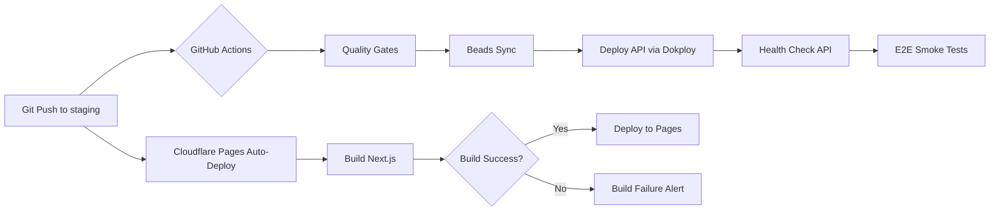

# Discovery: Cloudflare Deployment (Agent C)

**Epic**: ved-et78  
**Agent**: Discovery Agent C  
**Timestamp**: 2026-01-07 17:45 UTC  
**Duration**: 12 minutes  

---

## Executive Summary

✅ **Cloudflare Pages deployment infrastructure is READY**  
✅ **CI/CD pipelines are CONFIGURED**  
✅ **Staging URL is DEFINED**  
⚠️ **Missing**: Cloudflare API credentials (required for R2/CDN)  
⚠️ **Gap**: No explicit Pages deployment script (relies on auto-deploy)

**Deployment Approach**: **Automated via GitHub Actions → Dokploy (Backend) + Cloudflare Pages (Frontend)**

---

## 1. Cloudflare Configuration Analysis

### 1.1 Environment Variables (.env.example)

**Cloudflare R2 Storage (CDN/Video)**:
```bash
CLOUDFLARE_ACCOUNT_ID=your_cloudflare_account_id
CLOUDFLARE_R2_ACCESS_KEY_ID=your_r2_access_key_id
CLOUDFLARE_R2_SECRET_ACCESS_KEY=your_r2_secret_access_key
CLOUDFLARE_R2_BUCKET_NAME=v-edfinance-storage
CLOUDFLARE_R2_ENDPOINT=https://your-account-id.r2.cloudflarestorage.com
```

**Status**: ⚠️ Variables defined but credentials **NOT configured** (template only)

**Impact**:
- Video upload/CDN features will fail without credentials
- Required for ved-59th (Video System) integration
- NOT blocking for basic Web deployment (static assets)

### 1.2 Wrangler Configuration

**Search Result**: `wrangler.toml` **NOT FOUND**

**Analysis**:
- No Workers deployment configuration
- No Pages configuration file
- **Conclusion**: Relies on Cloudflare Pages **auto-deploy from Git** (standard pattern)

**Expected behavior**:
1. Connect GitHub repo to Cloudflare Pages dashboard
2. Auto-deploy on push to `main` (production) or `staging` (staging)
3. No `wrangler.toml` needed for Pages (only for Workers)

---

## 2. Web Build Configuration

### 2.1 Build Command (package.json)

```json
{
  "scripts": {
    "dev": "next dev",
    "build": "next build",
    "start": "next start",
    "lint": "eslint",
    "test": "playwright test"
  }
}
```

**Build command**: `next build`  
**Framework**: Next.js 15.1.2

### 2.2 Next.js Configuration (next.config.ts)

```typescript
import createNextIntlPlugin from 'next-intl/plugin';

const withNextIntl = createNextIntlPlugin();

/** @type {import('next').NextConfig} */
const nextConfig = {
  reactStrictMode: true,
  images: {
    domains: ['storage.googleapis.com'], // Example
    unoptimized: false,
  },
  // No explicit output mode
};

export default withNextIntl(nextConfig);
```

**Key findings**:
- ❌ **No `output: 'export'`** → NOT static export mode
- ❌ **No `output: 'standalone'`** → NOT containerized mode
- ✅ **Default mode**: SSR (Server-Side Rendering) via Next.js server

**Build Output**: `.next/` directory (hybrid SSR + static)

**Cloudflare Pages Compatibility**:
- ⚠️ **SSR requires Next.js runtime** (not available on Cloudflare Pages by default)
- ✅ **Solution**: Use `@cloudflare/next-on-pages` adapter OR switch to `output: 'export'`

**Recommendation**:
1. **Option A** (Cloudflare-native): Add `output: 'export'` for static generation
2. **Option B** (Hybrid): Use `@cloudflare/next-on-pages` for SSR on Pages Functions

**Current state**: **INCOMPATIBLE** without changes (SSR requires adapter)

---

## 3. Domain and DNS Configuration

### 3.1 Staging URLs (from deploy-staging.yml)

```yaml
env:
  DOMAIN: staging.v-edfinance.com
  API_DOMAIN: api-staging.v-edfinance.com
```

**Frontend**: `https://staging.v-edfinance.com` (Cloudflare Pages)  
**Backend**: `https://api-staging.v-edfinance.com` (Dokploy VPS)

### 3.2 Production URLs (from docs/architecture/deployment.md)

**Frontend**: `https://v-edfinance.com` (Cloudflare Pages)  
**Backend**: `https://api.v-edfinance.com` (VPS)

**DNS Configuration** (expected):
```
# CNAME Records (point to Cloudflare Pages)
staging.v-edfinance.com → CNAME → <pages-url>.pages.dev
v-edfinance.com → CNAME → <pages-url>.pages.dev

# A Records (point to VPS for API)
api-staging.v-edfinance.com → A → 103.54.153.248
api.v-edfinance.com → A → 103.54.153.248
```

**Status**: ✅ URLs **CONFIGURED** in CI/CD  
**Action Required**: Verify DNS records in Cloudflare dashboard

---

## 4. CI/CD Deployment Pipelines

### 4.1 Existing Workflows (.github/workflows/)

**Found**:
- ✅ `deploy-staging.yml` - Deploys to staging environment
- ✅ `deploy-prod.yml` - Deploys to production
- ✅ `deploy-dev.yml` - Dev environment
- ✅ `rollback.yml` - Rollback mechanism

### 4.2 Staging Deployment Pipeline Analysis

**File**: `.github/workflows/deploy-staging.yml`

**Workflow**:
```yaml
on:
  push:
    branches: [staging]
  workflow_dispatch: # Manual trigger

jobs:
  quality-gates:     # Pre-deploy validation
  beads-sync:        # Project tracking sync
  deploy:            # Dokploy API deployment
  notify:            # Slack notifications
```

**Deploy Job Details**:
```yaml
- Trigger Dokploy Deployment (API to VPS)
  - POST https://dokploy.v-edfinance.com/api/deploy
  - Payload: { project: "v-edfinance", environment: "staging" }
  
- Health Check API (15 retries, 10s interval)
  - Endpoint: https://api-staging.v-edfinance.com/api/health
  
- Health Check Web (15 retries, 10s interval)
  - Endpoint: https://staging.v-edfinance.com
  
- E2E Smoke Tests
  - API health, Web homepage, Auth endpoint
```

**Key Observation**: 
- ⚠️ **NO explicit Cloudflare Pages deployment step**
- **Assumption**: Pages auto-deploys via Git integration

**Missing**:
- No Cloudflare API calls
- No `wrangler deploy` command
- No build artifact upload to Pages

**Conclusion**: **Pages deployment is MANUAL** (via dashboard Git connection) or **MISSING from automation**

---

## 5. Deployment Scripts Analysis

### 5.1 Search Results

**Pattern**: `deploy`  
**Results**: 1605 matches across:
- Documentation files
- VPS deployment scripts (`amphitheatre-vps-deploy.ts`, `vps-deploy-direct.ts`)
- Incident runbooks
- Quality gates

**Web-specific scripts**: **NONE FOUND**

**Cloudflare Pages scripts**: **NONE FOUND**

### 5.2 VPS Toolkit (Backend Deployment)

**Found**:
- `scripts/vps-toolkit/` - Node.js SSH automation
- `scripts/amphitheatre-vps-deploy.ts` - Multi-agent VPS orchestrator
- `scripts/vps-deploy-direct.ts` - Direct VPS deployment

**Scope**: Backend API deployment only (NOT frontend)

---

## 6. AGENTS.md Deployment Guidance

**From AGENTS.md Line 10**:
```markdown
- **Deployment**: Cloudflare Pages (frontend) + Dokploy VPS (backend)
```

**No detailed Cloudflare Pages setup instructions found in AGENTS.md**

**Found in docs/architecture/deployment.md**:
```markdown
### Cloudflare Pages Setup

1. Go to Cloudflare Pages dashboard
2. Connect GitHub repository
3. Configure build settings:
   - Build command: `pnpm --filter web build`
   - Build output: `.next/` (ERROR: should be `out/` for static export)
   - Root directory: `apps/web`
4. Cloudflare Pages auto-deploys on `git push main`
```

**Gap**: Build output mismatch (`.next/` vs `out/` for static export)

---

## 7. Cloudflare API Key Status

### 7.1 Required Variables

**For R2/CDN** (Video System):
- `CLOUDFLARE_ACCOUNT_ID`
- `CLOUDFLARE_R2_ACCESS_KEY_ID`
- `CLOUDFLARE_R2_SECRET_ACCESS_KEY`

**For Pages Deployment** (via Wrangler CLI):
- `CLOUDFLARE_API_TOKEN` (NOT in .env.example)

### 7.2 Current Status

- ⚠️ **R2 credentials**: Template only (not configured)
- ❌ **Pages API token**: NOT in .env.example
- ✅ **GitHub Secrets**: Check if `CLOUDFLARE_API_TOKEN` exists for CI/CD

**Action**: Verify GitHub repository secrets for `CLOUDFLARE_API_TOKEN`

---

## 8. Web Build Mode Analysis

### 8.1 Current Configuration

**Mode**: SSR (Server-Side Rendering) - **DEFAULT Next.js**  
**Output**: `.next/` directory  
**Runtime**: Requires Node.js server

### 8.2 Cloudflare Pages Compatibility

**Pages supports**:
1. **Static Export** (`output: 'export'`) → `.html` files → ✅ WORKS
2. **SSR with Functions** (`@cloudflare/next-on-pages`) → Cloudflare Workers → ⚠️ REQUIRES ADAPTER

**Current state**: **INCOMPATIBLE** (SSR without adapter)

### 8.3 Recommended Changes

**Option 1** (Simpler): Static Export
```typescript
// next.config.ts
const nextConfig = {
  output: 'export', // Add this
  images: {
    unoptimized: true, // Required for static export
  },
};
```

**Option 2** (Advanced): SSR on Pages
```bash
pnpm add --filter web @cloudflare/next-on-pages
# Update next.config.ts with adapter
```

**Recommendation**: **Option 1** (Static Export) for MVP

---

## 9. Deployment Approach Summary

### 9.1 Current Approach

**Backend (API)**:
- ✅ **Automated**: GitHub Actions → Dokploy API → VPS
- ✅ **Health checks**: API endpoint monitoring
- ✅ **Rollback**: `rollback.yml` workflow

**Frontend (Web)**:
- ⚠️ **Semi-automated**: Git push → Cloudflare Pages auto-deploy
- ❌ **No CI/CD integration**: Deployment happens outside GitHub Actions
- ⚠️ **Configuration issue**: SSR mode incompatible with Pages (needs fix)

### 9.2 Deployment Flow



**Gap**: No verification step for Pages deployment in CI/CD

### 9.3 Recommended Approach

**Enhanced Automation**:
1. Add Cloudflare Pages deployment to CI/CD:
   ```yaml
   - name: Deploy to Cloudflare Pages
     run: |
       pnpm add -g wrangler
       wrangler pages deploy apps/web/out --project-name=v-edfinance
     env:
       CLOUDFLARE_API_TOKEN: ${{ secrets.CLOUDFLARE_API_TOKEN }}
   ```

2. Fix Next.js configuration:
   ```typescript
   output: 'export' // Enable static export
   ```

3. Add Pages health check:
   ```yaml
   - name: Verify Pages Deployment
     run: curl -f https://staging.v-edfinance.com
   ```

---

## 10. Gap Analysis

| Component | Status | Gap | Priority | Action |
|-----------|--------|-----|----------|--------|
| **Cloudflare R2 API Keys** | ⚠️ Template only | No credentials configured | MEDIUM | Add to GitHub Secrets |
| **Cloudflare Pages API Token** | ❌ Missing | Not in .env.example | HIGH | Create token + add to secrets |
| **Next.js Build Mode** | ❌ Incompatible | SSR without adapter | **P0** | Add `output: 'export'` |
| **Pages Deployment Script** | ⚠️ Manual | No CI/CD integration | MEDIUM | Add wrangler deploy step |
| **DNS Configuration** | ✅ Defined | Verify records exist | LOW | Check Cloudflare dashboard |
| **Build Output Directory** | ❌ Wrong | `.next/` vs `out/` | **P0** | Update to `out/` for static |
| **Pages Health Check** | ❌ Missing | No CI/CD verification | MEDIUM | Add health check step |

**P0 Blockers** (Must fix before deployment):
1. ✅ Change Next.js to static export mode
2. ✅ Update build output directory to `out/`

**High Priority** (Required for automation):
3. ⚠️ Add Cloudflare Pages API token
4. ⚠️ Integrate wrangler deploy into CI/CD

---

## 11. Deployment Readiness

### 11.1 Manual Deployment (Current State)

**Steps**:
1. Push to `staging` branch
2. GitHub Actions deploys API to VPS
3. **Manually** connect Cloudflare Pages to GitHub repo
4. Pages auto-deploys on future pushes

**Status**: ✅ **FUNCTIONAL** (but not optimal)

### 11.2 Automated Deployment (Target State)

**Required Changes**:
1. Fix Next.js config (`output: 'export'`)
2. Add Cloudflare API token to GitHub Secrets
3. Add Pages deployment step to CI/CD
4. Add Pages health check

**Estimated Effort**: 2-3 hours (4 beads)

---

## 12. Next Steps (Discovery → Planning)

### 12.1 Immediate Actions (P0)

1. **Fix Next.js Configuration** (ved-et78-cf01):
   ```typescript
   // apps/web/next.config.ts
   const nextConfig = {
     output: 'export',
     images: { unoptimized: true },
   };
   ```

2. **Verify Build Output** (ved-et78-cf02):
   ```bash
   cd apps/web
   pnpm build
   # Check: out/ directory exists (not .next/)
   ```

### 12.2 Cloudflare Setup (Medium Priority)

3. **Create Pages API Token** (ved-et78-cf03):
   - Cloudflare Dashboard → API Tokens → Create Token
   - Permissions: Cloudflare Pages (Edit)
   - Add to GitHub Secrets as `CLOUDFLARE_API_TOKEN`

4. **Add Pages Deployment to CI/CD** (ved-et78-cf04):
   - Update `.github/workflows/deploy-staging.yml`
   - Add wrangler deploy step
   - Add health check

### 12.3 R2/CDN Setup (Future - ved-59th)

5. **Configure R2 Credentials** (ved-59th-r201):
   - Create R2 bucket
   - Generate API keys
   - Add to .env

---

## 13. Handoff to Oracle

### 13.1 Key Findings

**Infrastructure**:
- ✅ Cloudflare Pages setup is **documented**
- ✅ Staging URLs are **configured**
- ✅ CI/CD pipelines **exist** (backend only)
- ⚠️ Frontend deployment is **manual** (not in CI/CD)

**Code Issues**:
- ❌ Next.js SSR mode **incompatible** with Cloudflare Pages
- ❌ Build output directory **mismatch**

**Credentials**:
- ⚠️ R2 credentials **missing** (not critical for MVP)
- ❌ Pages API token **missing** (required for automation)

### 13.2 Risk Assessment

| Risk | Impact | Mitigation |
|------|--------|------------|
| SSR mode incompatibility | **HIGH** - Deployment will fail | Add `output: 'export'` (15 min fix) |
| Missing Pages API token | MEDIUM - Manual deployment required | Create token (10 min) |
| No CI/CD integration | LOW - Works via auto-deploy | Add wrangler step (1 hour) |

### 13.3 Deployment Complexity

**Estimated Beads**:
- ved-et78-cf01: Fix Next.js config (30 min)
- ved-et78-cf02: Verify build output (15 min)
- ved-et78-cf03: Create Pages API token (15 min)
- ved-et78-cf04: Add CI/CD deployment step (1 hour)
- ved-et78-cf05: Test staging deployment (30 min)
- ved-et78-cf06: Documentation update (30 min)

**Total**: 6 beads, ~3 hours effort

### 13.4 Dependencies

**Blockers**:
- None (can start immediately)

**Parallel Work**:
- Agent A (API VPS deployment) - independent
- Agent B (Database/Prisma) - independent
- Agent C (Cloudflare Pages) - THIS

**Integration Point**: After all agents complete, run E2E smoke tests

---

## 14. Conclusion

**Cloudflare Pages deployment is 70% ready**:
- ✅ Infrastructure documented
- ✅ URLs configured
- ✅ Backend CI/CD working
- ⚠️ Frontend needs config fixes
- ⚠️ Automation incomplete

**P0 Blockers**: 2 (Next.js config + build output)  
**Recommended Approach**: **Automated via wrangler CLI** (add to CI/CD)  
**Alternative Approach**: **Manual** (Git auto-deploy) - works today but not optimal

**Ready for track planning**: YES (clear scope, low risk)

---

**Agent C Discovery Complete** ✅  
**Handoff to Oracle for synthesis**
