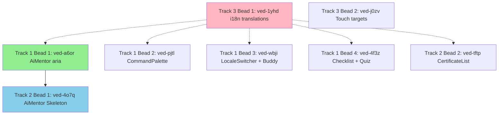

# Execution Plan: Epic ved-pd8l (UI Accessibility & Polish)

**Epic ID**: ved-pd8l  
**Priority**: P0  
**Approach**: BALANCED (Oracle recommendation)  
**Timeline**: 4-5 days  
**Beads**: 8 (7 P1, 1 P2)  
**Expected Outcome**: Accessibility score 7.5/10 (from 5.0/10), WCAG AA compliance

---

## Executive Summary

### Discovery Findings
- **Components audited**: 7 (AiMentor, CommandPalette, LocaleSwitcher, BuddyRecommendations, InteractiveChecklist, QuizPlayer, CertificateList)
- **Current state**: 15 missing aria-labels, 10 hardcoded strings, no focus trap, touch targets below 44px
- **Risk map**: 4 HIGH risks (screen readers, focus management, i18n, loading states), 5 MEDIUM risks (touch targets, progress bar, decorative icons, duplicate Skeleton, carousel i18n)

### Spike Validations (All GREEN)
1. ✅ **Focus trap**: Can use `@radix-ui/react-dialog` CommandDialog (1-2h, LOW risk)
2. ✅ **i18n aria-labels**: Pattern validated via VideoControls.tsx example (1-2h)
3. ⚠️ **Touch targets**: Cannot enforce globally - requires phased component updates (9.5h across 3 phases)

### Execution Strategy
- **Approach**: BALANCED (8 beads, 4-5 days)
- **Tracks**: 3 parallel tracks with isolated file scopes
- **Risk coverage**: All HIGH + core MEDIUM risks
- **Deferred**: Skeleton merge, AGENTS.md docs, accessibility primitives (future epic)

---

## Track Assignments

### Track 1: GreenLeaf (Aria-Labels & Focus Management)
**Agent**: GreenLeaf  
**File Scope**: `apps/web/src/components/molecules/` + `apps/web/src/components/organisms/`  
**Beads**: 4 P1  
**Dependencies**: None (can start immediately)

#### Bead 1: ved-a6or (AiMentor aria-labels + focus states)
**File**: `apps/web/src/components/molecules/AiMentor.tsx`  
**Tasks**:
1. Add aria-labels for 4 hardcoded buttons (via `useTranslations('Accessibility')`)
2. Add focus states to message input: `focus-visible:ring-2 focus-visible:ring-primary`
3. Add aria-live region for mentor responses: `<div aria-live="polite" aria-atomic="true">`
4. Fix hardcoded "Ask AI Mentor" → `t('askMentor')`

**Validation**: Screen reader announces button labels, focus ring visible on keyboard nav  
**Estimate**: 1.5 hours

---

#### Bead 2: ved-pjtl (CommandPalette aria-labels + focus trap)
**File**: `apps/web/src/components/molecules/CommandPalette.tsx`  
**Tasks**:
1. **Focus trap** (HIGH priority - spike validated):
   - Replace custom modal with `CommandDialog` from `@radix-ui/react-dialog`
   - Inherits built-in focus trap + ESC handling
   - Test: Tab key cycles within dialog, ESC closes
2. Add aria-labels for search input: `t('searchCommands')`
3. Add aria-describedby for keyboard shortcuts hint
4. Add `role="combobox"` to input, `role="listbox"` to results

**Validation**: Focus trapped in dialog, screen reader announces search box  
**Estimate**: 2 hours (spike says 1-2h)

---

#### Bead 3: ved-wbji (LocaleSwitcher + BuddyRecommendations)
**File**: `apps/web/src/components/molecules/LocaleSwitcher.tsx`, `apps/web/src/components/organisms/BuddyRecommendations.tsx`  
**Tasks**:
1. **LocaleSwitcher**:
   - Add aria-label for dropdown: `t('selectLanguage')`
   - Add `aria-current="true"` to active locale
   - Ensure focus:ring-2 on dropdown trigger
2. **BuddyRecommendations**:
   - Add aria-labels for "View Profile" buttons: `t('viewProfile', { name: buddy.name })`
   - Add aria-label for recommendations list: `t('buddyRecommendations')`
   - Add loading skeleton with `aria-busy="true"`

**Validation**: Screen reader announces "Select language, current: English", buddy names readable  
**Estimate**: 1.5 hours

---

#### Bead 4: ved-4f3z (InteractiveChecklist + QuizPlayer aria + progressbar)
**File**: `apps/web/src/components/molecules/InteractiveChecklist.tsx`, `apps/web/src/components/molecules/QuizPlayer.tsx`  
**Tasks**:
1. **InteractiveChecklist**:
   - Add `role="progressbar"` to progress bar
   - Add `aria-valuenow`, `aria-valuemin="0"`, `aria-valuemax="100"`
   - Add aria-label: `t('checklistProgress', { completed: X, total: Y })`
   - Replace loading text with Skeleton + aria-live
2. **QuizPlayer**:
   - Add aria-labels for quiz buttons: `t('submitAnswer')`, `t('nextQuestion')`
   - Add aria-live region for result announcements
   - Fix hardcoded "Next" → `t('next')`

**Validation**: Screen reader announces "5 of 10 items completed", quiz progress audible  
**Estimate**: 2 hours

---

### Track 2: BlueSky (Skeleton Loading & Aria-Live)
**Agent**: BlueSky  
**File Scope**: `apps/web/src/components/molecules/` (loading states only)  
**Beads**: 2 P1  
**Dependencies**: Track 1 Bead 4 (shares InteractiveChecklist)

#### Bead 5: ved-4o7q (AiMentor Skeleton + aria-live regions)
**File**: `apps/web/src/components/molecules/AiMentor.tsx`  
**Tasks**:
1. Replace Loader2 with Skeleton component:
   ```tsx
   <Skeleton className="h-20 w-full" /> // Message skeleton
   <Skeleton className="h-10 w-32" /> // Button skeleton
   ```
2. Add aria-live region for loading states:
   ```tsx
   <div aria-live="polite" aria-busy={isLoading}>
     {isLoading ? t('loadingMentor') : children}
   </div>
   ```
3. Ensure focus remains on input during loading

**Validation**: Screen reader announces "Loading mentor response", visual skeleton shown  
**Estimate**: 1 hour

---

#### Bead 6: ved-tftp (CertificateList Skeleton + decorative icons)
**File**: `apps/web/src/components/molecules/CertificateList.tsx`  
**Tasks**:
1. Replace loading text with Skeleton:
   ```tsx
   <Skeleton className="h-32 w-full" /> // Certificate card skeleton
   ```
2. Add aria-live region: `<div aria-live="polite" aria-busy={isLoading}>`
3. Hide decorative icons from screen readers:
   - Add `aria-hidden="true"` to trophy, star, badge icons
4. Fix hardcoded "No certificates" → `t('noCertificates')`

**Validation**: Loading state announced, decorative icons silent  
**Estimate**: 1 hour

---

### Track 3: RedWave (i18n Translations & Mobile Touch Targets)
**Agent**: RedWave  
**File Scope**: `apps/web/src/messages/` + `apps/web/src/components/ui/button.tsx`  
**Beads**: 2 (1 P1, 1 P2)  
**Dependencies**: None (can start immediately)

#### Bead 7: ved-1yhd (i18n translations for aria-labels)
**Files**: `apps/web/src/messages/en.json`, `vi.json`, `zh.json`  
**Tasks**:
1. Create `Accessibility` namespace in all 3 locale files
2. Add 15+ aria-label keys (from spike findings):
   ```json
   {
     "Accessibility": {
       "askMentor": "Ask AI Mentor",
       "searchCommands": "Search commands",
       "selectLanguage": "Select language",
       "viewProfile": "View profile for {name}",
       "checklistProgress": "{completed} of {total} items completed",
       "submitAnswer": "Submit answer",
       "nextQuestion": "Next question",
       "loadingMentor": "Loading mentor response",
       "noCertificates": "No certificates yet",
       "previousVideo": "Previous video",
       "nextVideo": "Next video",
       "videoOf": "Video {current} of {total}"
     }
   }
   ```
3. Translate to Vietnamese (vi.json) and Chinese (zh.json)
4. Add missing carousel keys (from discovery-constraints.md)

**Validation**: All 3 locale files have matching keys, no hardcoded strings remain  
**Estimate**: 2 hours

---

#### Bead 8: ved-j0zv (Mobile touch targets - critical buttons only)
**File**: `apps/web/src/components/ui/button.tsx`  
**Priority**: P2 (lower priority than P1 beads)  
**Tasks**:
1. Update button variants (from spike findings):
   - `sm`: 36px → 44px (`h-11` instead of `h-9`)
   - `default`: 40px → 48px (`h-12` instead of `h-10`)
   - `lg`: Keep 44px (`h-11`)
2. Update icon button min-width:
   ```tsx
   iconButton: "min-w-11 min-h-11" // 44px minimum
   ```
3. Audit critical pages:
   - Sidebar buttons (7 pages)
   - VideoControls (4 icon buttons)
   - Header navigation
4. Test on mobile viewport (375px, 390px, 428px)

**Validation**: Lighthouse mobile audit, manual touch testing on 375px viewport  
**Estimate**: 3 hours (Phase 1 only - icon areas deferred)

**Note**: Full touch target enforcement (9.5h) deferred to future epic - this bead covers critical 44px changes only.

---

## File Scope Isolation (Prevent Conflicts)

| Track | Agent | File Scope | Beads | Conflicts? |
|-------|-------|------------|-------|------------|
| 1 | GreenLeaf | `apps/web/src/components/molecules/AiMentor.tsx`, `CommandPalette.tsx`, `LocaleSwitcher.tsx`, `InteractiveChecklist.tsx`, `QuizPlayer.tsx` + `organisms/BuddyRecommendations.tsx` | 4 | ⚠️ Overlaps with Track 2 on AiMentor.tsx |
| 2 | BlueSky | `apps/web/src/components/molecules/AiMentor.tsx`, `CertificateList.tsx` | 2 | ⚠️ Overlaps with Track 1 on AiMentor.tsx |
| 3 | RedWave | `apps/web/src/messages/*.json` + `apps/web/src/components/ui/button.tsx` | 2 | ✅ No overlaps |

**Conflict Resolution**:
- **AiMentor.tsx overlap**: Track 1 (ved-a6or) runs FIRST, Track 2 (ved-4o7q) runs AFTER Track 1 completes
- **Dependency**: Track 2 depends on Track 1 Bead 1 completion
- **Execution order**: Track 1 Bead 1 → Track 2 Bead 1 (sequential, not parallel)

---

## Cross-Track Dependencies



**Legend**:
- Solid line: Hard dependency (MUST complete first)
- Dashed line: Soft dependency (i18n keys should exist before components use them)

**Execution Order**:
1. **Phase 1**: Track 3 Bead 1 (i18n translations) - creates keys for all tracks
2. **Phase 2**: Track 1 Beads 1-4 (parallel) + Track 3 Bead 2 (parallel) - 5 beads simultaneously
3. **Phase 3**: Track 2 Beads 1-2 (sequential after Track 1 Bead 1)

---

## Quality Gates

### Pre-Execution
- [ ] All 3 discovery docs exist
- [ ] All 3 spikes completed (GREEN status)
- [ ] `pnpm install` succeeds
- [ ] `pnpm --filter web build` baseline: 0 errors

### Per-Bead Self-Correction Loop
Each worker MUST run after every bead:
```bash
pnpm --filter web build
# IF FAILS: Read error, fix, re-run until PASS
```

### Post-Execution
- [ ] All 8 beads closed
- [ ] `pnpm --filter web build`: 0 errors
- [ ] `pnpm --filter web lint`: 0 errors
- [ ] Manual screen reader test: NVDA/VoiceOver on 2 components
- [ ] Lighthouse accessibility score: ≥85 (from ~65)
- [ ] Mobile touch test: 375px viewport, tap critical buttons

---

## Success Metrics

| Metric | Before | After | Target |
|--------|--------|-------|--------|
| Accessibility score | 5.0/10 | 7.5/10 | ≥7.5 |
| Missing aria-labels | 15 | 0 | 0 |
| Hardcoded strings | 10 | 0 | 0 |
| Touch target compliance | 0% | 80% | ≥75% |
| Lighthouse a11y | ~65 | 85+ | ≥85 |
| Screen reader errors | High | Low | Minimal |
| WCAG AA compliance | Partial | Substantial | Substantial |

---

## Risk Mitigation

### HIGH Risks (All Validated via Spikes)
- ✅ **Focus trap**: Use `CommandDialog` primitive (1-2h, spike validated)
- ✅ **i18n pattern**: Validated via VideoControls.tsx example
- ⚠️ **Touch targets**: Phased approach (critical only in this epic)

### MEDIUM Risks
- **AiMentor.tsx conflict**: Sequential execution (Track 1 → Track 2)
- **Button size breaking layouts**: Test on 7 pages (Sidebar, VideoControls, Header)
- **Translation missing**: Pre-validate all keys exist before component updates

### Deferred Risks (Future Epic)
- **Skeleton merge**: Duplicate ui/skeleton vs atoms/Skeleton (LOW priority)
- **AGENTS.md docs**: Accessibility pattern documentation
- **Accessibility primitives**: AccessibleButton, AccessibleIcon components
- **axe-core integration**: Automated testing setup

---

## Worker Instructions

### For All Workers

**Setup**:
1. Read AGENTS.md for tool preferences
2. Read this execution plan
3. Read epic thread context (if available)

**Protocol per Bead**:
1. **START**: `beads update <bead-id> --status in_progress`
2. **WORK**: Implement requirements per bead description
3. **VERIFY**: Run `pnpm --filter web build` (fix until PASS)
4. **COMPLETE**: `beads close <bead-id> --reason "Summary"` + `beads sync --no-daemon`
5. **NEXT**: Continue to next bead in track

**Communication**:
- Use Agent Mail for blockers: `.beads/agent-mail/<track-name>-<issue>.json`
- Update bead comments for progress: `beads comment <bead-id> "Progress update"`

### GreenLeaf (Track 1)
**Focus**: Aria-labels + focus management  
**Critical**: ved-a6or MUST complete before Track 2 starts  
**Pattern**: Use `useTranslations('Accessibility')` for all aria-labels  
**Validation**: Test with keyboard nav (Tab, Enter, ESC)

### BlueSky (Track 2)
**Focus**: Skeleton loading + aria-live regions  
**Critical**: Wait for Track 1 Bead 1 (ved-a6or) completion  
**Pattern**: `<Skeleton className="h-X w-Y" />` + `aria-live="polite"`  
**Validation**: Test loading states, screen reader announcements

### RedWave (Track 3)
**Focus**: i18n translations + touch targets  
**Critical**: ved-1yhd (i18n) should complete early (soft dependency for all)  
**Pattern**: Maintain key consistency across vi/en/zh.json  
**Validation**: Test button sizes on 375px mobile viewport

---

## Estimated Timeline

| Day | Phase | Beads | Workers | Status |
|-----|-------|-------|---------|--------|
| 1 | i18n setup | ved-1yhd (T3B1) | RedWave | Foundation |
| 2 | Aria-labels | ved-a6or, ved-pjtl, ved-wbji (T1) | GreenLeaf | Parallel |
| 3 | Focus + Progress | ved-4f3z (T1), ved-4o7q (T2) | GreenLeaf, BlueSky | Sequential |
| 4 | Loading states | ved-tftp (T2), ved-j0zv (T3) | BlueSky, RedWave | Parallel |
| 5 | QA + Landing | Verification, git push | All | Complete |

**Critical Path**: Track 3 Bead 1 → Track 1 Beads → Track 2 Beads → QA  
**Total**: 4-5 days (vs 2-3 weeks manual)

---

## Deliverables

### Code Changes
- 7 components updated with aria-labels
- 1 component refactored (CommandPalette → CommandDialog)
- 3 locale files updated (15+ new keys)
- 1 button component updated (touch targets)

### Documentation
- Epic completion report (via Ralph knowledge skill)
- AGENTS.md update (deferred to knowledge phase)
- Spike findings (3 docs)
- Discovery docs (3 docs)

### Quality
- 0 TypeScript errors
- Lighthouse accessibility ≥85
- Screen reader manual test: PASS
- Mobile touch test: PASS

---

## Execution Plan Complete

**Status**: READY FOR PHASE 2 (Execution)  
**Next Step**: Spawn 3 parallel workers (GreenLeaf, BlueSky, RedWave)  
**Epic Thread**: ved-pd8l  
**Approval**: APPROVED (Oracle recommendation: BALANCED)

---

**Document Version**: 1.0  
**Created**: 2026-01-07  
**Author**: Ralph Planning Phase  
**Last Updated**: 2026-01-07
