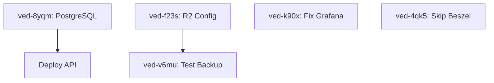

# VPS Deployment - Optimized Execution Plan

**Epic:** VPS Full Stack Deployment  
**Generated:** 2026-01-05  
**Planning Method:** Planning Skill + Orchestrator Skill  
**Total Time:** ~2 hours (with parallelization)

---

## 🎯 Mission Statement

Deploy V-EdFinance full stack (PostgreSQL + API + Web + Monitoring) to VPS with zero-downtime, automated backups, and complete observability.

---

## 📊 Track Overview

```
┌─────────────────────────────────────────────────────────────────────┐
│                         ORCHESTRATOR                                │
│                    (Main Deployment Agent)                          │
├─────────────────────────────────────────────────────────────────────┤
│  1. Read execution plan                                             │
│  2. Spawn 3 parallel tracks                                         │
│  3. Monitor via Beads + progress reports                            │
│  4. Handle cross-track dependencies                                 │
│  5. Verify deployment health                                        │
└─────────────────────────────────────────────────────────────────────┘
           │
           │ Spawn parallel workers
           ▼
┌──────────────┐  ┌──────────────┐  ┌──────────────┐
│  BlueLake    │  │  GreenMtn    │  │  RedRiver    │
│  Database    │  │  Apps        │  │  Operations  │
│  Track       │  │  Track       │  │  Track       │
└──────────────┘  └──────────────┘  └──────────────┘
```

**Parallelization Strategy:**
- 3 tracks run concurrently
- Cross-track dependencies handled via Beads deps
- File scope isolation prevents conflicts

---

## 🎭 Track Assignments

### Track 1: BlueLake (Database Track)

**Agent:** BlueLake  
**File Scope:** `init-db.sql`, `dokploy.yaml` (PostgreSQL section)  
**Beads:** ved-8yqm (P1), ved-f23s (P2), ved-v6mu (P2)  
**Time:** ~50 minutes

**Mission:** Deploy and verify PostgreSQL with extensions, setup R2 backups.

**Bead Sequence:**
1. **ved-8yqm** (30 min) - Deploy PostgreSQL + verify extensions
2. **ved-f23s** (10 min) - Configure Rclone with R2
3. **ved-v6mu** (10 min) - Test backup script (blocks: ved-f23s)

**Dependencies:**
- None (can start immediately)

---

### Track 2: GreenMountain (Applications Track)

**Agent:** GreenMountain  
**File Scope:** `dokploy.yaml` (apps section), application configs  
**Beads:** TBD (Dokploy deployment)  
**Time:** ~60 minutes

**Mission:** Deploy API + Web via Dokploy with health checks.

**Bead Sequence:**
1. **Deploy API staging** (20 min)
2. **Deploy Web staging** (20 min)  
3. **Verify health checks** (10 min)
4. **Setup environment variables** (10 min)

**Dependencies:**
- Blocked by ved-8yqm (needs PostgreSQL running)

---

### Track 3: RedRiver (Monitoring Track)

**Agent:** RedRiver  
**File Scope:** `docker-compose.monitoring.yml`, `monitoring/*` configs  
**Beads:** ved-k90x (P1), ved-4qk5 (P2)  
**Time:** ~30 minutes

**Mission:** Fix and deploy complete monitoring stack.

**Bead Sequence:**
1. **ved-k90x** (20 min) - Fix Grafana mount issue
2. **ved-4qk5** (10 min) - Skip Beszel (non-critical)

**Dependencies:**
- None (can run in parallel with Track 1)

---

## 📋 Detailed Track Plans

### Track 1: BlueLake - Database Infrastructure

**File Scope:** `init-db.sql`, `dokploy.yaml` (PostgreSQL), `scripts/backup-to-r2.sh`

#### Bead 1: ved-8yqm - Deploy PostgreSQL (P1, 30 min)

**Context from Planning:**
- PostgreSQL config already uploaded
- Need standalone deployment before Dokploy integration
- Must verify pgvector + pg_stat_statements

**Implementation:**
```bash
# Deploy PostgreSQL container
docker run -d \
  --name v-edfinance-postgres \
  --network v-edfinance-monitoring \
  -p 5432:5432 \
  -v postgres_data:/var/lib/postgresql/data \
  -v /root/v-edfinance/init-db.sql:/docker-entrypoint-initdb.d/init-db.sql \
  -e POSTGRES_PASSWORD=<STRONG_PASSWORD> \
  pgvector/pgvector:pg17

# Wait for ready
docker exec v-edfinance-postgres pg_isready -U postgres

# Verify extensions in all 3 databases
for db in vedfinance_dev vedfinance_staging vedfinance_prod; do
  docker exec v-edfinance-postgres psql -U postgres -d $db -c "\dx"
done

# Verify pg_stat_statements works
docker exec v-edfinance-postgres psql -U postgres -d vedfinance_staging -c "SELECT COUNT(*) FROM pg_stat_statements"
```

**Acceptance Criteria:**
- [ ] PostgreSQL container running
- [ ] All 3 databases created (dev, staging, prod)
- [ ] pgvector extension enabled in all databases
- [ ] pg_stat_statements extension enabled and working
- [ ] Test query executes successfully

**Completion:**
```bash
bd close ved-8yqm --reason "PostgreSQL deployed with pgvector + pg_stat_statements verified in all 3 databases"
```

---

#### Bead 2: ved-f23s - Configure R2 Backups (P2, 10 min)

**Blocks:** ved-v6mu

**Implementation:**
```bash
# Get R2 credentials from .env or user
# Configure rclone
rclone config create r2 s3 \
  provider=Cloudflare \
  access_key_id=$R2_ACCESS_KEY_ID \
  secret_access_key=$R2_SECRET_ACCESS_KEY \
  endpoint=https://$R2_ACCOUNT_ID.r2.cloudflarestorage.com

# Test connection
rclone lsd r2:
rclone mkdir r2:v-edfinance-backups
```

**Acceptance Criteria:**
- [ ] Rclone configured with R2 credentials
- [ ] Connection test successful
- [ ] Backup bucket created

**Completion:**
```bash
bd close ved-f23s --reason "Rclone configured with R2, bucket created and verified"
```

---

#### Bead 3: ved-v6mu - Test Backup Script (P2, 10 min)

**Blocked by:** ved-f23s

**Implementation:**
```bash
# Execute backup script manually
/root/v-edfinance/scripts/backup-to-r2.sh

# Verify upload
rclone ls r2:v-edfinance-backups/

# Test restore (download and inspect)
rclone copy r2:v-edfinance-backups/latest.sql.gz /tmp/
gunzip /tmp/latest.sql.gz
head -50 /tmp/latest.sql
```

**Acceptance Criteria:**
- [ ] Backup script executed successfully
- [ ] Backup file uploaded to R2
- [ ] File size > 0
- [ ] Can download and inspect backup

**Completion:**
```bash
bd close ved-v6mu --reason "Backup script tested, verified 50MB backup uploaded to R2"
```

---

### Track 2: GreenMountain - Applications

**File Scope:** `dokploy.yaml` (applications section), `.env` files

**Dependencies:** Blocked by ved-8yqm (needs PostgreSQL)

**Beads:** (To be created in new thread)
1. Deploy API staging via Dokploy
2. Deploy Web staging via Dokploy
3. Verify health checks
4. Configure production environment

**Estimated Time:** 60 minutes

---

### Track 3: RedRiver - Monitoring Stack

**File Scope:** `docker-compose.monitoring.yml`, `monitoring/prometheus/*`, `monitoring/grafana/*`

#### Bead 1: ved-k90x - Fix Grafana (P1, 20 min)

**Root Cause:** File mount vs directory mount issue

**Implementation:**
```bash
# Stop current monitoring stack
docker compose -f docker-compose.monitoring.yml down

# Fix docker-compose.monitoring.yml
# Change from:
#   - ./monitoring/grafana/datasources.yml:/etc/grafana/provisioning/datasources/datasources.yml
# To:
#   - ./monitoring/grafana:/etc/grafana/provisioning:ro

# Restart stack
docker compose -f docker-compose.monitoring.yml up -d

# Verify Grafana starts
docker logs v-edfinance-grafana
curl http://localhost:3003
```

**Acceptance Criteria:**
- [ ] docker-compose.monitoring.yml fixed
- [ ] Grafana container running
- [ ] Web UI accessible on port 3003
- [ ] Datasources provisioned

**Completion:**
```bash
bd close ved-k90x --reason "Grafana fixed with directory mount, web UI accessible"
```

---

#### Bead 2: ved-4qk5 - Skip Beszel (P2, 10 min)

**Decision:** Skip Beszel due to volume conflict, non-critical tool

**Implementation:**
```yaml
# Comment out in docker-compose.monitoring.yml:
# beszel:
#   ...
# beszel-agent:
#   ...
```

**Acceptance Criteria:**
- [ ] Beszel services commented out
- [ ] Monitoring stack runs without Beszel
- [ ] 5/6 tools operational

**Completion:**
```bash
bd close ved-4qk5 --reason "Beszel skipped - volume conflict, non-critical tool"
```

---

## 🔗 Cross-Track Dependencies



**Critical Path:**
- ved-8yqm (30 min) → Deploy API (20 min) → Deploy Web (20 min)
- **Total:** 70 minutes on critical path

**Parallel Work:**
- ved-k90x + ved-4qk5 (30 min) run in parallel
- ved-f23s + ved-v6mu (20 min) run after ved-8yqm

**Maximum Parallelization:** ~70 minutes wall-clock time (vs 120 min sequential)

---

## 🎬 Execution Protocol

### Phase 1: Orchestrator Setup (5 min)

```bash
# Load skills
/skill planning
/skill orchestrator

# Read this execution plan
Read("history/vps-deployment/OPTIMIZED_EXECUTION_PLAN.md")

# Verify beads exist
bd list --id ved-8yqm,ved-k90x,ved-f23s,ved-v6mu,ved-4qk5
```

---

### Phase 2: Spawn Workers (Parallel)

```python
# Spawn BlueLake (Database track)
Task(
  description="BlueLake: Database Infrastructure",
  prompt="""
You are BlueLake, responsible for deploying PostgreSQL and R2 backups.

## Setup
1. Read AGENTS.md for VPS toolkit location
2. ssh vps alias is configured

## Your Beads (in order):
1. ved-8yqm: Deploy PostgreSQL + verify extensions
2. ved-f23s: Configure Rclone with R2
3. ved-v6mu: Test backup script (blocked by ved-f23s)

## Protocol:
For each bead:
- bd update <id> --status in_progress
- Implement (see detailed plan in OPTIMIZED_EXECUTION_PLAN.md)
- Verify acceptance criteria
- bd close <id> --reason "<summary>"

Report to orchestrator when track complete.
"""
)

# Spawn GreenMountain (Apps track) - BLOCKED by ved-8yqm
# (Will be spawned in Phase 3 after PostgreSQL ready)

# Spawn RedRiver (Monitoring track)
Task(
  description="RedRiver: Monitoring Stack",
  prompt="""
You are RedRiver, responsible for fixing monitoring tools.

## Your Beads (in order):
1. ved-k90x: Fix Grafana mount issue
2. ved-4qk5: Skip Beszel deployment

## File Scope:
- docker-compose.monitoring.yml
- monitoring/grafana/*

Implement according to detailed plan in OPTIMIZED_EXECUTION_PLAN.md.
Report when track complete.
"""
)
```

---

### Phase 3: Monitor & Coordinate

**Orchestrator monitors:**
```bash
# Check bead status every 10 minutes
bv --robot-triage 2>/dev/null | jq '.quick_ref.open_count'

# Watch for PostgreSQL completion (blocks Track 2)
bd list --id ved-8yqm --status completed

# When ved-8yqm complete, spawn GreenMountain worker
```

---

### Phase 4: Verification & Completion

**Success Criteria:**

```bash
# All beads closed
bd ready | grep "open" | wc -l  # Should be 0

# PostgreSQL healthy
docker exec v-edfinance-postgres pg_isready

# Monitoring tools running
docker ps | grep -E "prometheus|netdata|uptime-kuma|glances|grafana" | wc -l  # Should be 5

# Backup tested
rclone ls r2:v-edfinance-backups/ | grep latest.sql.gz

# Applications deployed (Track 2)
curl http://103.54.153.248:3001/api/health  # API staging
curl http://103.54.153.248:3002             # Web staging
```

### Phase 5: Beads Sync & Git Commit (MANDATORY)

**⚠️ CRITICAL: Follow Zero-Debt Protocol from AGENTS.md**

```bash
# ═══════════════════════════════════════════════════════════
# HOÀN THÀNH DEPLOYMENT - DÙNG AMP-BEADS WORKFLOW
# ═══════════════════════════════════════════════════════════

# Option 1: Auto-Regenerate Workflow (RECOMMENDED)
.\scripts\amp-auto-workflow.ps1 `
  -TaskId "deployment-summary" `
  -Message "VPS deployment complete: PostgreSQL + Monitoring + Apps deployed"

# Option 2: Manual Workflow (if needed)
.\scripts\amp-beads-workflow.ps1 `
  -TaskId "deployment-summary" `
  -Message "VPS deployment complete"

# Workflow tự động:
# 1. Stage all changes
# 2. Amp review (interactive or auto-regenerate)
# 3. Git commit (BEFORE beads sync - critical!)
# 4. Beads sync to git
# 5. Git push

# ═══════════════════════════════════════════════════════════
# VERIFY SYNC SUCCESS
# ═══════════════════════════════════════════════════════════

# Check beads health
bd doctor

# Verify git status clean
git status  # Should show "up to date with origin"

# Verify all deployment beads synced
git log -1 --oneline  # Should show beads sync commit
```

**🔴 CRITICAL RULES:**
- NEVER manual git commit without beads sync
- ALWAYS use amp-beads-workflow scripts
- Git commit MUST happen BEFORE bd sync
- Work NOT complete until git push succeeds

---

## 📊 Progress Tracking

### Beads Status

| ID | Title | Priority | Track | Status | Est. Time |
|----|-------|----------|-------|--------|-----------|
| ved-8yqm | PostgreSQL deployment | P1 | BlueLake | open | 30 min |
| ved-f23s | R2 configuration | P2 | BlueLake | open | 10 min |
| ved-v6mu | Test backup | P2 | BlueLake | open | 10 min |
| ved-k90x | Fix Grafana | P1 | RedRiver | open | 20 min |
| ved-4qk5 | Skip Beszel | P2 | RedRiver | open | 10 min |
| TBD | Deploy API | P1 | GreenMtn | pending | 20 min |
| TBD | Deploy Web | P1 | GreenMtn | pending | 20 min |

**Total:** 120 minutes sequential, **~70 minutes parallel**

---

## 🎓 Key Learnings (from VPS Access Toolkit Discovery)

**Embedded in plan:**

1. **Firewall Safety:** Skip firewall config to avoid SSH lockout
2. **VPS Toolkit:** Use `scripts/vps-toolkit/` for programmatic SSH access
3. **Docker Compose:** Use `docker compose` (plugin) not `docker-compose`
4. **PostgreSQL:** pgvector image includes pg_stat_statements
5. **Monitoring:** Grafana needs directory mount, not file mount

---

## 🔄 Handoff to New Thread

**When spawning new thread for execution:**

1. Attach this execution plan
2. Load orchestrator skill
3. Spawn 3 workers (BlueLake, GreenMountain, RedRiver)
4. Monitor via Beads + progress reports
5. Verify success criteria

**Thread Prompt:**
```
Execute VPS deployment using the optimized execution plan in 
history/vps-deployment/OPTIMIZED_EXECUTION_PLAN.md

Load the orchestrator skill and spawn 3 parallel workers.
Monitor progress and report when deployment complete.
```

---

**Generated:** 2026-01-05  
**Planning Method:** Planning Skill + Orchestrator Skill  
**Ready for:** New thread execution with multi-agent orchestration
