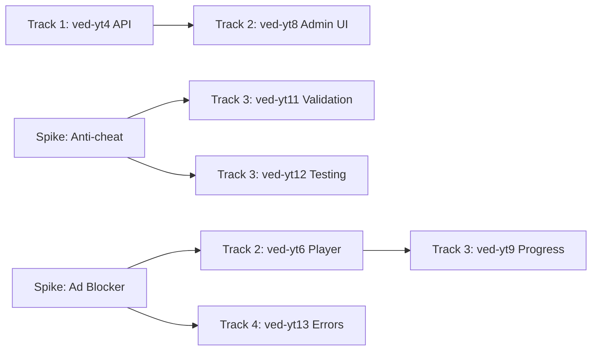

# Execution Plan: YouTube Video Integration

**Epic:** ved-yt-epic  
**Generated:** 2026-01-04  
**Estimated Duration:** 20-30 hours (2 weeks part-time)  
**Approach:** Option B (Standard Integration)

---

## Pre-requisites (Spikes)

⚠️ **Must complete before implementation begins:**

| Spike | Question | Time | Output |
|-------|----------|------|--------|
| ved-spk-yt1 | Anti-cheat progress validation | 2h | `.spikes/youtube/anti-cheat/` |
| ved-spk-yt2 | Ad blocker detection | 1h | `.spikes/youtube/ad-blocker/` |
| ved-spk-yt3 | Content availability monitoring | 1h | `.spikes/youtube/monitoring/` |

**Spike Epic:** ved-spk-yt-epic (4 hours total)

---

## Tracks (Parallel Execution)

| Track | Agent | Beads (in order) | File Scope | Duration |
|-------|-------|------------------|------------|----------|
| 1 | BlueLake | ved-yt1 → ved-yt2 → ved-yt3 → ved-yt4 | `apps/api/src/modules/youtube/**` | 12-16h |
| 2 | GreenCastle | ved-yt5 → ved-yt6 → ved-yt7 → ved-yt8 | `apps/web/src/components/**` | 8-10h |
| 3 | RedStone | ved-yt9 → ved-yt10 → ved-yt11 → ved-yt12 | `apps/api/src/modules/progress/**` | 10-14h |
| 4 | PurpleBear | ved-yt13 → ved-yt14 → ved-yt15 → ved-yt16 | `tests/**`, `.github/**` | 6-8h |

---

## Track Details

### Track 1: BlueLake - Backend YouTube Service

**File scope:** `apps/api/src/modules/youtube/**`, `apps/api/src/common/schemas/**`  
**Dependencies:** None (can start immediately after spikes)  
**Beads:**

1. **ved-yt1** - Add YOUTUBE_VIDEO_METADATA to SchemaRegistry  
   - Add Zod schema for YouTube metadata validation
   - Register in `schema-registry.ts`
   - Unit test: validate sample YouTube metadata JSON

2. **ved-yt2** - Create YouTubeService with metadata fetch  
   - Axios client for YouTube Data API v3
   - Caching layer (in-memory + DB duration storage)
   - Error handling for quota limits
   - **Spike learnings:** Cache strategy from ved-spk-yt3

3. **ved-yt3** - Update CreateLessonDto  
   - Add `youtubeUrl?: string` field
   - Add `videoType?: 'FILE' | 'YOUTUBE'` field
   - Class-validator decorators
   - Unit test: validate `yt:VIDEO_ID` format

4. **ved-yt4** - Add POST /youtube/validate endpoint  
   - Endpoint to validate YouTube URL and fetch metadata
   - Return: `{ videoId, title, thumbnail, duration }`
   - Integration test with mock YouTube API

---

### Track 2: GreenCastle - Frontend Player Components

**File scope:** `apps/web/src/components/**`, `apps/web/src/app/(app)/courses/**`  
**Dependencies:** Track 1 (ved-yt4 must complete before ved-yt8)  
**Beads:**

1. **ved-yt5** - Install react-player  
   - `pnpm --filter web add react-player`
   - Add types: `@types/react-player`
   - Verify SSR compatibility

2. **ved-yt6** - Create YouTubeEmbed molecule  
   - Component: `molecules/YouTubeEmbed.tsx`
   - Props: `videoId`, `onProgress`, `onEnded`
   - Dynamic import with `ssr: false`
   - **Spike learnings:** Error boundary from ved-spk-yt2

3. **ved-yt7** - Replace placeholder in lesson page  
   - Update `app/(app)/courses/[slug]/lessons/[id]/page.tsx`
   - Conditional rendering: `videoType === 'YOUTUBE'` → YouTubeEmbed
   - Fallback UI for deleted videos

4. **ved-yt8** - Add admin URL input field  
   - Form field in admin lesson create/edit
   - YouTube URL parser (extract video ID)
   - Auto-fetch metadata on blur (call `/youtube/validate`)
   - **Dependency:** Requires ved-yt4 (API endpoint)

---

### Track 3: RedStone - Progress Tracking Integration

**File scope:** `apps/api/src/modules/progress/**`, `apps/web/src/lib/hooks/**`  
**Dependencies:** Track 2 (ved-yt6) for player hooks  
**Beads:**

1. **ved-yt9** - Implement onProgress handler  
   - Hook: `useYouTubeProgress(videoId, lessonId)`
   - Track playedSeconds, loadedSeconds
   - Debounce API calls (5s intervals)

2. **ved-yt10** - Connect to existing progress API  
   - Update `UserProgress` via existing PATCH endpoint
   - Calculate `progressPercentage` from playedSeconds
   - Handle pause/resume behavior

3. **ved-yt11** - Server-side duration validation 🔴 HIGH  
   - Fetch video duration from YouTube API on first progress report
   - Compare reported `playedSeconds` to actual duration
   - Reject if `playedSeconds > duration + 5s` (tolerance)
   - **Spike learnings:** Anti-cheat strategy from ved-spk-yt1

4. **ved-yt12** - Anti-cheat edge case testing 🔴 HIGH  
   - E2E test: skip ahead, verify rejection
   - E2E test: console injection, verify detection
   - E2E test: tab switch, verify resume
   - **Spike learnings:** Attack vectors from ved-spk-yt1

---

### Track 4: PurpleBear - QA & Polish

**File scope:** `tests/**`, `.github/workflows/**`, `apps/web/src/components/ui/**`  
**Dependencies:** Tracks 1, 2, 3 (all beads must be in_progress)  
**Beads:**

1. **ved-yt13** - Error boundaries + fallbacks  
   - ErrorBoundary for YouTubeEmbed
   - Fallback UI for ad blockers
   - Fallback UI for deleted videos
   - **Spike learnings:** Detection from ved-spk-yt2

2. **ved-yt14** - E2E test suite  
   - Test: Admin paste YouTube URL → metadata auto-fetches
   - Test: Video embeds on lesson page
   - Test: Progress updates after 90% watch
   - Test: Error handling for invalid URL

3. **ved-yt15** - Security audit 🔴 HIGH  
   - Review YouTube API key handling (ConfigService)
   - Review server-side duration validation
   - Test console injection attacks
   - Rate limiting for `/youtube/validate`

4. **ved-yt16** - Performance optimization  
   - Lazy load react-player component
   - Optimize YouTube API caching
   - Bundle size analysis
   - Lighthouse score check

---

## Cross-Track Dependencies



**Key Points:**
- Track 1 (BlueLake) can start immediately after spikes
- Track 2 (GreenCastle) must wait for ved-yt4 before ved-yt8
- Track 3 (RedStone) depends on spike ved-spk-yt1 results
- Track 4 (PurpleBear) starts when others reach in_progress

---

## Key Learnings (from Spikes)

Embedded in beads, but summarized here for orchestrator reference:

### From ved-spk-yt1 (Anti-cheat)
- react-player `onProgress` fires every 1s (reliable)
- Console manipulation possible: must validate server-side
- Server fetches duration from YouTube, compares to reported `playedSeconds`
- Tolerance: ±5s for buffering/network lag

### From ved-spk-yt2 (Ad Blocker)
- uBlock Origin blocks YouTube iframe silently (no error event)
- Detection: `onError` callback + timeout (3s)
- Fallback UI: "YouTube blocked. Please disable ad blocker."

### From ved-spk-yt3 (Monitoring)
- YouTube API has NO webhooks for video deletion
- Cron job recommended: daily check for all YouTube lessons
- Cost: 1 quota unit per video check (10K free quota/day)
- Batch API: can check 50 videos per request

---

## Quality Gates

Before epic close, verify:

```bash
# ✅ Builds pass
pnpm --filter api build
pnpm --filter web build

# ✅ Tests pass
pnpm test

# ✅ E2E tests pass
pnpm playwright test

# ✅ Beads clean
bv --robot-insights  # No cycles
bd ready             # No blockers

# ✅ Security audit
# Manual review: YouTube API key handling, duration validation
```

---

## Success Criteria

- [ ] Admin pastes YouTube URL → metadata auto-fetches
- [ ] Video embeds on lesson page with player controls
- [ ] Progress tracking updates UserProgress API
- [ ] 90% completion unlocks next lesson
- [ ] Error handling for deleted/unavailable videos
- [ ] No SSR hydration errors
- [ ] Zero build errors

---

## Orchestrator Notes

**Spawn Order:**
1. Spawn spike workers first (ved-spk-yt1, ved-spk-yt2, ved-spk-yt3) - parallel
2. Wait for spike epic close
3. Spawn Track 1 (BlueLake), Track 2 (GreenCastle) - parallel
4. Wait for ved-yt4 complete → unblock ved-yt8
5. Spawn Track 3 (RedStone) when ved-yt6 complete
6. Spawn Track 4 (PurpleBear) when others in_progress

**Communication:**
- Epic thread: `ved-yt-epic`
- Track threads:
  - `track:BlueLake:ved-yt-epic`
  - `track:GreenCastle:ved-yt-epic`
  - `track:RedStone:ved-yt-epic`
  - `track:PurpleBear:ved-yt-epic`

**File Reservations:**
- Track 1: `apps/api/src/modules/youtube/**`
- Track 2: `apps/web/src/components/**`
- Track 3: `apps/api/src/modules/progress/**`, `apps/web/src/lib/hooks/**`
- Track 4: `tests/**`, `.github/**`

No file overlap → all tracks can run truly parallel!
